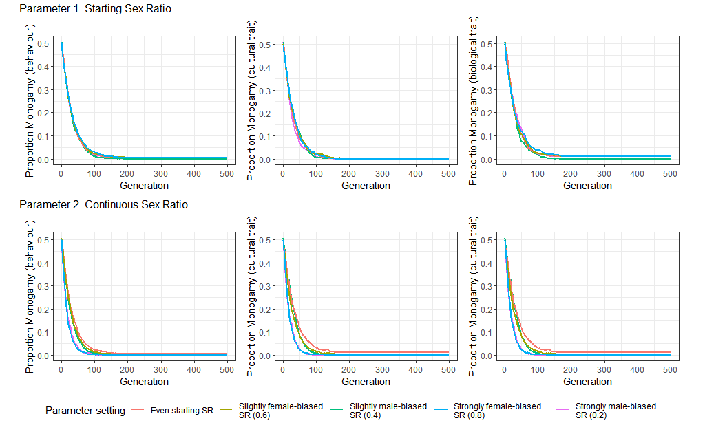
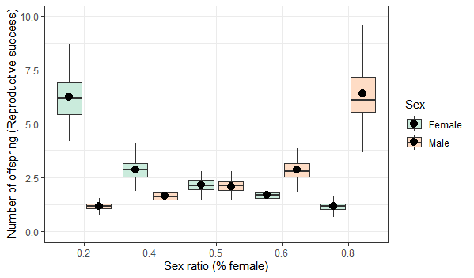

\newpage{}

# Abstract

Lorem ipsum etc.

\newpage{}

# Introduction and literature review

Marriage is a ubiquitous, and likely evolutionary ancient, institutional element of human kinship systems that organises romantic and reproductive relationships into socially-recognised familial units [@murdock1949; @chapais2008]. Despite this general ubiquity, marriage customs and norms also exhibit remarkable levels of diversity across human societies [@murdock1967], which has become a focal point of interest for entire generations of anthropologist and ethnographers [@radcliffe-brown1950; @fox1983; @tylor1889]. This, perhaps almost unique, mix of universality and diversity means that while marriage affects almost every human on the planet, it is bound to affect individuals in profoundly different ways, often in the form of significant constraints and moral imperatives [cite here]. However, despite its broad impact, the origins, and indeed the evolutionary history, of this diversity largely remains obscured [cite here]. As evolutionary anthropologists, we may be tempted to turn to the biological sciences for possible explanations. Indeed, the extensive study of animal mating systems has revealed that pair-bonding for the purposes of reproduction are common, and similarly diverse, across many taxa [cite here], including extant non-human primates [cite here].

At first glance, it may seem tempting to extend the vast biological literature on mating systems across species to the evolution of human pair-bonding, as much of the literature reviewed here cautiously does. Importantly, however, this caution is certainly warranted as a straightforward application has largely eluded scientific consensus for a number of reasons. But before delving into this, it is useful to make some broad definitions. Broadly speaking, "mating system" refers to the, generally species-typical, way in which a species' sexual and reproductive behaviour is structured, primarily in reference to the number of sexual partners an individual entertains within a certain time period [@kokko2014]. They generally take one of two forms - monogamy, which is a one-to-one pairing, or polygamy, which may include multiple partners of either sex. More precisely, "polygamy" includes polygyny (one male with multiple female partners), polyandry (one female with multiple male partners) or polygynandry [or polyandrogyny, clusters of multiple male and female partners; @shuster2003]. Confoundingly, these descriptions can be applied either to single mating cycles or an individual's lifetime - as such, some species may be seasonally monogamous, but polygamous across the long run [e.g. @moore2009]. Additionally, biologists now commonly distinguish between genetic mating systems and social mating systems [@gowaty1996]. Social mating systems refers primarily to the pair-bonding and parental care arrangements of a given species, while the genetic mating system accounts for often divergent patterns of paternity and fertilisation - for example, due to extra-pair copulations, even socially monogamous, pair-bonding species may be genetically polygamous [@pechacek2005; @wiebe2009].

Even within this framework, the human mating system is challenging to pin down still. For one, it is difficult to define a "species-typical" mating arrangement for humans in the first place. While the mating behaviour of most vertebrate species can reasonably be uniformly characterised through a single system (differences between genetic and social mating systems notwithstanding), human mating arrangements show considerable diversity [@low2007]. For example, in their landmark classification of 186 distinct human cultures from the ethnographic record in the Standard Cross-Cultural Sample (SCCS), @murdock1969 code 17% of recorded societies as monogamous, with the other 83% sanctioning some type of polygamy (predominantly polygyny). Conversely, however, because many of these polygamous societies represent small-scale, pre-industrial societies, in absolute numbers, a majority of humans live in societies that are institutionally monogamous - further complicating any attempt to derive any human-typical mating pattern [@brown2009]. Secondly, even this argument assumes in the first instance a close correspondence between human mating systems and human marriage systems, but this has recently been questioned by evolutionary anthropologists [@fortunato2018]. Mating systems are, fundamentally, patterns of behaviour - they are descriptive rather than normative. Marriage systems, on the other hand, are almost by definition normative; they are sets of rules that legitimise, govern and often restrict, rather than merely describe, sexual and reproductive behaviour in humans, including ancillary behaviours such as parental obligations and inheritance [@fortunato2015]. As such, marriage systems are only an accurate representation of mating systems as far as these rules are strictly adhered to and there is no extra-marital reproductive behaviour - an unrealistic assumptions for a wide range of human societies [@blow2005; @walker2010]. This somewhat mirrors the difference between social and genetic monogamy. Additionally, some marriage systems only sanction normative behaviour at a given point in time (e.g. concurrent spouses), rather than across an individuals lifespan. As such, even in monogamous societies, divorce and remarriage may lead to overall mating patterns that are effectively polygamous, or "serially monogamous" [@borgerhoffmulder2009].

The matter is further complicated by the fact that a marriage *system*, by virtue of being normative rather than descriptive, may not even necessarily reflect the marriage *patterns* observable in a given population or culture. For example, even though polygamy is widely sanctioned, it is not enforced, and in reality often only rarely practised - while 83% of societies in the SCCS are polygynous, in only 28% is polygynous marriage actually practised in more than 40% of recorded marriages [@murdock1967; @marlowe2003]. Finally, even "mating patterns" as defined by the actual, observable pattern of sexual interaction within and outwith marital arrangements is detached from the genetic level of mating systems, for example through the use of contraceptives [@oreilly2010]. In summary, the disconnect between human marriage systems and human mating systems is therefore three-fold - marriage systems may not necessarily represent actual marriage arrangements, marriage arrangements may fail to adequately capture all sexual interactions, and finally sexual interactions may not actually reflect reproductive activities. Nevertheless, evolutionary sciences still often employ this somewhat crude heuristic and habitually treat marriage systems as indicative of underlying alternative reproductive strategies [e.g. @buss1993].

Fundamentally, this dissertation is an attempt to reconcile insights into the evolution of both human mating (as a biological phenomenon) and marriage (as a cultural phenomenon) in a gene-culture coevolutionary framework that draws extensively on wide range of disciplines concerned with the empirical and theoretical dynamics of mating systems. Building from basic principles, this literature review will critically examine the components of the traditional sexual selection paradigms that have dominated much of the evolutionary approach to human mating and marriage (section x). Then, drawing on more contemporary approaches, it will narrow in on the hypothesised role of biased sex ratios as a demographic contingency for evolutionary trajectories (section x), subsequently moving to embed this approach within competing explanations regarding the evolution of human marriage systems (section X). Finally, it will consider how the dynamics of gene-culture coevolutionary models may alter the way we think about the evolution of marriage systems (section x), and synthesise the discussed approaches into a novel theoretical framework to discuss old research questions (section X).

## Sexual selection theory and human mating strategies

**The Darwin-Bateman paradigm.** Until a relatively recent diversification of approaches, sexual selection theory has long been used to assert that sexually antagonistic selection on interest in mating may give rise to a fundamental and near-universal dichotomy between "coy females" and "promiscuous males" - sometimes characterised as the "Darwin-Bateman paradigm" [@borgerhoffmulder2021; @dewsbury2005]. As the name would suggest, it is rooted in @darwin1981 's early assertion that males in almost all animal species are more eager and less discriminate than females when it comes to reproduction. This, Darwin continues, makes them the primary target of evolution via sexual selection - either through male-male competition or through female choice, the inverse processes of which (e.g. female-female competition, etc.) he largely neglects [but see @bonduriansky2009]. Darwin, of course, could only speculate about the origin of these sex differences, which he tentatively reasoned to be driven by the fact that insemination requires males to closely approach females, thus selecting for an "eagerness" in males to seek out the opposite sex [@darwin1981]. But the brevity with which this, entirely non-empirical, explanation is offered in The Descent of Man perhaps speaks to the lack of confidence Darwin had in this line of reasoning. In any case, Darwin's ideas on sexual selection and the associated coy female-ardent male dichotomy largely languished in scientific no-man's land until the latter half of the eponymous paradigm, Angus J. Bateman, published an article titled "Intra-sexual selection in Drosophila" in Heredity in 1948. Here, @bateman1948 publishes three key findings that would prove very influential for the science of mating systems: For one, he found that males show greater variability in fertility or "reproductive success" than females across his experiments. Similarly, mating success in males was significantly more variable than mating success in females. This held both on a group level, with 1 in 5 males failing to reproduce where for females, it was only 1 in 25, as well as on the individual level, where number of partners varied more between individual males than between individual females. The third finding was that, additionally, reproductive success of males seemed to increase linearly with number of mates - indicating that males should strictly prefer more mating opportunities (i.e. promiscuity), within the constraints of Bateman's experiments. Female reproductive success, on the other hand, did not seem to benefit from additional mates beyond the first one. When visualised as a two-dimensional line graph, this relationship between number of mates (or "mating success") and reproductive success is referred to as Bateman's gradient, the slope of which, after Bateman, is often posited to be steeper for males than for females [@gerlach2012]. Collectively, Bateman's results were enshrined in modern sexual-selection research as "Bateman's principles", seemingly offering an elegant explanation for sex differences in sexual selection that had eluded Darwin [@arnold1994], and which continue to exert considerable influence on contemporary sexual selection research [e.g. @janicke2016]. @bateman1948 explained these results by invoking anisogamy: Male sex cells (gametes) are comparatively small and metabolically inexpensive, making the number of matings the limiting factor of male reproductive success, whereas female gametes are expensive and thus themselves constitute the limiting factor on female reproduction. Like his results, the idea of anisogamy as an underlying cause was later picked up by @trivers1972, who in his landmark chapter on parental investment (cited 15940 times according to Google Scholar) argued that sex differences in post-zygotic parental investment (i.e. parental care) followed logically from anisogamy, which he recognises as a form of pre-zygotic parental investment itself. Subsequently, in circumstances under which males and females differ in their parental investment, they ought to differ in their reproductive strategies, with the least invested sex being more promiscuous [@trivers1972]. Simply put, their relatively small parental investment affords males with a higher potential reproductive rate, which should bias them toward promiscuous mating [@clutton-brock1991]. Interestingly, invoking anisogamy as the ultimate cause for sex-differences in mating behaviour poses the corollary question of what, ultimately, causes anisogamy, which similarly has been subject of much scientific interest, notably by Geoff Parker and researcher influenced by him [@parker1972; @lehtonen2011]. This is why the aforementioned "Darwin-Bateman paradigm" is sometimes more completely, but rather confusingly, described as the "Darwin-Bateman-Trivers-Parker paradigm" of sexual selection and the evolution of sex roles [@hoquet2020]. This paradigm, or derivations thereof, remains at the basis of much sexual-selection research in non-human animals [e.g. @arnold1994; @clutton-brock2019].

It is worth noting that, in his original paper, @bateman1948 himself only alludes in passing to generalising his results to humans, though he seemed convinced that his results would extend to many species in which anisogamy holds. Similarly, while @trivers1972 is more explicit in terms of applying his parental investment principles to humans, overall he also takes a broad, cross-specific view of the subject. Nevertheless, and albeit firmly rooted in theoretical evolutionary biology, Trivers' treatment of Bateman's ideas quickly captured the interest of evolutionary minded anthropologists and psychologists, first through inclusion in Wilson's Sociobiology [@wilson1975] and the subsequently growing focus on evolutionary causation of behaviour, and then later through the prominent early work of evolutionary psychologists focused on human mating behaviour [e.g. @buss1989]. For example, in their seminal work on sex differences in mating strategies, @buss1993 argue, in line with Trivers, that obligatory parental investment differences are a fundamental evolutionary driver in human male preferences for promiscuous (short-term) mating. In this context, they also contend that the broad preferences of males for multiple partners, in the context of polygamy, similarly evolved as a function of the same sex differentials. Since then, evolutionary psychologists have gathered a substantial amount of evidence for consistent sex-differences in reproductive strategies, sometimes labelled the males compete-females choose (MCFC) model, across geographies [e.g. @chang2011; @souza2016] and methodologies [e.g. @conroy-beam2015; @thomas2020], broadly along the lines of Trivers' original sex-specific predictions. In this manner, sexual selection theory-derived work on evolved human mating strategies continues as a fruitful (one may be tempted to say "fertile") field of ongoing research [@buss2019; @mogilski2021], albeit an often contentious one [@stewart-williams2013; @eagly1999; @zentner2012]. In an adjacent but separate line of research, Bateman's principles have been directly put to the empirical test with human populations [reviewed in @betzig2012]. The sex differences in variance of reproductive success in this context are often associated with the cultural practice of polygyny, which allows for large differentials in reprodutive success among males via varying number of partners [@low1988]. There are significant difficulties in compiling data on reproductive success in humans, for example because paternity is particularly challenging to discern in the absence of comprehensive genetic testing - nevertheless anthropologists, demographers, and occasionally historians have collected a wealth of cross-cultural data on reproductive success by sex [@betzig2012; @brown2009]. On the matter of Bateman's principles, @brown2009 report that while there is some good evidence that reproductive success is more variable in males than females overall across multiple datasets, seemingly affirming Bateman's first principle, this difference is neither universal nor constant. For example, in data on the Meriam people of Australia, variance of reproductive success in women is twice as high as that in men, running directly counter to Bateman's first principle [@smith2003]. Similarly, @brown2009 contend that, contrary to a widely-held assumption among evolutionary-minded behavioural scientists, the widespread practice of polygyny does not necessarily indicate greater variation in mating success (Bateman's second principle) among males than females, a criticism to which I will return in the next section. Overall, the Darwin-Bateman paradigm has certainly been a dominant and driving theoretical narrative in the evolutionary investigation of human sex roles across both evolutionary psychological and behavioural ecological approaches, and, as I will explore in later sections, sits at the base of many evolutionary approaches to human marriage systems as well.

**Recent critiques and a new sexual selection paradigms.** But recent advances across multiple disciplines have cast reasonable doubt on the clear applicability of Bateman's principles to humans, or at least imply that the coy female-ardent male dichotomy requires substantial additional nuance. These critiques generally span three categories - theoretical advancements in parental investment and sexual selection theory, empirical critiques of Bateman and Triver's original work, and methodological difficulties in applying Bateman's principles to humans specifically. I will discuss each in turn.

First off, the factors influencing strength and direction of sexual selection have been subject to recent theoretical revisions. @kokko2008 question two key features of Trivers' reasoning on sex role divergence, which they describe as the "female" and "male" argument, respectively. The female argument relates to the poorly substantiated claim that pre-zygotic investment (anisogamy) necessarily leads to post-zygotic parental care. Fundamentally, however, this association does not strictly hold, as past investment in offspring should be irrelevant, in principle, to decisions regarding to future care - the cost of anisogamy is unrecoverable, and evolution should favour the care decision with the highest future payoff [@dawkins1976a]. It is not immediately obvious why female's future payoff from parental care should be higher than male's, and whether past investment reduces the cost or increases the benefits of future care is uncertain [@kokko2008]. The "male argument" relates to the idea that if effort or time are limited resource, and intra-sexual competition for mates is higher in males than in females, this necessarily leads to more investment in competition in males at the cost of parental care. However, @fromhage2005 have suggested that strong male-male competition may actually favour monogamous mating (as the mate search cost in this scenario may be very high). Overall, it is clearly worth considering under what circumstances the marginal benefit of care may outstrip the marginal benefit of competition, thus favouring male parental care[@kokko2008]. Overall, @kokko2008 question the straightforward relationship between anisogamy and choosiness/promiscuity expounded on by Trivers. In a related piece of work, theoretical modelling indicates that rather than anisogamy alone, sex-specific mortality cost of caring, sex-specific mortality cost of mate searching, mate encounter rate, variation in mate quality, and the operational sex ratio (which will be discussed in greater detail in the next section) all seem to be important parameters in determining the strength and direction of sexual selection, and the associated choosiness it engenders [@kokko2001]. Notably, anisogamy may well factor into some of these elements, but the exact mechanisms by which it does requires a nuanced understanding of all implicated parameters. Thus, broadly, these models seek to extend and refine rather than replace existing models of sexual selection and parental investment. A more forceful variation of this critique, which discounts the causal role of anisogamy entirely, is advanced by some evolutionary biologists who argue that the use of "sex roles" in this line of research is inherently problematic (given their non-continuous nature and variability across taxa), and dismiss inherent sex differences in favour of environmental and/or stochastic effects which lead to flexible "sex-typical" (in the intraspecific sense) behaviours [@gowaty2009; @ah-king2013]. For reference, @ah-king2013a offer a useful review of this perspective [but see @kokko2013], a detailed discussion of which would, however, exceed the scope of this introduction.

Outside of these theoretical refinements, there have been specific empirical challenges to Bateman's principles, both via reexamination of his original experiments and their conceptual replication across taxa [see @tang-martinez2016 for a review]. Multiple scholars have extensively criticised Bateman's experimental design and procedure [@dewsbury2005; @tang-martinez2005], with specific criticisms spanning selective use of data [@tang-martinez2005], choice of species and sample size [@hoquet2020], statistical technique and inference [@sutherland1985; @snyder2007], and systematic mismeasurement of fitness variance [@gowaty2012]. Of particular note here is a full-scale replication of Bateman's experiments which revealed flaws in Bateman's measurement of mating and reproductive success, both of which are crucial to the formulation of his principles [@gowaty2012; @gowaty2013]. A more conceptual challenge to the Darwin-Bateman paradigm is the repeated evidence of multiple female matings and polyandry across multiple taxa including primates [e.g. @newcomer1999; @drea2005; @lewis2004]. In line with these observations, empirical work has also demonstrated that females may benefit from polyandry, counter to some of Bateman's conclusions [@slatyer2012; but see @akcay2007]. Additionally, the overarching finding that sexual selection may strongly target females, and that male mate choice can play a significant evolutionary role is now largely uncontroversial among evolutionary biologists, even those who advocate for the usefulness and general validity of Bateman's principles [@clutton-brock2009; @clutton-brock2013; @janicke2016]. The issue remains, however, that much of this nuance is often lost in discussions of Bateman's principles outside of evolutionary biology [e.g. the evolutionary psychology approaches discussed above; @borgerhoffmulder2021]. Overall, all this empirical criticism tends to coalesce into one suggestion; that it is perhaps more fruitful to examine the Darwin-Bateman paradigm on a species-by-species basis, rather than applying it indiscriminately to the entirety of biology [@tang-martinez2016].

Fortunately, evolutionary anthropologists are afforded to do just that. But even among humans specifically, application of Bateman's principles runs into some challenges. One would be remiss not the mention the contribution that Sarah Blaffer Hrdy has made in challenging the application of static, Bateman-derived sex roles in human and non-human primates [@hrdy1981]. In line with aforementioned empirical challenges, @hrdy1986 discusses at length evidence for polyandrous mating in primates, including barbary macaques, baboons and langurs, and challenges the uncritical extension of Bateman's results. Clearly, Bateman's principles within human populations, too, are subject to a range of interacting factors discussed in the theoretical approaches above, which render unitary mating strategies in humans counter-intuitive - as exemplified by the diversity of human mating systems codified via different marriage norms and practices [@fortunato2018]. However in this context, prevalance of culturally sanctioned polygyny [see @murdock1967], has been interpreted as evidence for the general validity of Bateman-derived sex roles in humans, as polgyny seems to be testament to male promiscuity and directly lead to higher variance of male reproductive success (Bateman's second principle) by unequally distributes mating opportunities among men [@schmitt2005]. Multiple researchers have cautioned against the use of this unsophisticated analogy [@brown2009; @borgerhoffmulder2009; @smiler2011]. For one, @murdock1967 's ethnographic data, often the primary citation regarding the cross-cultural prevalence of polygyny, itself shows that while polygynous marriage is often allowed, it is comparatively rare - that is to say, even in polygynous societies many males are monogamous. Conversely, both monogamous and polygynous societies may be marked by "serial monogamy" (i.e. remarriage or re-partnering), which further disolves the relationship between marriage systems and actual mating patterns [@fortunato2018], and leads to the emergence of female mating behaviour favouring multiple partners [@borgerhoffmulder2009]. It is unclear whether the coy female-ardent male dichotomy clearly derives from these patterns [@brown2009]. These difficulties are also exacerbated by the fact that "promiscuity" is a somewhat ill-defined concept that can either refer for the number of partners (mate-number promiscuity) or the number of matings [mating-number promiscuity; see @ShusterStephenM.2003Msas]. The operating definition is clearly relevant in the context of mating and marriage systems as only mate-number promiscuity is necessarily indicative of polygamous mating.

It is worth noting that these critiques ought not to be interpreted as entirely invalidating Bateman's contributions or his eponymous principles per se [see @morimoto2020], and that it would be counterproductive to simply dismiss an entire body of well-evidenced associated research [@wade2005; @janicke2016]. But they do draw attention to the fact that, in their applications to humans in particular, Bateman's principles have both been fuelled by, and have fuelled, out-dated preconception about traditional sex roles and behaviours [@knight2002] - that is to say, normative *a priori* assumptions about how females and males *ought to* behave. Arguably, such imposition of social stereotypes on biological principles and vice versa impedes epistomological efforts in both science and society, which neither are likely to benefit from. Instead, a research approach based on the careful re-examination of the Darwin-Bateman paradigm allows to amplify and extend our understanding of the evolution of sex roles and mating strategies in a way that an over-reliance on Trivers' arguments would simply not allow for. Part of the purpose of this dissertation is to use recent theoretical advances in sexual selection theory to refine our understanding of the evolution of human mating and marriage systems. One key factor identified in the operation of sexual selection is the sex-ratio - which I shall now turn to.

## Sex-ratio theory: principles and applications

**Basic tenets of sex ratio theory.** The causes, consequences, and evolution of sex-ratio patterns across biological species has been a point of contention throughout the history evolutionary thought. @darwin1981 himself wrote, after unsuccessfully grappling with it, that "the whole problem is so intricate it is safer to leave its solution for the future" (find exact page). Only over half a century later, after seminal works by @dusing1884 and @fisher1930, did biological science follow suit in formulating such a solution. Most notable in this context remains Fisher's key mathematical treatment of the topic, eponymously named Fisher's principle (or the Fisher condition), which explains why, evolutionarily, the sex-ratio at birth (SRB) converges toward an even 1:1 split. It is worth noting at this point that the Fisher's theory of sex-ratio and sex allocation is a null-model [that is to say, it makes a number of assumptions that many species may be expected to deviate from; see @west2009]. Nevertheless Fisher's explanation makes a simple and elegant observation: In sexually reproducing species, offspring generally have one father and one mother -- the overall reproductive success of the male and female population within those species is, therefore, equal. If one sex is rarer (that is to say, if the sex ratio is uneven), their average (or per capita) reproductive success increases relative to the more frequent sex. Their higher average reproductive success makes them, evolutionarily, more attractive and effective offspring. Consequently, parental genes which lead to overproduction of the rarer sex are likely to start contributing more to the gene pool as their offspring will have higher average reproductive success -- until, that is, they aren't the rarer sex anymore (and therefore lose their reproductive advantage). The equilibrium in which neither sex has a higher average reproductive success is a ratio of 1:1. That equilibrium is the Fisher condition. This does not run contrary to Bateman's principles, as these are concerned with sex differences in *variance*, rather than average reproductive success.

**Types of sex ratios and theoretical implications.** Fisher's theory is a useful starting point for examining and understanding sex ratios, but it comes with a number of corollaries. First off, it usually specifically refers to the sex ratio at birth (SRB), elsewhere referred to as the secondary sex ratio [@graffelman2000; but see @fromhage2016]. But the ratio of males to females tends to vary throughout an organisms lifecycle, and meaningful differences in the sex ratio is often seen at conception (SRC), at birth and in adulthood [ASR; also primary, secondary, and tertiary sex ratio, respectively, after @szekely2014]. Additionally, some researchers have advocated for the use of an intermediate "sex ratio at (sexual) maturation" (MSR), a concept closely related to, but temporally preceding, the ASR [@fromhage2016]. This is because, unlike the ASR, the MSR is not subject to bias resulting from, for example, sex-specific adult mortality or lifespan differentials [and thus allows for more straightforward application of the Fisher condition; see @jennions2017a]. Finally, while measures like the MSR and ASR count all living individuals at a given point in time, they might be misleading when it comes to mating markets because not all adults are going to be mate-searching at any given point in time. Instead, there is an operational sex ratio (OSR) which only includes sexually receptive individuals and dynamically responds to individuals entering and leaving the mating market (e.g. to care for their offspring, to enter monogamous pair bonds, etc.) - as such, it tends to oscillate over time [@delguidice2012]. In a continuation of the sexual selection work detailed above, the OSR was identified shortly after Trivers as an additional determinant of sex role divergence, with the argument that whichever sex the OSR is biased toward would experience higher intrasexual competition for mates and, by extension, stronger sexual selection, which leads to even more competition via a positive feedback loop [@emlen1977a; @kvarnemo1996]. @emlen1977a in particular related the OSR directly to mate monopolisability, arguing that, for example, a male-biased OSR is an indication of *male* ability to monopolise mates (e.g. through polygyny). This line of thought also suggests that a biased male-biased sex ratio leads to less investment in parental care and weaker pair bonds, as males invest in mate competition instead [@schacht2017c]. The empirical record offers no clear endorsement of such a relationship [@ims1988; @weir2011], and theoreticians have moved away from the OSR as a strong predictor of sexual selection and mate monopolisation [@klug2010; @shuster2009]. After all, there does not seem to be a strong *a priori* reason to believe that adding more members of the mate-limited sex offers more opportunity for mate monopolisation - if anything, it appears as if it would be harder to defend mates in that case. Indeed in humans, the OSR (though generally more broadly referred to as "sex ratio") is thought to be a key factor in the formation of "mating markets", in which the rarer sex gains quasi-economic bargaining powers in the formation of romantic relationships [@becker1981; @chiappori2020]. However, sociologists, psychologists and economists working within this space still commonly presuppose inherent sex differences in mating preferences [e.g. @regnerus2012], rather than letting them develop endogenously within their models - the very thing that theoretical biologists have cautioned against. I will discuss the current discourse on sex ratio theory in humans in greater detail below. In any case, given these conceptual difficulties, and the fact that measuring the OSR itself is problematic [@clutton-brock2017a], any work that aims to understand the evolution of mating system must look beyond biased OSRs alone to explain variation in mating behaviours [see @kokko2001; @kokko2003].

Instead of the OSR alone, recent work has highlighted the role of the ASR in determining reproductive strategies [@schacht2017b; @kappeler2017]. This is sometimes due to methodological necessity - in studies of human populations, variants of the ASR (like the ratio of marriage-age males to females) are often used as stand-ins as the true OSR is difficuly to determine [@wehbe2020]. More generally, the ASR and OSR are of course closely related - a biased ASR may well lead to a biased OSR, especially at the start of a given mating period [@jennions2017b]. But notably, ASR and OSR often display starkly different temporal patterns in wild populations, where the OSR tends to fluctuate more strongly due to fast-moving mating markets [@10.1093/beheco/arw183]. The ASR, on the other hand, is also directly determined by comparatively slower-changing demographic factors that only indirectly affect the OSR, like sex- or activity-specific mortality costs, and there are scenarios in which a sex might be in the majority in one but in the minority in the other [@kokko2008]. Interestingly, the OSR is simultaneously cause *and* consequence of mating systems, whereas the ASR is largely an external cause (unless reproductive decisions alter mortality risk - in any case, the strong impact of demographic processes on ASR is bound to weaken that reverse causality). Exploring this causal role of ASR in mating system formation, recent theoretical biology work has reversed or at least revised some of Emlen and Orings's early predictions regarding the effects of a sex ratio imbalance - rather than increasing the competition for mates in the more abundant sex, a biased sex ratio (either OSR or ASR) may actually reduce the benefit derived from competing for mates relative to guarding existing mates or caring for one's offspring. In short, if the cost of competing is high, individuals should switch to cheaper ways of increasing one's fitness and forego competition [@kokko2008; @fromhage2008]. These models have found support from empirical and theoretical work which highlights that male-biased ASRs can indeed be predictive of higher male parental care and monogamy, or even polyandry, across species [@fromhage2005; @liker2013], or even within species via phenotypic plasticity [@karlsson2010]. For example, experimental studies of honey locust beetles have shown that ASR biases can even lead to the reversal of sex roles within species, lending further credence to the idea that sustained sex ratio differentials may influence the evolution of sex roles [@fritzsche2016]. But where might such ASR variation stem from? In fact, the ASR is determined by a variety of demographic and ecological factors, which have been investigated in a wide range of evolutionary models [@szekely2014]. Importantly, as a result of this causal mosaic, the ASR can vary substantially throughout the animal kingdom - tendentially, for instance, birds have male-biased and mammals female-biased ASRs [@donald2007]. Nevertheless, the origins of such biases remain largely obscured, though recent work in avian species argues for a significant influence of juvenile mortality in the formation of ASRs [@eberhart-phillips2017; @eberhart-phillips2018a]. Additionally, imbalances in the ASR of any given population can of course theoretically stem from deviations in any preceding sex ratio (e.g. primary or secondary), as well sex-biased dispersal or migration patterns and adult mortality or life-span differences [@veran2009; @kappeler2017a]. Much of this comparative work on the causes and consequences of adult sex ratios has been conducted in avian populations, partially because the social organisation of many mammalian species complicates the measure of biologically relevant ASRs [@kappeler2017a]. Within the social sciences, however, there has long been a burgeoning investigation of sex ratios in humans.

**ASR causes and consequences in humans.** Overall, and across many geographies, the human sex ratio at birth (SRB) is somewhere around 105 or 106 males to 100 females, sometimes referred to as the "natural" (according to the WHO) or "expected" sex ratio [@owidgenderratio]. However, this ratio goes down to parity for sexually mature age ranges, and finally reverses in post-reproductive populations due to higher male adult mortality [@wisser2014]. Despite this general pattern of sex ratios in contemporary human societies often being relatively even, they vary remarkably across geographies, history and the human lifespan [@hollingshaus2019]. To begin to understand this, we can employ, in the first instance, the same set of tools that behavioural ecologists use to investigate causal patterns of ASR variation across species - namely the SRB, sex-specific mortality rates (both juvenile and adult) and sex-specific migratory patterns [@szekely2014]. In a comprehensive review, @orzack2015 showed that while the human sex ratio at conception is even, slightly higher female than male fetal mortality leads to the male-biased SRB detailed above. However, evidence suggests that the SRB can be influenced by environmental factors spanning from the physiological, e.g. hormone-induced male fetal loss [see @james2017a], to cultural practices such as sex-selective abortions [@zhou2012; @qayyum2017], which induce geographical variation to SRB patterns. Similarly, sex-specific child mortality rates vary cross-culturally [@kishor1993], further exacerbating such variation, with some researchers asserting that this variation is systematically predicted by cultural gender equality norms and associated practices such as female infanticide [@bhatnagar2012; @iqbal2018]. Adult sex-specific mortality, too, often studied by demographers through what is called the "gender mortality gap", also showcases significant cross-cultural variation predicted, in part, by differences in health behaviours and their respective cultural relevance [@rochelle2015]. Sex differences in adult mortality may also be brought about by warfare and other forms of intergroup-conflict which disproportionately affect and involve men [@ember1974]. Finally, evidence for evolutionarily ancient sex-specific human migratory patterns has been revealed by genomics and genetics research [@seielstad1998; @perez-lezaun1999; @hammer2008], mirroring contemporary sex-specific trends for example in labour migration which may reflect local economic circumstances [@sharpe2001]. It stands to reason that the ways in which these factors interacts with cultural practices, as demonstrated in some of these cases, may give rise to significant consistent geographical variation in ASR patterns. Likewise, if the ASR is itself causally related to the evolution of certain cultural practices like marriage norms, this could indicate an interesting reciprocal relationship between demography and culture.

In any case, establishing that adult sex ratio imbalance and variation exists is of course only the first step - its impact has similarly been the source of much scientific inquiry. Notably, outside of the domain of biologists, the adult sex ratio in humans has been of interest to social scientist for a long time. In his early formulation of marriage market economics, @becker1973 reasoned that sex ratio imbalances influences the bargaining powers of either sex in the marriage market and determines how the "output" of a marriage is divided between the partners, with the rarer sex commanding a larger share and better chances in the marriage market. He also argues that an imbalanced sex ratio is one of the few circumstances that could lead to polygamous marriage, as he sees monogamous unions as more economically efficient [but see @gould2008 for a review of the precise circumstances under which monogamy may not be economically efficient]. In general, Becker's approach has proven enduring even in more contemporary economic models of marriage (many of which treat marriage as a "matching problem" for two sets of broadly complemtary types of people, men and women), and has even found support in empirical economic analyses [@angrist2002; @chiappori2020]. Adjacently, sociologists @guttentag1983 wrote broadly on the effects an imbalanced sex ratio, examining predominantly how variations in the adult sex ratio have affected the perceived value of women. Though stemming from a different methodological tradition than Becker, their conclusions read similar: The rarer sex enjoys relatively more "dyadic" power, which is expressed in male promiscuity in the case of a female-biased sex ratio, and increased male devotion to family in male-biased populations. Sociology continues to employ sex ratio as a demographic factor influencing gender (in)equality in the spirit of this work, sometimes referred to as "social exchange theory" [@stone2019]. Crucially, however, traditional sex roles and structural differences between male and female power are not endogenous to this approach - conversely, this theory specifically presupposes patriarchal power structures which interact, but do not arise from, sex ratio patterns. Finally, anthropologists, keenly aware of the diversity of marriage practices, have argued that sex ratio imbalances may cause the adoption of certain marriage norms like polygyny. Interestingly, the roots of this work precede almost the entire scientific discourse around sex ratios [cite Spencer here]. Early empirical work indicated that in a random sample drawn from the Ethnographic Atlas, polygynous societies did indeed show a more female-biased sex ratio (associated here with high male mortality from warfare; @ember1974). More recently, a female-biased ASR was found to be associated with lower male investment in mating effort among the Makushi of southern Guyana [@schacht2015], and a male-biased ASR was predictive of a lower variance of mating success among women in Northern Ireland [@uggla2017], both results in line with prediction from recent parental investment theory. Indeed overall, early results from economics, sociology and anthropology seem to largely reflect a common theme despite their starkly different methodological traditions. It is, however, worth reviewing how exactly adult sex ratio has been found to be associated with differences in human mating and marriage practices in more recent empirical work.

After the largely theoretical "social exchange" accounts by Guttentag, Secord and Becker, many social scientists have put their general predictions concerning the influence on sex ratio on varying mating and marriage practices to the empirical test, and especially whether sex ratio predicts the strength of pair bonding across societies. For example, a common prediction of this approach is that more male-biased sex ratios (hereafter "higher sex ratios", as sex ratios are often expressed as the number of males to females) will predict higher marriage rates, as it disincentives short-term mating in males [see also @schacht2015]. As such, marriage rates are commonly interpreted as individuals foregoing quasi-polygamous arrangements in favour of monogamous mating and the chance to secure a mate *at all* (meaning that associated studies are generally restricted to populations with monogamous marriage norms). Accordingly, empirical analysis has shown that, across a broad set of samples including historical populations in the US, Canada, and Russia, as well as cross-cultural data, the marriage rate tends to be higher in more male-biased populations [@angrist2002; @brainerd2017; @goldman1984; @south1988; @trovato1988]. There are a number of caveats to this, however. For one, in some special populations with unusually high sex ratios, namely India and China, where the SRBs may approach 120 males to 100 females, this pattern can be reversed in males through what demographers call a "marriage squeeze" on excess males, which technically actually lowers the male marriage rate as many men are failing to secure marriages rather actively avoiding them [e.g. @guilmoto2011; @jiang2014]. Such marriage squeezes can of course affect both sexes, depending on the sex ratio [@jones2006]. Additionally, it is worth noting, as suggested above, that many of these studies suffer from largely being focused on large-scale monogamous societies when using marriage rates as a proxy for pair-bonding.

In an interesting and valuable parallel, some anthropological work on small-scale societies has instead focused on "divorce rates" as an empirical proxy for strength of pair-bonds. Notably, @blurtonjones2000 found that in a hunter-gatherer sample including Hadza, !Kung, Ache and Hiwi populations, a lower sex-ratio is associated with higher divorce rates, and thus weaker pair bonds. Furthermore, empirical analysis of divorce rates has of course not been restricted to foraging societies. For example, large scale cross-cultural analysis using data from the late 20th century associate high sex ratios with lower divorce rates [@south1988; @trent1989]. However, the effects here are less one-dimensional as it may appear. In one notable study of divorce rates across US cities, @south1995 found that divorce rates actually increase when sex-ratios deviate *either way* from the overall population mean - meaning that pair bonds appear to weaken both in the presence of a relative male-bias and a relative female-bias. The authors relate this to Becker's theory of relative bargaining power, but it also reflects predictions from contemporary biological theory, namely that both male and female mating behaviour may actually be affected by sex ratio swings in a similar manner, rather than being necessarily differentiated by inherent sex differences. As with the marriage squeeze, the possibility of symmetrical effects of sex ratio is an important consideration for the research at hand.

Finally, there is some evidence that even in humans , sex ratios may impact the dynamics of sexual selection by influencing mate choice. The logic of this hearkens back to @emlen1977a 's work - the rarer sex can afford to be "choosier" and thus steers sexual selection - but is also reflected in the more social-scientific mating market approaches. A lot of the empirical literature on this effect of sex ratio biases has focused on the ability of women to choose wealthier and more educated men in male-biased populations [@albrecht1997; @pollet2008]. This may reflect an opportunity for women to select better "male provisioning" by choosing partners with high earning potential. However, no empirical research has been conducted on the reverse - whether low sex ratios lead to higher male choice (and marriage) of provisioning females. This is likely at least in part because much of the work on the issue has been conducted on historical populations where female educational and earning potentials were significantly constrained. An alternative proxy through which to consider mate choice are mate preferences, prominently explored in evolutionary psychology [@buss1989]. This evidence must be considered carefully, not least because mate preference may not actually mirror mate choice particularly closely [@todd2007], but it may offer some interesting insights into the effects of sex ratio. Notably and somewhat confoundingly, a study on the issue revealed that while male preferences seem largely unaffected by sex ratio, female preferences for provisioning proxies like "good financial prospects" and pair-bonding proxies like "mutual attraction - love" are actually negatively correlated with sex ratio, i.e. these preferences matter less to women in high sex ratio societies [@stone2007]. However, the same study did suggest that female preference for "chastity" was positively correlated to sex ratio, meaning that women seemed to put increasing emphasis on monogamous mating in high sex ratio environments - though far from definitive, this finding reveals a mechanism by which monogamous mating may be sexually selected for.

The preceding paragraphs are primarily concerned with the influence of sex ratio on inter-sexual behaviours, but, as discussed, sexual selection also operates through intra-sexual competition. A common prediction in this context is that intrasexual competition in males in particular takes the form of violent behaviours [@daly2001]. Consequently, sex ratio imbalances, and particularly male bias, are sometimes viewed as catalyst for violent behaviours [@hudson2002], ostensibly because males are forced to compete aggressively over restricted mating opportunities [@hesketh2006]. On the population level, this should translate to an association between sex ratio and, for example violent crime [e.g. @messner1991]. This prediction of "bachelor-driven" violence of social instability runs counter to the evidence indicating that higher sex ratios are actually predictive of more stable pair-bonds discussed above. Indeed, researchers have suggested that thinking about violence as an effective form of intrasexual competition in this way underestimates the influence of female choice, as well as misinterprets what male intra-sexual competition actually looks like - after all, there appears to be no strong reason to believe that men would compete violently rather than, say, on parental care or provisioning ability [@schacht2014]. Overall, this is in line with the mating market approach which would predict that male mating effort should increase when males are abundant, leaving relatively little room for high-cost intrasexual competition in the form of violent crime. Empirical evidence on the issue is decidedly mixed, with some studies repeatedly pointing toward the fact that higher sex ratios are actually associated with reduced crime violent crime and homicide rates [@antonaccio2007; @barber2000; @schacht2016c], whereas others find the positive association predicted by more traditional approaches [@diamond-smith2018; @edlund2013; @vandello2007]. @Filser2021 hypothesise that these mixed results are likely due to methodological complications (e.g. level of analysis), unobserved regional heterogeneity and further imprecise use of aggregate data irrespective of sex of either perpetrator or victim, and instead suggest that the debate requires more precise analysis of individual-level data (e.g. specifically investigating patters of violence against women, or violence perpetrated by childless men) which may in turn lend themselves to more nuanced hypothesis. For example, there is data to suggest that intimate partner violence actually increases in male-biased populations, which, decidedly crudely, could be interpreted as a form of mate-guarding [@bose2013; @diamond-smith2018; @dalessio2010]. Overall, the relationship between sex ratio and violence is only tangentially related to the study at hand, but it serves as a useful reminder that any approach that means to understand the relationship between sex ratio and behavioural patterns would do well to approach aggregate data carefully.

**Computational modelling.** This empirical literature on the effects of sex ratio has been complemented by (sometimes specifically human-focused) mathematical modelling approaches that integrate some intuitions generated by the empirical results discussed here with the broader novel theoretical approaches detailed above [e.g. @kokko2008]. Nevertheless, explicit modelling of sex ratio and the evolution of different mating strategies in humans remains relatively rare, with an number of notable exceptions. @schacht2016a investigate how partner scarcity affects male mating strategies using an individual-based recursive model, finding that a male-biased sex ratio shifts the optimal strategy towards mate guarding of existing partners, thus favouring the evolution of monogamy within those systems. @loo2017 replicate and extend these finding using an ordinary differential equation (ODE) model, reaching similar conclusions. @coxworth2015 use agent-based modelling (ABM) to show that adult sex ratios relevant to reproduction are often male-biased due to the human life history, where women enter the post-reproductive stage earlier than men and thus "leave" the reproductive pool, and argue that this may account for the evolution of strong pair-bonding via mate guarding. Making a similar link between the evolution of monogamy, sex ratio variation and mate guarding, @gomes2018 construct an agent-based model in which male-biased populations tend towards monogamy, but only if efficient mate guarding is possible. Overall, these modelling approaches mirror the general learnings from the empirical literature - namely, that ASR does seem to represent a causal factor in the formation of mating strategies overall, and more specifically, that it favours the adoption of monogamous over promiscuous strategies, especially in male-biased populations. But they often make simplifying assumption regarding the way in which mating strategies propagate, often simply assuming they are purely genetically inherited [e.g. @gomes2018]. This may belie a more complex reality, especially when it comes to humans, where genetic and cultural inheritance, both of which are likely to play a significant role in the formation of mating strategies, interact in complex ways [@richerson2005, see also Section X.]. Modelling approaches to human mating which do take this co-evolutionary dynamic into account tend to focus on the evolution of particular aspects of mating strategies, like incest avoidance [@aoki1997] or partible paternity beliefs [@mesoudi2007], rather than the evolution of monogamous behaviour more general. Sometimes these models do include sex ratios as an explanatory parameter - for example, @mesoudi2007 's results suggest that within their agent-based model, biased sex-ratio imbalances in either direction favour the evolution of monogamy. In other cases, they explicitly endogenise sex ratio as the factor that is co-evolving (e.g. with sex-selective cultural practices) in their simulations, rather than treating it as parameter [@kumm1994]. In any case, none of them allow for mating strategies to be co-determined by evolved genetic and cultural factors. But should they? Arguably, human mating may evolve biologically, as is assumed in the majority of the mating system models discussed above. On the other hand, human mating is subject to complex systems of norms and cultural beliefs which determine the type of mating behaviour that is permissible - and such cultural practices like follow a separate inheritance system. In other words, an examination of human mating is likely rendered incomplete lest it considers the evolution of human marriage systems.

## Explanations for marriage patterns in humans

As indicated in the introduction, the evolution of human marriage and mating systems continues to draw extensive scientific interest [@schacht2009a]. Particularly, in light of the relative rarity of monogamy among mammals [cite here] and even many human societies [@murdock1969], researchers often speak of monogamy as a fundamentally counter-intuitive mating pattern, labelling it a "paradox", "mystery" or "puzzle" across human and non-human mammals alike [@carter2018; @henrich2012; @gould2008]. Implicitly, this appears to be rooted in the idea that monogamy represents a deviation from the baseline mating pattern, which is polygamy, or polygyny in particular [@low2007]. Accordingly, though others have argued that human life history constraints, especially the extended dependence of offspring on parental care, may fundamentally favour monogamy [@lancaster1987; @kaplan2000; but see @hrdy2009], most approaches have focused on determining under what circumstances monogamy may arise from polygamous arrangements [@chapais2013; reviewed in @fortunato2015 and @minocher2019a]. In fact, both comparative evidence from the mating systems of extant non-human primates and phylogenetic analyses suggests that *some form* of polygamy likely represents the ancestral mating system for the genus Homo [@opie2012; @chapais2011], though it is worth noting that mating systems in great apes vary substantially both within and between groups, including both harem-defense type polygyny in gorillas as well as promiscuous polygynandry in chimpanzees and bonobos, somewhat obscuring their evolutionary history and perhaps limiting the efficacy of primate models in this context [@grueter2012; @nakahashi2012]. Regardless, even constricting the time horizon to more recent evolutionary history (i.e. the last 100k years), it has been suggested that the last common ancestor of all extant human populations had at least moderate levels of polygamy [@minocher2019a]. There are number of important caveats to these findings. For one, they also suggest that the evolution of marriage systems is *not* a unidirectional transition from polygamy to monogamy - some extant population may exhibit stronger polygamous tendencies than ancestral populations and vice versa. Similarly, this is not to say that monogamy necessarily co-emerges with features of "modern" or "complex" societies, as has been suggested elsewhere [e.g. @blumberg1972; @levinson1980; @enke2018], as monogamy in Eurasia, for example, appears to precede these features substantially [@fortunato2011; @fortunato2020]. It is also worth noting that this "polygyny baseline" idea is effectively a direct derivation of the Darwin-Bateman paradigm of ardent males and coy females, underscored by the same sexual selection theory literature that is undergoing revision, and has been subject to similar criticisms, often principally relying on sexual conflict [@fortunato2015]. That being said, the shortcomings of this approach have been discussed at length elsewhere in this review.

Overall, it appears likely that there have indeed been bidirectional evolutionary transitions between different marriage patterns across certain cultures and geographies - but what factors influence these changes remains a topic of debate. A full review would far exceed the scope of this introduction (but see @fortunato2015), so I will only briefly recount the most common theoretical frameworks, honing in on the one that is most relevant to the dissertation at hand. In a comprehensive recent review, @minocher2019a categorise contemporary hypotheses into 5 distinct theoretical models: the polygyny threshold model (model 1), inheritance of rival wealth induced monogamy (model 2), harem defense or mate guarding polygyny (model 3), cultural group selection monogamy (model 4) and market forces polygyny (model 5). The polygyny threshold model draws heavily from extended behavioural ecology in predicting that polygyny may be the result of female mate choice of wealthier males in environments where resources are distributed unequally [@orians1969; @verner1966]. The underlying idea is that there may be a high enough net resource benefit to women being polygynously married to wealthy partners (i.e. becoming additional wives), when the monogamous alternatives are comparatively resource-poor [@borgerhoffmulder1990; @sellen2004]. "Resources" in this context can be broadly defined and extended beyond material or physical wealth to include social capital or even genetic qualities that protect offspring against prevalent diseases [@chaudhary2015; @low1990]. However, recent empirical analysis suggests that physical resource inequality is actually predictive of macro-level trends towards monogamy rather than polygyny, refuting the central prediction of this model [@scheidel2009; @ross2018]. This ties into an alternative explanation, which instead emphasises the role of inheritance of rival wealth - resources that have to be divided among offspring [@oh2017]. Where such partitioning of wealth leads to reduced fitness for the inheritors, evolution may favour monogamous arrangements which effectively funnels resources from one generation to the next instead of dividing between potential heirs from multiple wives [@fortunato2010]. Forms of such rival wealth, like land, become more important in agricultural production systems, which are in turn often marked by higher levels of inequality (when compared to, for example, horticulturalist systems), thus offering an explanation for the association between higher inequality and monogamy [@ross2018; @mattison2016].

Where polygyny threshold models primarily invoke the role of female choice (in the broadest sense), harem defense or mate guarding approaches to polygyny tend to instead emphasise the role of male coercion and non-resource based male-male-competition in enforcing polygynous marriage systems [@chisholm1991; @marlowe2000]. Accordingly, some evidence suggests that polygyny is associated with heightened level of male intrasexual violence [@carter2018b] and partner-directed violence [@ahinkorah2021; @ebrahim2020; @jansen2020], with the latter posited to represent a direct form of physical coercion. However, it is important to note that intimate partner violence in humans can and should not be unduly reduced to a mate guarding strategy [e.g. @wilson2009], and that the link between polygyny and increased level of intrasexual violence in men are not consistent [@schacht2014]. Using similar evidence of links between violence and polygyny, one influential account invokes the role of monogamy in limiting intragroup conflict for mates [@henrich2012]. Early versions of this argument posited that "socially imposed" monogamy served to preserve group cohesion, typically in democratic societies, by equalising reproductive capabilities [@alexander1979; @alexander1987]. More recently, however, this logic has been extended in the context of cultural group selection, where monogamy represents a group-level trait that allows cultural groups to redirect resources from intra-group mating competition to intragroup cooperation, which in turn allows for higher success in intergroup competition [@henrich2012; @richerson2016; @handley2020]. However, cultural group selection theory remains controversial [see commentaries on @richerson2016], and the central underlying mechanism - that monogamy is conducive to intragroup cooperation - remains empirically untested.

Finally, the market force polygyny approach employs the same "biological markets"-derived relationship between sex ratio and mating systems discussed in previous sections, and applies it more specifically to the formation of marriage systems [@noe1994; @minocher2019a]. As opposed to other theories which tend to emphasise either female choice (as in the polygyny threshold model) or male coercion (as in harem defense polygyny), this approach assumes that marriage system formation is subject to mutual choice of both sexes under the bargaining constraints afforded by the relevant sex ratio. For example, @pollet2009 show that prevalance of polygyny across localities in Uganda is associated with a female sex-ratio, and @ember1974 observe a similar pattern across cultures drawn from the Ethnographic Atlas. However intuitive, the market-driven approach to the evolution of polygyny is subject to both empirical and conceptual challenges. @quinlan2007 fail to find a meaningful relationship between sex ratio and polygyny in the Standard Cross-Cultural Sample, while @ember2007 find it only in non-state societies (reflecting cultural group selection ideas that larger institutions may inhibit biological markets). In an attempt to derive the evolutionary history of marriage systems while testing different theories, @minocher2019a find no evidence for an influence on sex ratio on marriage system formation across the SCCS while accounting for cultural relatedness, but they are limited to the sex ratio data recorded in the SCCS for this analysis, which only provides a snapshot of the sex ratio at a given moment. Generally, while these types of cross-sectional studies may reveal "still image" patterns of correspondence between sex ratio and marriage system (including evidence both for and against this theory), they only allow for limited inference about the dynamic evolutionary process that may link the two. The Fisher principle limits the potential for sex ratio imbalances to persists over long periods of time, but temporary shocks to the sex ratio, for example via war, disease or migration [e.g. @plumper2006], may yet influence marriage systems along the lines of biological markets theory. This is particularly plausible if even temporary imbalances can lead to the formation and cultural evolution of marriage specific social norms that may constrain behaviour for many generations via cultural inheritance [@richerson2005]. Indeed, there is some evidence that temporary historical sex ratio imbalances can have an long-term influence on certain cultural traits like attitudes towards gender roles [@grosjean2019]. Combining this cultural evolutionist intuition with the logic of the biological market theory of marriage may shed light on the ways in which sex ratio influences marriage systems beyond cross-cultural analysis.

## Gene-culture coevolution

I have at various points asserted that the evolution of marriage systems may be most effectively modelled as a gene-culture coevolutionary process, combining the evolution of human mating as a biological disposition with the evolution of cultural marriage norms. Gene-culture coevolution (or dual inheritance) theory posits that genes and cultures are two separate inheritance mechanisms which generate (potentially adaptive) phenotypic change across time [@aoki2001; @richerson2010a; @whitehead2019]. Crucially, this assumed that culture, broadly defined as socially transmitted (read: socially learned) information, and cultural change can be modelled using the tools and insights afforded by an Darwinian evolutionary framework, even if the mechanisms of this cultural evolution are not perfectly analogous to its biological counterpart [@mesoudi2011; @cavalli-sforza1981; @richerson2005]. A key prediction of gene-culture coevolution theory is that these processes not only run in parallel, but that they interact: On one hand, genetic propensities and biological predisposition (e.g. learning mechanisms) may shape the way cultural information is acquired and transmitted, but on the other, cultural practices may modify the selection pressures through which natural selection affects the human genome [@laland2017; @kendal2011]. But while such interactions have been repeatedly shown to be highly plausible in theoretical accounts [e.g. @gintis2003], empirical evidence remains comparatively scarce with a number of notable exceptions [@laland2010]. One such exception, and a useful illustration, is the coevolutionary process which is posited to have shaped human adult lactose tolerance and the associated ability to digest dairy. Most humans, like most mammals, lose the ability to digest lactose, a principle component of milk, as they mature [@scrimshaw1988], however, some populations retain this ability, termed lactase persistence for the corresponding lactose-processing enzyme, due to genetic variation in the lactase gene LCT [@swallow2003; @lewinsky2005]. Interestingly, those population also tend to have a strong cultural history of cattle farming and milk consumption, leading some the hypothesise that dairy farming, as a cultural practices that provided a novel source of milk in the diet, may have shifted selection pressures to favour lactase persistence [@gerbault2011; but see @segurel2017]. This represents an oft-cited textbook example of gene-culture coevolution. To assess now whether this approach offers a strong framework for understanding the evolution of marriage systems, two questions need to be answered: Do marriage systems rely on both genetic and cultural factors that can plausibily interact? And does the application of this approach have the chance to offer novel insights which a different framework would not provide?

The first questions can be answered affirmatively by making the relatively light assumption that human mating strategies and marriage systems are shaped by both genetic and cultural influences. Indeed, the role of genetic mating preference traits is routinely assumed in evolutionary models of human mating systems [@mesoudi2007; @gomes2018a] - a reasonable assumptions considering that genetic influences are likely part of what determines mating systems across taxa, including primates [@shuster2003]. Additionally, recent investigations into the genetics of human social behaviour have indicated that certain marriage and pair-bonding related preferences may indeed be genetically heritable [@trumbetta2007; @whisman2017]. For example, @walum2008 found that polymorphisms in the *AVPR1A* gene are associated with differences in pair-bonding behaviour in men. A growing body of literature indicates that genes regulating vasopressin and oxytocin pathways play a role in determining affiliative, including romantic, behaviour in both sexes [@feldman2016; @monin2019; @walum2012], reflecting convergent evidence on the neurological underpinnings of human attachment [@feldman2017]. Though most of this evidence stems from behavioural genetics studies, which should be treated with care [see @abdellaoui2021], overall there appears to be good evidence that genetic factors play a role in human romantic attachment. As this could have an impact on mating behaviour, for example fidelity, they may thus also for the basis for a biological disposition toward monogamy or polygamy. Perhaps less controversial is the idea that marriage systems are also determined by culturally transmitted traits. As noted above, marriage systems show considerable cultural variability, and the divergent cultural evolution of social institutions, which includes rule systems that regulate marriage and reproduction, is well conceptualised [@bowles2004; @boyd2008]. As a result, evolutionary anthropologists routinely treat marriage norms as socially transmitted cultural traits [@mace2005a; @lipatov2011]. Additionally, in accordance with cultural group selection accounts of marriage system evolution, it is possible to conceive beliefs concerning monogamy and polygamy fundamentally as cooperation-like norms, perhaps representing moral concern over "fair" mating arrangements [@henrich2012]. This interpretation allows for an interesting analogy to be drawn between our co-evolutionary approach to marriage systems, and the coevolutionary dynamics of cooperation, which similarly is posited to include both genetic (innate prosocial proclivities) and cultural (norms and rules regulating interactions) factors that scaffold each other [@boyd2009; @henrich2010; @lindenfors2017].

The second question, conversely, is harder to answer, but represents a key point for this dissertation. What does a co-evolutionary approach have to offer in terms of scientific novelty? First of all, cultural evolution differs from genetic evolution in ways that may have interesting implications for the evolution of marriage systems. While biological evolution relies fundamentally on vertical transmission of traits [i.e. from parent to offspring; @mayr1982], cultural traits need not necessarily be transmitted vertically. Instead, they can theoretically be acquired from any other individual, including peers (via horizontal transmission) and non-parental individuals from the parent generation [via oblique transmission; @cavalli-sforza1981]. In reference to marriage system evolution, this means that cultural mating preferences are not necessarily propagated via sexual reproduction, as is the case with genetic traits, but can be acquired from non-reproductive individuals who serve as "cultural parents" [e.g. @enquist2010], weakening the link between reproductive success and associated cultural mating preference (biological mating preference traits would still be tied to reproductive success). This is especially relevant because polygamy (over monogamy) is associated with higher reproductive success, particularly in men [@gibson2007], which would seemingly favour the propagation of polygamous traits in exclusively genetic inheritance scenarios. Similarly, cultural inheritance may not only be subject to different inheritance pathways, but also different modes of (cultural) selection which affect the frequency of socially acquired cultural traits within population, variably described as social learning strategies or transmission biases [@laland2004; @mesoudi2011]. One such transmission bias is conformist bias, which describes the tendency to preferentially acquire cultural traits held by the majority of the population [@denton2020]. Like non-vertical transmission, conformist bias also has interesting implication for the transmission of marriage preference. For example, the viability of polygamy is bound to depend both on the number of available partners (captured through the sex ratio) and the number of existing same-sex rivals, with rival "polygamists" posing a larger potential risk to reproductive success than rival "monogamists", as the former threaten to monopolise more mates. Indeed, evolutionary biologists often invoke this kind of negative frequency-dependence (certain mating strategies perform better if they are relative rare) to explain the maintenance of concurrent alternative reproductive strategies within taxa [@taborsky2010; @shuster2010]. As a result, the frequency of mating strategies may oscillate around an evolutionarily stable equilibrium [@zamudio2000; @rios-cardenas2018]. We may expect to see a similar pattern in human mating strategies, but crucially, conformist bias introduces a unique element of positive frequency-dependence for cultural mating preferences. It is unclear how these counteracting forces would interact to shape marriage type frequencies over time.

As a final benefit, a gene-culture coevolutionary approach allows us to reflect the basic insight that marriage practices and mating strategies are conceptually distinct [cf. @fortunato2015], allowing for remarkable phenotypic variability across culture and biology, including mixed ones. Individuals may hold a moral belief about either monogamy or polygamy being the "right" marriage practice, but be biologically predisposed to another, offering an alternative explanation for phenomena like the relative rarity of polygyny even in polygynous societies, or infidelity within strictly monogamous systems. This introduces a kind of continuous, or at least graded, variation between the extremes of polygamy and monogamy.

## Summary and the present research

This broad review of the literature boils down to four key insights, which will form the basis of this research proposal: (1.) contemporary sexual selection research has added a substantial amount of nuance to the Bateman-Trivers paradigm, especially as applied to humans, so new approaches to the study of marriage system evolution should accommodate flexible mating strategies across sexes, rather than relying on out-dated and rigid interpretations of traditional sex roles [cite here]. (2.) one factor that has, across disciplines, been posited to have a strong influence on the dynamic of mating, and by extension marriage, systems is the human sex ratio [cite here]. Even though the human sex ratio displays substantial cross-cultural variation and may thus be an important differentiating environmental factor [cite here], conceptual modelling work explicitly focused on the mechanisms through which the sex ratio may influence marriage system evolution in humans remains comparatively sparse . (3.) despite a plethora of competing hypotheses, there is currently no dominant or unequivocal paradigm as to the causal factors which underlie the diverse cross-cultural pattern of human marriage systems, specifically in regards to rules sanctioning the number of concurrent spouses (i.e. monogamy and polygamy). Finally, (4.) among the modelling work that does exist in the domain, none have considered the evolution of marriage systems as an explicitly gene-culture coevolutionary dynamic which treats marriage norms and mating preferences as separate entities. Cultural evolution is posited to involve markedly different dynamics from biological evolution, through different transmission pathways and biases [cite here], which may have profound impact on the evolution of cultural marriage norms and its feedback on biological mating preferences.

Accordingly, the purpose of the present research proposal is two-fold. The first overarching research aim is *conceptual model development*; we devise, from basic principles, and implement an agent-based modelling approach to investigating the evolution of human mating systems which accommodates both contemporary sexual selection and cultural evolutionary theory into a model that can easily be calibrated to test the influence of assumptions and mechanisms detailed in either framework. Ideally, this model would be open to be used by any interested party and could eventually be employed to test hypotheses across a wide range of topics regarding the evolution of human marriage systems, many of which have been detailed in section X.

The second aim of the research is to test the mechanisms of the model by verifying its functionality, and then using it to explore one specific set of hypotheses. As reviewed above, sex ratio has emerged as a potentially influential factor in the evolution of marriage systems. More precisely, the rarer sex is predicted to have higher bargaining power in dynamic mating markets [cite here], which is posited to be a possible factor in the evolution toward monogamous mating and marriage [cite here]. Our hypothesis for the model tests that simple logic:

> *H~1~: Within the constraints of our agent-based model, a biased sex ratio in either direction will favour the evolution of monogamy because of negative frequency-dependent selection against strategies that attempt to monopolise multiple mates*
>
> *H~0~: Biased sex ratios have no discernible effect on the evolution of monogamy*

Following methodologies adapted from population genetics and cultural evolution, we will test this hypotheses by constructing artificial experiments within the agent-based model that allows us to observe *trait frequencies* (i.e. the proportion of individuals with a monogamy phenotype) of different simulated societies both across time (revealing the associated trajectory and disequibrium patterns) and, cross-sectionally, at the end of each model run (revealing outcome frequencies, possibly at equilibrium). More precisely, we predict that:

> *H~2~: The average trait frequency of monogamy will be higher at the end of simulation runs with a biased sex ratio*
>
> *H~0~: There will be no difference in average trait frequency at the end of simulation runs with different sex ratios*

\newpage{}

# Methods

## Methodological approach

Over the course of the introduction and literature review, I have tried to emphasise the importance of using dynamic, rather than merely cross-sectional techniques in uncovering the evolutionary trajectory of behaviours such as mating and marriage. However, attempts to derive the intricacies of these dynamic processes from the empirical record, while undoubtedly important, are restricted by significant practical issues [@romanowska2021]. Indirect observation of past behaviours via artificts is restricted by data availability and preservation biases [e.g. @gallo2021], whereas backwards inference about past behaviours from present populations may, for example, be complicated by issues arising from equifinality of different behavioural patterns [@barrett2019]. In short, attempts at unravelling the evolutionary history of behaviours are generally a daunting undertaking. Due to these issues, and as a complement to empirical approaches, mathematical modelling techniques are now commonplace across many disciplines concerned with the dynamics of behaviour, including ethology, human psychology and of course cultural evolution [@goldstone2005; @henson2010; @cavalli-sforza1981]. Modelling allows researchers to formalise theoretical frameworks of varying sophistication, and then test their hypotheses and predictions *in silico*, via simulation or mathematical derivation. In an evolutionary context, this opens a direct window into a possible past, allowing us to investigate the roles and interactions of distinct causal mechanisms in the emergence of behavioural patterns [@romanowska2021].

The sophistication of these formal models often varies widely, but can be usefully conceptualised between two extremes. On the one hand, some mathematical models strive to reflect reality at closely as possible, by using realistic parameters and relational assumptions, to make testable, empirical predictions [e.g. meteorological or other predictive models; @anderson2003]. But conversely, there are also abstract theoretical model which explicitly intend to simplify vastly complex empirical phenomena down to a limited number of constituent parts. These "proof-of-concept" models primarily serve to translate verbal logical models into mathematical formulations, which can then be used to estimate and test corollary hypotheses [@servedio2014]. Although these types of "bare-bones" models are often viewed with skepticism by pure empiricists for their lack of nuance [e.g. @henson2010], they also epitomise the key advantage of formal modelling as a scientific technique - namely, the necessity of explicitly constructing the system of interest and all its parts, while laying out every assumption made in its design [@smaldino2017]. Unlike verbal models which open themselves up, intentionally or not, to ambiguity, formal models are as precise and tractable as they might appear simplistic - and in the process, offer a straight path from base assumptions to their logical conclusions [@gunawardena2014]. The present model represents one such "proof-of-concept" model. It is, by necessity, a crude representation of human mating and marriage systems, but it allows us to explicitly test the impact of our parameters assumptions on their evolution. So far as it adequately reflects existing evolutionary mechanisms, this may offer insight into their real-world evolutionary history. In any case, it will allow me to formally test some predictions derived verbally from the extensive literature on human mating and marriage reviewed above.

[ADAPT AGENT FIGURE FROM MACAL & NORTH]

Specifically, I will employ an agent-based model (ABM). Agent-based models simulate populations of discrete, autonomous individuals (agents) whose behaviour is stochastically determined by sets of individual attributes and predetermined decision rules [@bonabeau2002]. ABMs allow us to disaggregate population level phenomena, like patterns of marriage norms, by observing the emergent, bottom-up processes of agent-to-agent interaction through which they arise over time. This also represents their primary advantage over alternative population level modelling techniques, like differential equation modelling - agent-based simulations allow for considerable heterogeneity between agents with different attributes. Given that evolution relies on heterogeneity as a founding principle [cite that paper], this makes them particularly well-suited to the study of evolutionary processes [@deangelis2005]. The present approach represents a simplified "toy model" version of such an evolutionary agent-based model. By implementing basic processes including cultural inheritance and sexual reproduction, it aims to combine insights from models of both mating behaviour [e.g. dan conroy beam cite] and cultural evolution [cite the mesoudi textbook here], allowing me to observe the impact that changing some key parameters - namely the sex ratio - has on the evolutionary trajectory of mating and marriage system preferences. This serves as an example of the broader potential of this technique within the constraints of a "research proposal" style dissertation.

To take advantage of the considerable degree of transparency afforded by having to explicitly determine every element of a model, ABMs have to be examinable by a wide audience [@grimm2006]. Using natural language (in addition to appendix-bound formal representations, e.g. code) to describe the structure of the underlying formal models bears the risk of reintroducing ambiguity, but represents a useful compromise that makes ABMs tractable to a non-technical readership and reproducible for peers [@muller2014]. In light of these considerations, I will describe the present model using an extension of the common ODD (Overview, Design Concepts and Details) protocol proposed by @grimm2010. This extension specifically accounts for the nuances of describing models featuring simulated human agents and is termed the ODD + D (plus Decision) protocol [@muller2013]. As the name suggests, the ODD model describes ABMs through three eponymous segments. I offer an abridged version of this protocol in this section - a full version can be found in Appendix X.

## Model description

### Overview

**Purpose.** The purpose of the model is to explore the role of individual-level genetic and cultural traits, as well as demographic constraints, in the evolution of human marriage systems. The model is primarily designed for natural and social scientists, specifically those interested in human evolution, with the aims of a.) testing hypotheses regarding the influence of sex ratio as a mating market constraint on the evolutionary process and b.) formulating a toy model which could be extended to examine the role of ancillary mechanisms, such as different social learning strategies.

**Entities, state variables, and scales.** The model simulates a population of 150 individuals, divided into four distinct types of human agents: female polygamists (FP), female monogamists (FM), male polygamists (MP) and male monogamists (MM). Each agent is characterised through four attributes, with two levels each: sex (male/female), cultural marriage preference (polygamy/monogamy), biological mating preference (polygamy/monogamy) and mating behaviour (polygamy/monogamy; see figure X). Mating behaviour determines mating strategy: Polygamists employ a "multiple matings" strategy, while monogamists employ a "single mating" strategy (detailed below). Each agent is capable of taking (a) reproductive partner(s) and producing offspring, the number of both of which is recorded in the model as a state variables for each agent. There are also a number of exogenous variables in the model which serve as key parameters. Those include the starting population ratios of sex, cultural marriage preference and biological mating preference, as well as fixed parameters determining the continuous sex ratio of each new generation, and the maximum number of offspring per mating encounter for monogamists and polygamists, respectively. For this toy model, and to balance inferential demands with computational constraints, each simulation is run over 500 timesteps, representing non-overlapping generations of agents. Future iterations of the model could implement a longer time series allowing the model to always stabilise.

**Process overview and scheduling.** In each timestep, each generation of agents goes through two sequential processes: mating and trait determination. At the start of each mating process, the population of individuals becomes the mating pool for that given generation. Individuals are randomly drawn from this mating pool to engage in mate search. If mates are available, they are then matched with a member of the opposite sex to simulate a mating encounter. Each mating encounter then proceeds to reproduction and results in a randomly determined, but constrained number of offspring, which are added to the next timestep's generation. Polygamists *only* will then mate search *again* for a second partner. Unlike the first mating encounter, the second encounter is not guaranteed, but derives its probability from the operational sex ratio - the rarer the opposite sex, the less likely a second mating encounter becomes. If a second encounter happens, it proceeds to reproduction like the first one. Monogamists are constrained to one mating encounter and partner, whereas polygamists can have up to two. Both monogamists and polygamists are removed from the matingpool as soon as these constraints are met. Mating and reproduction continues until number of offspring reaches the population constant of 150. This concludes the mating process. Next, each individual offsprings' traits are determined. Sex is stochastically determined based on the continuous sex ratio parameter. Cultural and biological traits are randomly inherited from one of the two parents via unbiased vertical transmission [cite here]. Finally, mating behaviour is stochastically determined based on the combination of biological and cultural traits [see Table X]. This concludes the trait determination process, and the simulation moves on to the next timestep.

### Design concepts

**Theoretical and empirical background.** The model draws on multiple theoretical backgrounds, primarily sexual selection theory and cultural evolutionary theory, in the conceptualisation of its processes and parameters. Mating in the model follows the basic rules of biparental sexual reproduction [@lively2014]. Biological inheritance employs the rules of standard haploid inheritance [@mesoudi2007], whereas cultural inheritance happens through unbiased vertical transmission [the smolla book], derived from cultural evolutionary theory [@cavalli-sforza1981]. The latter is a simplification for the present model that abates the complexities of multi-pathway cultural transmission [and represents a common starting point; @feldman1985], but therefore also precludes some of the unique dynamics of cultural evolution (see section X.X). Also note that these two inheritance mechanisms, while conceptually distinct, are functionally identical and perfectly analogous in this toy model. Biological and cultural determinants of mating preferences are both reduced to a single polymorphic trait with two variants, respectively. This is not to suggest that these influences can be reduced to a single "binary" gene or belief, but merely serves to simplify the analysis at hand. For some of its parameters, the model employs calibrated values derived from empirical data and relevant theory to simplify the model and limit the number of variables *a priori*:

-   **Number of partners.** Polygamists are limited to two partners, a simplification in line with findings from contemporary polygamous societies in which the vast majority of polygamous unions do not exceed two opposite sex partners (Blurton-Jones 2016, Borgerhoff Mulder 2009, gibson & mace 2006, Timæus & Reynar 1998). This limit is hard-coded and not parameterised.

-   **Reproductive success.** Monogamist pairs can produce up to 5 offspring per mating encounter that they initiate, whereas polygamist pairings only produce up to 3 per encounter. Mixed pairings can produce up to 4 (the median value). As all offspring in the model survives into adulthood, this can be thought of as "surviving offspring" rather than simply births. The higher number for monogamists derives from two related theoretical underpinnings: firstly, it presupposes, in line with some approaches, that the shape of Bateman's gradient in humans shows diminishing returns to mating success [i.e. reproductive success does not linearly increase with number of partners; @brown2009], which seems to be validated by recent empirical advances [@borgerhoffmulder2019; @borgerhoffmulder2009]. Secondly, it employs the logic of recent evolutionary "time in"-"time out" models of parental care, where monogamous behaviour allows for increased levels of parental investments, conferring a fitness benefit to its offspring at the cost of mating opportunities [e.g. @fromhage2016]. For this specific model, the parameters values chosen represent these diminishing returns to polygyny and benefit to monogamy, while overall allowing for high enough expected reproductive success to maintain population levels (a given monogamous pair, for example, must have at least two offspring on average for a fully monogamous society to maintain population levels). As a simplification, the model generalises this finding to both sexes.

-   **Opportunity for polygamy.** Following predictions from biological mating market approaches, especially in regards to the influence of sex ratio on "choosiness" and bargaining power [e.g. @emlen1977a; @becker1981], the model approximates shifting opportunities for polygamous mating by mathematically tying its likelihood to the sex ratio of the mating pool at the time of mating (a model-internal OSR equivalent). This makes polygamous mating less/more likely when the respective sex is relatively abundant/scarce, respectively. Importantly, this remains agnostic over the proximate mechanism by which the sex ratio influences the opportunity for polygamy, and is compatible with either intersexual choice or intra-sexual competition restricting access to additional mates, or environmental changes like decreased mate encounter rates [@weir2011]. This also, indirectly, serves as mechanism through which polygamy can be understood as negative frequency-dependent trait - polygamous mating biases the OSR, reducing the opportunity for polygamy in subsequent mating encounters.

-   **Population size.** The population size it fixed at 150 individuals, following conventions set out by similar agent-based models of cultural evolution [@mesoudi2007], meant to be representative of traditional societies [@dunbar1993].

-   **Sex ratio.** The model includes two sex ratio parameters - starting sex ratio and continuous sex ratio. The starting sex ratio parameter allows us to observe the effect of a one-time shock to the sex ratio, e.g. due to war or a type of "founder effect" [e.g. @barton1984]. The continuous sex ratio, on the other hand, models a more structural difference in frequency between the sexes. Existing agent-based models of monogamy often exclusively model this recurring sex ratio bias [@gomes2018; @mesoudi2007], which may represent phenomena such as fixed differences in sex-specific infant or childhood mortality, or other structural biases in any sex ratio preceding the ASR [e.g. cite here]. It is worth noting that enforcing such recurring sex ratio biases violates the Fisher condition, as, at stable population levels, the rarer sex will have higher average reproductive success and agents have no opportunity to adjust the sex ratio endogenously back toward parity.

All of these choices represent theoretical considerations reflecting a base level of realism as far as can be derived from the available literature, while keeping the model relatively simple.

**Individual decision making.** For the mating step, the primary individual decision making algorithms of the agent are limited to their mating strategy. Behaviourally monogamous agents will *always* only mate once and then withdraw from the mating pool ("single mating" strategy), where as behaviorally polygamous agents will *always* attempt to mate twice, then withdraw from the mating pool ("multiple matings" strategy). Either behaviours represent fitness-maximising algorithms within their respective constraints. Whether a second mating attempt succeeds is probabilistically determined through the OSR via the following linear relationship:

$$Likelihood_{Second\:mating\:encounter} = \frac{Number\:of\:available\:opposite\:sex\:agents\:in\:mating pool} {Number\:of\:available\:agents \:in\:mating\:pool} = Pseudo\:OSR$$

The outcome of each mating encounter (the number of offspring or reproductive success) is determined by a random draw of the numbers 1 through 3 for polygamous couples, 1 through 5 for monogamous couples, 1 through 4 for mixed couples, who gain partial benefits for the monogamous half of the pair. If polygamous agents do not secure a second mate during their mating encounter, they always decide to return to the matingpool.

For the trait determination step, individual agents decide probabalistically whether to adopt their biological or their cultural preference as a their mating behaviour. This is determined entirely randomly with equal probability as a null model of equivalence between cultural and biological influences on behaviour.

**Individual sensing and prediction.** Individual agents have complete and certain information about their own attributes and state variables, but are blind to those of other agents. This means that mate-searching agents are unable to select mates for any attribute or variable (e.g. expressing a direct preference for same-trait mates). Additionally, agents do not have any predictive capacities (e.g. about the composition of the mating pool), and do not base any decision algorithm on individual predictions.

**Interaction and collectives.** The solitary context of interaction for agents is through the mating matching algorithms, where both interacting agents are drawn from the mating pool. Interaction is direct, random, and limited to reproduction. There are no repeated interactions. Agents during the interactive mating stage collectively belong to the mating pool subpopulation, which changes dynamically as a result of agents leaving it after meeting their mating limits.

**Heterogeneity.** Agents are heterogeneous and may differ along four different attributes: their sex, which can be male or female. Their biological mating preference, which may be monogamous or polygamous. Their cultural marriage preference or norm, which may similarly be monogamous or polygamous. And finally, their mating behaviour, which is also either monogamous or polygamous. A full list of possible trait combination can be found in Appendix X. The heterogeneity in mating behaviours affects the agents in two ways: First, it leads them to implement separate mating strategies, and secondly, it determines their respective mating success per mating encounter. As detailed above, this leads to the following reproductive success (number of offspring) for each strategy *at any given encounter*:

Let $RS_{mono}$ be a random variable following the discrete uniform distribution over the set {1,2,3,4,5}, let $RS_{poly}$ be a random variable following the discrete uniform distribution over the set {1,2,3}, and let $RS_{mixed}$ be a random variable following the discrete uniform distribution over the set {1,2,3,4}:

```{=tex}
\begin{equation} 
RS_{Monogamist} = \frac{n_{mono}}{n_{total}} * RS_{mono} + \frac{n_{poly}}{n_{total}} * RS_{mixed}
\end{equation}
```
```{=tex}
\begin{equation}
RS_{Polygamist} = \frac{n_{poly}}{n_{total}} * RS_{poly} + \frac{n_{mono}}{n_{total}} * RS_{mixed} + OSR * (\frac{n_{poly}}{n_{total}} * RS_{poly} + \frac{n_{mono}}{n_{total}}* RS_{mixed})
\end{equation}
```
Heterogeneity in sex only affects agents via respective probabilistic effects of the OSR and, more generally, availability of opposite sex mates - in their general decision making and function, both sexes are perfectly equivalent.

**Stochasticity.** At the initialisation of each simulation run, the sex, biological and cultural traits of every first generation agent are stochastically determined based on a set of parameters which assign their respective probabilities (e.g. a starting sex ratio parameter of 0.3 gives all individuals a 30% of being assigned female sex, and a 70% chance of being assigned male sex at initialisation). During mating, potential mating pairings are randomly drawn from the populations of available mates. The reproductive outcome of each mating encounter is stochastically determined based on the parameters determining the maximum offspring per mating for monogamists (mono_max) and polygamists (poly_max), respectively. Whether polygamists may advance to a second mating encounter is stochastically determined via the sex ratio as outlined above. During trait determination, sex is stochastically determined based on the value of the continuous sex ratio parameter (functionally equivalent to starting parameter, but recursive). Biological and cultural traits are randomly inherited from either parent with equal probability. Finally, across all generations, the mating behaviour attribute is stochastically determined by the combination of cultural and biological traits.

**Observation and data.** At the end of each timestep, the model collects data on the relative frequency of each agent attribute described above, as well as on the relative frequency of monogamous outcomes (regardless of traits, meaning it includes polygamous individuals who failed to secure multiple matings), polygynous outcomes and polyandrous outcomes. The trait frequency data generated by this approach allows us to employ analytical methods common in the population genetics, where much gene-culture coevolutionary research is rooted [@cavalli-sforza1981; @boyd1985].

### Details

**Implementation details.** The model code and all analysis were written and conducted using R and RStudio, using the packages etc etc on Windows 10. The code was executed using AWS cloud computing services, approximate run time of X. All code can be found in Appendix X, or is available at \>insert github\<.

**Initialisation.** At the initialisation of each simulation run, the sex, biological and cultural traits of every first generation agent are stochastically determined based on their respective parameters. A full set of parameters can be found in Appendix X. The initial sex ratio parameter is varied systematically across simulation runs for hypothesis testing purposes.

**Submodels.** The full code for the relevant submodels, mating and trait determination, as well as further descriptions can be found in Appendix X.

\newpage{}

# Analysis and results

Having detailed the structure of our agent-based model, I will now move to discuss its preliminary implementation regarding the research question. It is important to note here the limits of a "research proposal" style approach to modelling; while there exists a working version of the model, which should be regarded as "toy model" or proof-of-concept, rigorous simulation design for actual research requires a long and, more relevantly, computationally intensive process of model verification and validation [@sargent2010]. Indeed, verification and validation are sometimes purported to be precisely what distinguishes a "toy" model from a "tool" model [@north2007]. Verification in this context refers to the testing process which ensures that the mechanisms of the implemented ABM match the conceptual model underlying it. While there is no predetermined or generally accepted verification routine, it should include precise documentation of the conceptual design (e.g. through ODD protocols), programmatic testing (e.g. debugging of the code), and the use of test cases and scenarios [@rand2011]. The latter may include systematic testing of the influence of certain parameter values, holding all others constant, on the emergent output of the model, also called OFAT sensitivity analysis [one-factor-at-a-time; @tenbroeke2016]. A full verification should include a sensitivity analysis for every variable parameter, sometimes referred to as a parameter sweep [@romanowska2021]. These parameter sweeps may serve as a dual purpose - with parameters for which we have clear expectations outside the research question, sensitivity analysis serves a verification purpose. However, if the research question itself hypothesises about the impact of a certain parameter on emergent outputs, then the same technique can be used for analysis [@romanowska2021]. For the present toy model, we will both run an example verification procedure (sensitivity analysis regarding reproductive success parameters) and an analysis procedure (sensitivity analysis regarding sex ratio parameters). Finally, I will discuss the next analytical steps that would have to be taken to validate the model with empirical data.

## Example verification: Relative reproductive success

Reproductive success (RS) in the present model is simply denoted through the number of offspring a mating encounter produces. Across all of an agent's mating encounters, this represents individual lifetime reproductive success, which is a common fitness proxy measure in empirical evolutionary research [e.g. @engen2017]. However, I have opted to vary this number between monogamist, polygamist and mixed mate pairings for the theoretical reasons detailed above. This introduces variation in relative reproductive success, which in turn determines relative fitness. In our vertical transmission framework, relative reproductive success directly influences trait frequencies in the next generation; if the model is working as intended, we would expect model outputs to therefore be highly sensitive to the relative offspring parameters. As a behaviour's relative fitness payoff increases, so should the frequency of the underlying traits. To test this in a sensitivity analysis, we will fix the parameter for maximum polygamist RS per mating (denoted poly_max) at 3, and vary the parameter for maximum monogamist RS per mating (denoted mono_max) systematically, incrementally increasing it by 1 in a range from 2 to 10 (note that the mixed pairing RS is not an input parameter in the model, but is dynamically calculated as the rounded-down median of mono_max and poly_max). The parameter value of 1 was excluded as the model failed to compute at minimum range. For this example, we ran the model 20 times at each parameter value, for 200 timesteps (or generations) each. Figure 1 shows the proportion of monogamist individuals (in terms of their behavioural strategy) at timestep 200.

```{r sensfigure1, echo=FALSE, warning=FALSE, fig.height=3,  fig.width=5, fig.align='center', fig.cap="Sensitivity analysis plot for maximum monogamist offspring parameter"}
library(ggplot2)
load("~/test.rdata.RData")


sens_analysis <- ggplot(finalstates2, aes(x=`Parameter setting`, y=p_bh)) + 
  geom_bar(position=position_dodge(), stat="identity", fill="red", alpha=0.5) +
  geom_errorbar(aes(ymin=p_bh-se, ymax=p_bh+se), width=.2,position=position_dodge(.9)) +
  theme_bw() +
  labs(y = "Proportion of individuals \nwith Monogamy behaviour", x = "Parameter value for mono_max") +
  ggtitle("Effect of monogamous reproductive success parameter \non frequency of monogamous behaviour at end of simulation") +
  theme(plot.title = element_text(hjust = 0.5, size = 12), axis.title.y=element_text(size=10))

sens_analysis
```

*Note. Errors bars denote one standard error deviation in either direction.*

An interesting pattern emerges here. First off, it is apparent that the the model output is highly sensitive to the parameter mono_max, which has substantial positive influence on the evolutionary "success" (in terms of propagation) of monogamous behaviours, in line with our expectations. It appears that, within the constraints of this model, the relative reproductive payoff for monogamy must be substantially above that for polygamy to offset the fitness advantage conferred by multiple matings. Notably, in 7 of the 9 testruns, behaviour trait frequency fixated at complete polygamy (for values 2 through 5) or complete monogamy (8 through 10) in all simulation runs. Most interesting, perhaps, are the threshold values of 6 and 7, where we do not observe this one-sided fixation. It is possibly that this is due to population that have not yet reached equilibrium (due to the limited runtime) - a good way to assess this is to plot out the the runs for parameters 5 through 8 (the sensitive range) in a timeseries graph, tracking behaviour trait frequencies over time (see Figure 2).

```{r sensfigure2, echo=FALSE, warning=FALSE, message=FALSE, fig.height=5,  fig.width=6, fig.align='center', fig.cap="Timeseries for each threshold parameter value across 20 simulation runs"}

library(ggplot2)
library(dplyr)
library(gridExtra)
library(ggpubr)
library(lemon)
library(grid)
load("~/test.rdata.RData")

RS5_graph <- ggplot(data = RSsens5, aes(y = p_bh, x = generation)) +
  geom_line(aes(colour = run)) +
  stat_summary(fun = mean, geom = "line", size = 1) +
  ylim(c(0, 1)) +
  theme_bw() +
  labs(y = "Proportion Monogamy", x = "Generation") +
  ggtitle("mono_max = 5") +
  theme(plot.title = element_text(hjust = 0.5, size = 12))

RS6_graph <- ggplot(data = RSsens6, aes(y = p_bh, x = generation)) +
  geom_line(aes(colour = run)) +
  stat_summary(fun = mean, geom = "line", size = 1) +
  ylim(c(0, 1)) +
  theme_bw() +
  labs(y = "Proportion Monogamy", x = "Generation") +
  ggtitle("mono_max = 6") +
  theme(plot.title = element_text(hjust = 0.5, size = 12))


RS7_graph <- ggplot(data = RSsens7, aes(y = p_bh, x = generation)) +
  geom_line(aes(colour = run)) +
  stat_summary(fun = mean, geom = "line", size = 1) +
  ylim(c(0, 1)) +
  theme_bw() +
  labs(y = "Proportion Monogamy", x = "Generation") +
  ggtitle("mono_max = 7") +
  theme(plot.title = element_text(hjust = 0.5, size = 12))

RS8_graph <- ggplot(data = RSsens8, aes(y = p_bh, x = generation)) +
  geom_line(aes(colour = run)) +
  stat_summary(fun = mean, geom = "line", size = 1) +
  ylim(c(0, 1)) +
  theme_bw() +
  labs(y = "Proportion Monogamy", x = "Generation") +
  ggtitle("mono_max = 8") +
  theme(plot.title = element_text(hjust = 0.5, size = 12))


joint_sens_graph <- grid_arrange_shared_legend(
  RS5_graph,
  RS6_graph,
  RS7_graph,
  RS8_graph,
  nrow = 2,
  ncol = 2,
  position = "bottom",
  top = NA
)

grid.draw(joint_sens_graph)
```

Figure 2 shows that for the value 6, most runs still reach equilibrium, but due to the stochastic nature of the model the populations now converge at either complete monogamy or complete polygamy - only 2 out of 20 runs failed to converge at timestep 200, and only 1 of those appears to have stabilised into a mixed equilbrium. Value 7 represents the "tipping point" toward the model now favouring complete monogamy in most cases, with a handful of seemingly stable mixed equilibria (note that it is difficult to determine whether these mixed equilibria are actually stable at point of termination). Finally, we may want to consider *why* these patterns emerge mechanically. How does the parameter shift the actual reproductive success of the respective strategies? One possible consideration here is to chart actual average reproductive success for each strategy across all parameter values (see Figure 3). In line with other verification analyses, we see that actual reproductive success across strategies approaches equity only at a parameter value of 6, in line with the mixed results we see from the model.

```{r sensfigure3, echo=FALSE, warning=FALSE, message=FALSE, fig.height=5,  fig.width=6, fig.align='center', fig.cap="Reproductive success by mating behaviour across first 20 generations"}

ggplot(fulldata_first20gens, aes(x=`Parameter setting`, y=RS, fill=Behaviour)) + 
  geom_boxplot() +
  theme_bw() +
  labs(y = "Number of offspring (Reproductive success)", x = "Parameter value for mono_max") +
  #ggtitle("Reproductive success by mating behaviour across first 20 generations") +
  theme(plot.title = element_text(hjust = 0.5, size = 12))


```

*Note. Analysis limited to first 20 runs as later runs feature many missing data due to fixation.*

Overall, this verification procedure illustrates the kind of insight necessary to determine whether an ABM is running as intended. In this case, the variable mono_max does appear to have the intended impact - as its relative value rises, so does the relative evolutionary success of monogamous behaviour. However, we have also observed the importance of threshold values in the parameter. [Insert more stuff about that here]. This is relevant to the analysis at hand as we have chosen a parameter value of 5 for mono_max, at which point all population still seem to converge towards total polygamy. Uncertainty about the mono_max parameter (which was crudely derived from theoretical considerations to simplify the model) is therefore likely to significantly influence results and requires further attention through validation. Besides that, and as noted above, a full verification procedure would require for this analysis to repeated across all parameter values for all other parameters (including unused background ones like transmission biases) to ensure the model works as intended.

Propose to specifically include uncertainty analysis in full research

## Example results: Sex ratio

If we are satisfied that the technical model represents the conceptual model reasonably well, we can move on to the actual analysis. Analysing the influence of sex ratio parameters (both starting and continuous) is conceptually very similar to the sensitivity analysis performed during verification, but bears a couple of distinctions. Most notably, to increase the statistical robustness of this analysis, we increase the number of simulation runs per parameter setting to 100, and the number of time steps to 500. The number of simulation runs for the toy model was subjectively approximated [a common technique even in published ABMs; @angus2015]. For the full model, however, a more precise technique should be employed to determine the necessary sample size, analogous to power analyses in standard inferential statistics [see @aberson2019]. To this end, @lee2015 recommend variance stability analysis, which includes systematically running a model over a continuous range of sample sizes (number of runs) to determine at point the variance of the output becomes stable, marking the "minimum sample size" for the given ABM design. With adequate computional resources, such an approach would be preferable.

+------------------------------------------+-----------------------------+
| **Scenario**                             | **Parameter combination**   |
+==========================================+=============================+
| A - Even sex ratio                       | Starting SR = 50% female,   |
|                                          |                             |
|                                          | Continuous SR = 50% female  |
+------------------------------------------+-----------------------------+
| B - Strongly male-biased starting SR     | Starting SR = 20% female,   |
|                                          |                             |
|                                          | Continuous SR = 50% female  |
+------------------------------------------+-----------------------------+
| C - Slightly male-biased starting SR     | Starting SR = 40% female,   |
|                                          |                             |
|                                          | Continuous SR = 50% female  |
+------------------------------------------+-----------------------------+
| D - Slightly female-biased starting SR   | Starting SR = 60% female,   |
|                                          |                             |
|                                          | Continuous SR = 50% female  |
+------------------------------------------+-----------------------------+
| E - Strongly male-biased starting SR     | Starting SR = 80% female,   |
|                                          |                             |
|                                          | Continuous SR = 50% female  |
+------------------------------------------+-----------------------------+
| F - Strongly male-biased continuous SR   | Starting SR = 20% female,   |
|                                          |                             |
|                                          | Continuous SR = 20% female  |
+------------------------------------------+-----------------------------+
| G - Slightly male-biased continuous SR   | Starting SR = 40% female,   |
|                                          |                             |
|                                          | Continuous SR = 40% female  |
+------------------------------------------+-----------------------------+
| H - Slightly female-biased continuous SR | Starting SR = 60% female,   |
|                                          |                             |
|                                          | Continuous SR = 60% female  |
+------------------------------------------+-----------------------------+
| I - Strongly male-biased continuous SR   | Starting SR = 80% female,   |
|                                          |                             |
|                                          | Continuous SR = 80% female  |
+------------------------------------------+-----------------------------+

: Test scenarios

For the analysis itself, we turn to *parameter space exploration*. This is similar to sensitivity analysis, but instead of blindly testing for a range of parameter settings we can construct specific hypothetical parameter scenarios of relevance to our research question as pseudo experiments. In this case, we are looking to discern the impact that sex ratio has on the output of the model (chiefly, the trait frequency of cultural and biological mating traits, and the resulting behavioural trait). As the model overview laid out, there are two separate sex ratio parameters in our model - starting and continuous sex ratios. From these two parameters, we derive 9 hypothetical scenarios of interest (see Table X). Figure X reveals the average relative frequency of Monogamy traits across all parameters.



The general pattern emerging in our results reflects that of our sensitivity analysis - at the given parameters, our model suggests that polygamy is heavily favoured regardless of the sex ratio and becomes fixed at all trait levels in most populations. Notable exceptions are a few population across both parameter variants that retain a mixed strategy equilibrium - further examination of the data reveals that this is due to rare instances where genetic and cultural drift [e.g. @allendorf1986] fixes one population trait level at either complete biological or cultural monogamy, whereas the other corresponding trait is fixed at polygamy, resulting in mixed behavioural traits for all offspring. This demonstrates the value of modelling a gene-culture coevolutionary process - random drift operating on either determinant can fundamentally change the equilbrium outcome of the simulation (though note that this model does not account for random mutation). However, the sex ratio parameters appear to have no bearing on whether or not this drift occurs. One noticeable difference between the sex ratio parameter variants however is that more biased continuous sex ratios, both male-biased and female-biased, lead to quicker decline in Monogamy traits across the board. Contrary to our hypotheses, this would suggest that a more biased continuous sex ratio actually leads to faster selection for polygamy. As before, we can examine the average reproductive success for polygamists and monogamists across parameter values to ascertain whether continuous sex ratio appears to have an influence on selection for polygamy. We will limit this analysis to timestep 1, taking a cross-sectional approach to circumvent autocorrelation issues and allowing us to analyse population where all other things, outside of sex ratio, should be even.


Figure X suggests that at the extreme sex ratio values of 0.2 and 0.8 in particular, the RS differential between monogamous and polygamous individuals is larger than at the more moderately imbalanced or even sex ratio. Indeed, using the same data, a robust linear regression of standardised fitness differentials between polygamists and monogamists on sex ratio parameter (modelled as categorical with 0.5 as the reference category) indicates that the extreme sex ratios 0.2 (𝛃=0.61, p\<0.001) and 0.8 (𝛃=0.59, p\<0.001) are both predictive of higher fitness differentials favouring polygamists (F(4, 495) = 39.38, p \< .001, pseudo R^2^ = .08). However, sex ratio obviously does not favour polygamists regardless of sex - instead, male-biased sex ratios specifically favour polygamous females (polyandrists or polygynandrists), and female-biased sex ratios specifically favour polygamous males (polygynists or polygynandrists). This is another important implication from the toy model - in the absence of sex differences in mating preference, sex ratio biases on either side of parity still lead to polygamous outcomes because the mate-searching disadvantage conferred by the model on polygamists of the abundant sex is balanced out by the mate-searching advantage conferred on polygamists of the rarer sex (see also Figure X).



Overall, our model, under the set parameters, indicates no direct effect of sex ratio on the adoption of monogamy in a restricted set of test scenarios. Albeit a useful illustration, a full version of this model would require extensive additional analysis. For one, the present example is simplified significantly by the fact that there is no real variability in the outcome of the simulation - regardless of parameter values, almost all population converge towards complete polygamy. If this was not the case, it would be important to employ regression analysis to stastiscally assess to what degree differences in the input parameters change the outcome variables of interest (in our case, trait frequency of polygamous behaviour). **An example regression output for the present null result can be found in Table X.** Note that these statistical approaches can be conducted either through classic statistical inference paradigms, using null hypothesis significance testing, or a Bayesian approach [@mcelreath2016], the latter of which we might particularly want to consider to bring model analysis in tune with broader model validation (see following section). Additionally, we would likely want to analyse the effect of sex ratio under different sets of ancillary parameter settings - that is to say, create more "artificial experiments" to ascertain the general predictions of the model. Most obviously, changing the monogamous RS parameter may function, in line with our sensitivity test, to change the dynamics of the model fundamentally enough for sex ratio to have an entirely different impact. Similarly, while the starting sex ratio was systematically varied, no such variation was undertaken for the starting trait frequencies - given the effects of drift on behaviour observed in the toy model, this is another potentially interesting consideration. Finally, from a statistical analysis standpoint, additional analysis does not have to be limited to the cross-sectional (i.e. focused on particular timesteps) analysis approaches exemplified throughout this section. As data is captured for each throughout the simulation run, additional analysis could make use of the rich toolbox that econometric approaches offer for time-series and panel data [@lutkepohl2004], although those techniques are rarely applied to agent-based models outside economics.

## Next steps and model validation

One recurring theme of this section has been the need for realistic parameter values. In model-building procedures, this is often addressed through the ancillary procedures calibration and validation. While *verification* serves to ensure the technical model fits the underlying conceptual model, *calibration* and *validation* serve to estimate how well the model reflects real-world systems; most commonly by comparing model outputs to real-world data, and estimating under what parameters the model approximates that data best [@romanowska2021]. This is often referred to as data-led validation, and comes with additional caveats - of course the fact that a model *can* approximate real-world data, does not mean it is necessarily a good, or any, reflection of the real world mechanisms [@romanowska2021]. In fact, any number of model specifications with any number of specification or parameters may replicate real-world data out of sheer stochasticity [cite here]. On the flip side, however, models do not necessarily need to be validated to be considered a useful tool - as discussed, they can also be used to formalise verbal models and mathematically test their predictions [@smaldino2016], as we have done here. Nevertheless, validation is often considered a crucial step in modelling real-world dynamics, and a subdisicipline all in itself [cite here]. Consequently, it would be worth consideration how validation may proceed with the present model, which I will address in the discussion section.

\newpage{}

# Discussion

## General discussion

In the present research proposal, I constructed an agent-based toy model of human mating gene-culture co-evolution based on a combination of insights from contemporary sexual selection and cultural evolution research, and ran an example analysis investigating the influence of both temporary and sustained sex ratio imbalances. Though both the model and the results reported are primarily illustrative, they yield some interesting insights with regards to the underlying assumptions and mechanisms that the model prescribes, some of which may have to be revised in future iterations. Overall, and contrary to our hypothesis, the model suggests no impact of sex ratio imbalances, either temporary or sustained, on the evolution of marriage systems - which generally all converged towards complete polygamy across all traits, with some notable exceptions of genetic or cultural drift. This null results holds for both the trajectory of evolution, and the trait frequencies at termination. Our result differs from a range of theoretical models which predict that sex ratio bias can lead to the evolution of stable monogamy (e.g. @schacht2016; @gomes2018; @mesoudi2007) and empirical results that find a relationship between sex ratio and marriage systems [@ember1974] and mating strategies [@schacht2015], though it is worth noting that this particular null result does not *necessarily* mean that the model failed to simulate real-world evolutionary dynamics. In fact, it reflects the fact that the empirical evidence on the causal role of sex ratio variation in explaining the current pattern of marriage norms and practices is decidedly inconclusive, with recent work failing to find any such relationship [@minocher2019]. However, a seperate result of the model was the almost complete absence of monogamous equilibria at any trait level and any sex ratio parameter value, which certainly *does* run counter to real-world patterns [cite here]. Such failures (i.e. trait extinction) are common in initial model specifications - in fact, designing a good agent-based model from scratch requires, as a rule, a loop of iterative improvement [@railsback2012]. From this perspective, the toy model can be seen as a null model whose failure to produce any divergence in marriage system evolution can teach us about what is important by tracing this failure to (any combination of) two possible causes - misspecification of model parameters and mechanisms, and exclusion of necessary ancillary mechanisms.

The importance of certain parameter values that were fixed in the main analysis, for example, was demonstrated by the sensitivity analysis of the reproductive success parameters, which strongly influenced model outcomes. These fixed parameters were chosen to reflect a general theoretical logic [diminishing returns to multiple matings; @borgerhoffmulder2019], but in reality the relationship between number of partners and number of offspring, and the scale of these respective numbers, is likely to vary significatly across different human cultures [@brown2009]. Indeed, fertility rates, which have a direct bearing on number of surviving offspring, differ significantly across populations [@bentley1993], as do number of marriage partners [@blurtonjones2016; @hill1996; @howell1979]. Subsequently, it is not immediately apparent what the "correct" baseline values should be - instead, reproductive success parameters should likewise be varied across simulation runs to reflect the differing evolutionary dynamics afforded by different population Bateman gradients [@arnold1994a]. But while parameter values are relatively easily corrected through the empirical record, misspecifications in the existing mechanisms, represent a more conceptual challenge to the model's interpretation. A salient example is the conscious simplification of cultural inheritance to consist only of vertical parent-offspring transmission of cultural traits, analogous to biological transmission. Since these cultural traits, characterised as norms, are copied directly, this implies the explicit teaching of marriage norms instead of, say, learning by merely observing behaviour (which is modeled as seperate trait). While this does reflect findings in small-scale societies where active teaching is the primary transmission mechanism for social norms [@lew-levy2018], some cultural evolutionists argue that social learning should instead be understood as reconstructive inference from the observable phenotypic behaviour [@waring2021]. The use of vertical transmission also ties cultural selection directly to natural selection, as cultural traits are propagated exclusively through reproductive success. Albeit a useful null model, this may mischaracterise the role of cultural transmission in the evolution of human mating. For one, as highlighted in the literature review, cultural transmission may include a range of alternative inheritance pathways, notably oblique and horizontal transmission, which are often implicated in the maintenance of cultural diversity [@fogarty2017], and influence the speed and direction of evolutionary processes [@ram2018; @woodcock2006]. Indeed, studies with hunter-gatherer societies indicate that transmission through multiple pathways is common even in small-scale societies [@hewlett2011]. These pathways may also be modified by additional mechanisms which further distinguish cultural from natural selection, like conformist bias - in fact, seminal work in cultural evolutionary theory stresses the possible importance of this bias in the evolution of group-level phenomena like cooperation [@boyd1985, ch. 7]. Reformulations of the model could take these alternative transmission mechanisms into account.

Finally, while cultural inheritance, despite these mechanistic question marks, is still implemented, there are other mechanisms that the toy model is missing entirely. Here, the present model differs from other published models which have found a relationship between sex ratio and mating system evolution. One possible interpretation of our null result is that sex ratio imbalances *alone* are insufficient to effect these evolutionary dynamics - they need to occur in conjunction with other mechanisms to propagate monogamy traits. For example, @mesoudi2007's agent-based model implemented sexual selection for monogamy - as a rule, all agents strictly preferred to mate with monogamist agents (because they offer exclusive reproductive access or increased parental care). This leads to a pattern of assortative mating in which monogamists pair off with *each other* in the first instance. In our model, mating is completely random instead - as such monogamist agents frequently find themselves "stuck" with polygamist mates who, conversely, are able to seek out additional mating opportunities. As such, explicit sexual selection of monogamy traits (as a proxy for increased parental care) is a possible missing mechanism in our toy model [@iwasa1998; @klug2018]. However, research in mammals generally and non-human primates in particular has called into question whether increased parental care is actually a cause rather than a consequence of social monogamy [@opie2013; @kvarnemo2018]. In their models of the human mating strategy evolution, @schacht2016a and @gomes2018 both stress the importance of a different mechanism: mate guarding. In fact, like in our sensitivity analysis, benefits to paternal care had to essentially double the number of surviving offspring, for care benefits *alone* to favour monogamous mating strategies - in all other cases, monogamy only arose when monogamous males were able to efficiently mate-guard their partners, preventing cuckoldry and extra-pair mating (which, as mentioned, is common in our model). @fromhage2005 similarly argues for the importance of behaviours that increase paternity certainty in the evolution of monogamy. Interestingly, other broader theoretical modelling work also explicitly makes the connection between sex ratio and mate guarding, arguing that a more biased sex ratio should favour more mate guarding, which in turn may result in monogamy when guarding prevents individuals from mate multiplying [@harts2013]. Interestingly, while this does imply a level of sexual conflict, neither mate-guarding nor sexual selection of parental care require the Bateman-Trivers paradigm to explain evolutionary dynamics of mating patterns - in fact, mate-guarding only becomes necessary because females *aren't* necessarily coy. While obligate parental investment may still play a role in the complex cost-benefit-structure to mating behaviour, extension of the present toy models may serve to replicate these findings presented here and add to a growing literature suggesting that "innate" sex differences in mating strategies do no necessarily emerge as the primary drivers in models of the evolution of monogamy.

## Limitations and future directions

While the mechanistic challenges and possible extensions discussed above certainly already represent one set of limitations for the model, as well as contain implications for future iterations, there are also a number of more fundamental conceptual challenges. First of all, one key assumption of the model was that the agents always pursued the mating strategies favoured by their respective disposition - monogamists always stick to one partner, polygamists always mate-search twice. Simply put, there was no meaningful behavioural plasticity [@gross2010], and agents did not adjust their behaviour based on the environments they encountered during mating (e.g. the sex ratio). So while alternative reproductive strategies existed, they were effectively "fixed" upon trait formation. Insights from evolutionary behavioural ecology and social psychology converge on questioning this kind of behavioural fixity [cite here]. In evolutionary biology, *flexible* (and reversible) alternative reproductive strategies are common across many taxa [@oliveira2008], and readily evolve where competition for mates is high [@shuster2010]. Crucially, however, the expression of these strategies depends strongly on both genetic and environmental factors [@taborsky2008], the latter leading to the evolution of "conditional" reproductive strategies which trigger as environmental changes alter the fitness payoffs of different reproductive strategies [@engqvist2016]. Interestingly, there is a fairly clear analogy to our model - as the sex ratio becomes biased and multiple matings become increasingly unlikely for the rarer sex, individuals might benefit from being able to switch to monogamy, with the associated reproductive benefits, instead. However, the model as is does not account for flexibility of this kind. Evolutionary and social psychologists echo this concern for intrasexual flexibility in mating strategies in what is referred to as "strategic pluralism theory" [@gangestad2000]. This framework focuses on the adaptive espousal of "long-term" and "short-term" mating strategies (often expressed in a certain "sociosexual orientation") that roughly map onto our distinction between polygamous and monogamous strategies [cite here]. In this context, mate availability, as captured in the sex ratio, often emerges as an important driver of this flexible strategy choice [@moss2016; @noe2017]. Indeed, empirical anthropological work among the Makushi of Guyana suggests that male mating effort shows a remarkable level of responsiveness to the local sex ratio, lending further credibility to the importance of such flexible mating strategies. Overall, the evidence for flexible strategies is striking, but the concept remains unrealised in the current model. Future work may consider the impact of allowing flexible strategy phenotypes to invade model populations. Interestingly, however, this also speaks to the importance of modelling biological and cultural traits seperately; while biological traits may often display this kind of flexibility in expression, @walker2011a conversely suggests that marriage practices (i.e. the cultural traits modelled) are much less labile and only change slowly over time.

Another important limitation of this work, albeit purposeful, is its general agnosticism towards the influences of sex differences across various domains on the model outcomes. For all intents and purposes, "male" and "female" agents are completely interchangeable, partially to showcase that strong and one-dimensional assumptions about inherent sex differences are not necessarily fundamental to the evolution of marriage systems. That being said, a nuanced understanding of these differences, and integration of relevant insights, would undoubtedly serve to improve future modelling work in the domain, and we are not naive about the importance of both biological and sociocultural factors that contribute to sex differences. As noted in the literature review, it is *not* that the ideas developed by @trivers1972 in particular are fundamentally unsound. Obvious examples are, for instance, obligate parental investment (e.g. pregnancy, lactation) and sexual differences in refractory periods [@geary2000], which are likely to impact the sex-specific cost-benefit considerations of mating strategies as well as put assymetric constraints on the ability to pursue multiple matings. Accordingly, even researchers that reject inflexible traditional sex role paradigms admit freely, for example, that human paternal investment exhibits different dynamic properties than maternal investment and is largely facultative [@schacht2018]. @kokko2013 argue poignantly that while diversity and flexibility of sex roles is an exciting and important phenomenon, there are well-substantiated macroscale patterns of sex differences that deserve both recognition and explanation. This applies, of course, to humans as well. After all, while we can model polygamy broadly, the empirical record shows that in terms of marriage systems, polygamy is all but symmetrical - polygyny is common, but polyandry is rare [@murdock1967]. Our model offers no explanation for such patterns. Additionally, deliberate preclusion of sex differences necessarily blinds the research to the evolutionary role of sexual conflict and its interaction with socio-environmental factors in creating the substantial diversity of gender roles, and indeed mating and marriage preferences, observed in contemporary human societies [@borgerhoffmulder2009b]. This includes uneven social constraints put on marriage behaviour stemming from structural inequalities - cross-cultural differences vary how control over marital choice or divorce is unequally distributed across the sexes [@allendorf2017; @fortunato2015], or whether marriages are arranged, which seems to interact with marriage systems in some societies [@marlowe2003]. Future work in this domain, even in the realm of theoretical modelling, must, carefully, strive to understand and integrate a nuanced understanding of these sex-specific factors if it wants to reflect empirical patterns and capture the full breadth of human diversity.

On the note of reflecting empirical patterns, a final limitation is an entirely practical one - the model is currently detached from empirical data. As introduced in the results section, the process of aligning a model with empirical data is referred to as validation. Data-led model validation requires, by definition, real-world data that mirror the key parameters and outcomes of the model. In this case, that requires in the first instance datasets which capture both sex ratio and marriage outcomes. Data on both sex ratio and levels of polygyny are are available through public datasets by the United Nations (cite here) and Demographic and Health Surveys (DHS) program, respectively, however it is generally limited to country level data which may only poorly approximate state-variables for traditional, non-state societies. At a more granular level, however, there are classic anthropological datasets that may lend itself to this analysis, and have been used for this purpose before - @ember1974 combines sex ratio data from the Human Relations Area Files (HRAF; cite here) with coded data on marriage practices from the Ethnographic Atlas [@murdock1967]. @minocher2019 use relevant data from the Standard Cross-Cultural Sample (SCCS; cite here), namely sex ratio and two types of marriage practice data, cultural marriage rules (which could be interpreted to be analogous to majority cultural traits in our model) and percentage of men married polygynously (more analogous to actual marriage behaviour). This approach serves as a good guide for possible validation procedures as the present model models the behaviour of not one, but three fundamental polygamy measures - biological and cultural traits as well as their behavioural outcomes. In that respect, however, what is generally missing from all of these datasets, but required in a full empirical validation of gene-culture coevolutionary models [@ross2014], is some measure of the hypothesised biological mating preference trait - like, ideally, gene-frequency data for pair-bonding candidate genes. The practical difficulties of identifying such a variant notwithstanding [but see cite gene variant study here], such genetic and genomic data is now often available in the form of databases indexed anything ranging from individual variants to whole genomes [@kopanos2019]. This kind of "cultural genomics" research is, however, frequently hampered by the comparative lack of available genomic data for populations of non-European descent [cite here], which could make establishing correspondences to the diverse population in anthropological cultural samples challenging. For example, only a fraction of around 2000 African ethnolinguistic groups have been genetically profiled [@choudhury2020], though progress is being made as the affordability of genomic sequencing increases [@glanzmann2021].

Consequently, a hypothetical full validation dataset would ideally have data on all these elements - cultural norms, relevant biological variants and behavioural outcomes. Once such a dataset is constructed, various methodological approaches can be taken to select the parameter configuration under which the model best reflects the available empirical data, which may include inferring different parameters for different populations. While classically, many of these processes are researcher-led and iterative [e.g. @grimm2012], researcher now often advocate for more computationally-led approaches. These may range from genetic algorithms which let parameter specifications "evolve" until they fit the available data [@stonedahl2011] to "Approximate Bayesian Computation" (ABC), which randomly draws parameter values from prior distributions, retaining only those simulations that fit the target data closely [@vandervaart2015]. Interestingly, the latter overlaps with the kind of generative approaches in empirical cultural evolutionary research recently advocated for by @kandler2018 as a tool of inferring patterns of social learning processes and cultural transmission from cultural frequency data. This could be useful to empirical validation approaches which fix observable parameters (such as sex ratio) to empirical estimates, but allow social transmission to vary and be inferenced from available data. While caution must be exercised with these tools to avoid overfitting a theoretical model to empirical data [@romanowska2021], overall this connection to real-world empirical data represents a potentially fruitful avenue for research.

## Summary

The evolution of human marriage systems remains one of the most hotly debated topics in the study of kinship. Evolutionary psychologists, cultural evolutionists and evolutionary anthropologists alike all spar, via competing hypotheses, over the causal underpinnings of the remarkable diversity evident across human marriage systems, and to what degree fixed sexual dimorphisms play a crucial role in its evolution. What this debate has hitherto perhaps been lacking are comprehensive attempts to reconcile these approaches and translate competing hypotheses and verbal models into a formal modelling methodology. The present research illustrates how a gene-culture coevolutionary framework offers the opportunity for such reconciliation, by integrating pathways for both "innate biological" and "acquired cultural" drivers of mating and marriage behaviours. We propose that this framework can then be formalised as an agent-based simulations, the mechanisms and parameters of which can be experimentally varied to investigate the conceptual logic of underlying theories, as we have done specifically for the hypothesised impact of sex ratio differentials. Our proto-model and results showcase both the promise, and the difficulty, of this approach. For one, despite the null result indicating that sex ratio does not have an influence on marriage system evolution, our toy model has offered valuable insight into the the possible mechanisms which may be strictly necessary for monogamy to be a favoured by natural selection, and for sex ratio to play a role in this dynamic. As such, while we reject our hypotheses, the modelling framework has shown promise specifically *because* its explicit formalisation allows close scrutiny of its limitation. Conversely, however, as these limitations amass we also find ourselves faced with the incredible intricacy of human reproductive behaviour, and it is, at this current juncture, decidedly unclear whether a comprehensive modelling approach can satisfy these conceptual demands. Nevertheless, through the proposed further research and refinement detailed above, the present model may yet find balance between complexity and parsimony and offer a valuable tool for fellow evolutionary-minded scientists.

\newpage{}

# Practical considerations

## Timeline

Based on the development time of the toy model, a substantial revision of the model, as proposed here, would likely follow this timeline:

+-----------------------+-----------------------------------------------------------------------------------------------------------+
|                       | Activities                                                                                                |
+=======================+===========================================================================================================+
| Month 1               | -   Revise and reconstruct proto-model in R                                                               |
|                       |                                                                                                           |
|                       | -   Consolidate literature review                                                                         |
+-----------------------+-----------------------------------------------------------------------------------------------------------+
| Month 2               | -   Full debugging and programmatic testing                                                               |
|                       |                                                                                                           |
|                       | -   Implement full model verification procedure and parameter sweep                                       |
+-----------------------+-----------------------------------------------------------------------------------------------------------+
| Month 3               | -   (If necessary) Compile real-world data for validation procedure                                       |
|                       |                                                                                                           |
|                       | -   Implement model validation                                                                            |
|                       |                                                                                                           |
|                       | -   Pre-specify model analysis procedure and code                                                         |
|                       |                                                                                                           |
|                       | -   Pre-register hypotheses for artifical experiments                                                     |
+-----------------------+-----------------------------------------------------------------------------------------------------------+
| Month 4               | -   Run artificial experiments                                                                            |
|                       |                                                                                                           |
|                       | -   Analyse artificial experiment outputs                                                                 |
+-----------------------+-----------------------------------------------------------------------------------------------------------+
| Month 5               | -   Write up                                                                                              |
+-----------------------+-----------------------------------------------------------------------------------------------------------+

: Proposed project timeline

## Cost effectiveness

The entire model, and indeed dissertation, was conceived and written in free-to-use software applications which implement R code. However, there can be costs associated with computation if the researcher chooses to run the model using cloud computing services such as Amazon Web Services (AWS) EC2, which I would recommend for complex models and repeated simulation runs. Costs for AWS EC2 services vary by computational power required, but a powerful processor, like the ones used in the example analysis, can be rented on demand at a spot cost of \$0.45 per computing hour. A complete parameter sweep verification of the model may take up to 150 hours, translating into an approximate cost of \$675, or £490.

## Ethical considerations

The coding and implementation of the theoretical model has no strong ethical implications, as all data is generated via *in silica* experiments. However, as the validation procedure may include the use of existing ethnographic and/or genomic data, it may be important to familiarise oneself with the ethical implication of storing and using such data, as well as the circumstances under which this data was collected and how consent was obtained [@mcewen2013; @russell2020]. Additionally, it is important to remain mindful of the fact that work on the intersection of cultural and genetic diversity is particularly sensitive to harmful misconstrual by third parties, which emphasises the need for accompanying educational materials that are tractable for a broad audience [@hernandez2021a].

## Potential publication outlets

The explicitly interdisciplinary focus of this research opens multiple avenues for publication across clusters of specialist journals, which are represented prominently in the literature review. The list of journals identified here is not exhaustive and meant to be examplary of a range of scientific impact, as measured by Clavariate's 2020 journal impact factors (JIF, reported in parentheses). An alternative, less formal outlet would be to present the results at specialist conferences such as the Human Behaviour and Evoluton Society (HBES) Conference or Social Simulation Conference.

+----------------------------------------------------------------+--------------------------------------------------------------+---------------------------------------------------------------+------------------------------------+
| (Theoretical) Evolutionary Biology                             | Human Evolutionary Sciences                                  | (Social) Simulation                                           | Others                             |
+================================================================+==============================================================+===============================================================+====================================+
| Proceedings of the Royal Society B-Biological Sciences (5.349) | Evolutionary Anthropology: Issues, News, and Reviews (6.086) | PloS Computational Biology (4.475)                            | Scientific Reports (4.379)         |
+----------------------------------------------------------------+--------------------------------------------------------------+---------------------------------------------------------------+------------------------------------+
| Evolution (3.694)                                              | Evolution and Human Behavior (4.178)                         | Ecological Modelling (2.974)                                  | PLoS One (3.240)                   |
+----------------------------------------------------------------+--------------------------------------------------------------+---------------------------------------------------------------+------------------------------------+
| Journal of Theoretical Biology (2.691)                         | Human Nature (2.444)                                         | Journal of Artificial Societies and Social Simulation (2.106) | Royal Society Open Science (2.963) |
+----------------------------------------------------------------+--------------------------------------------------------------+---------------------------------------------------------------+------------------------------------+

: Potential publication outlets


\newpage{}

# References

::: {#refs}
:::

\newpage{}

# Appendix
