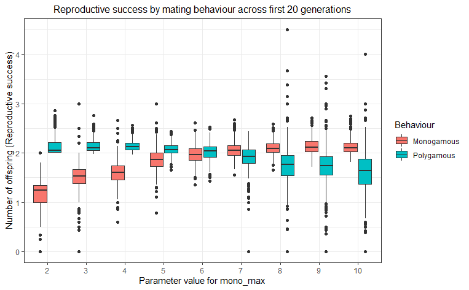
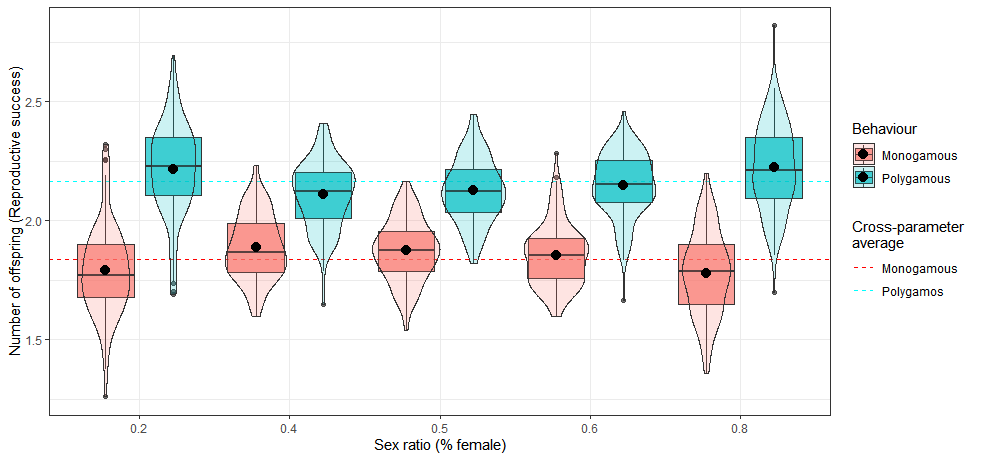

\newpage{}

<center>

# Abstract {.unnumbered}

</center>

<center>

The evolution of human mating and marriage system is one of the most discussed topics in the evolutionary study of kinship [@fortunato2015]. While sexual selection theory (SST) traditionally stresses the role of innate sex differences in shaping mating preferences, and by extension marriage systems, along the lines of a fundamental dichotomy between "coy females" and "ardent males" [@borgerhoffmulder2021], recent advances instead focus on the role of wider demographic factors, like the adult sex ratio (ASR), in determining the dynamics of sex roles within variable mating systems [@kokko2008]. Applied to marriage system evolution, this predicts that biased sex ratios should favour the evolution of monogamy, but empirical evidence for this causal relationship has hitherto been mixed [@minocher2019a].

</center>

 

<center>

Combining this focus on the causal role of sex ratios with a novel approach to modelling marriage system evolution through gene-culture coevolution [@laland2017a], here I construct a proof-of-concept agent-based model. Derived from sexual selection and cultural evolutionary theory, I use it to formally model the influence of sex ratio biases on emergent patterns of marriage and mating traits. Contrary to other formal models in the literature, but in accordance with some empirical approaches, our model indicates no influence of sex ratio on marriage system evolution, and no increased tendency towards monogamy. I discuss this null result in the context of similar work and illustrate what can be learned from the proposal model's failure to replicate some established patterns for its further development.

</center>

\newpage{}

\tableofcontents

\newpage{}

\listoffigures

\listoftables

\newpage{}

# Introduction and literature review

Marriage is a ubiquitous, and likely evolutionarily ancient, institutional element of human kinship systems that organises romantic and reproductive relationships into socially-recognised familial units [@murdock1949; @chapais2008]. Such marriage customs and norms also exhibit remarkable cross-cultural diversity [@murdock1967], which has been a focal point of interest for anthropology since its inception [@tylor1889]. This mix of universality and diversity means that while marriage affects almost everyone, it is bound to affect individuals in distinct ways, often through deeply influential constraints and moral imperatives [@fox1983]. But despite its profound social impact, the origins and evolutionary history of this diversity remain obscured. As evolutionary anthropologists, we may be tempted to extend principles derived from the vast biological literature on the diversity of cross-specific mating systems to the evolution of human pair-bonding [@clutton-brock1989a]. However, a straightforward application has eluded scientific consensus for reasons this dissertation aims to illuminate.

 

But first, it is useful to make some general definitions. Broadly speaking, "mating system" refers to the way in which a species' sexual and reproductive behaviour is structured, often primarily referring to the *number* of sexual partners an individual entertains within a certain time period [@kokko2014]. They generally divide into two structures - monogamy, referring to one-to-one pairings, or polygamy, mate-clusters including multiple partners. "Polygamy" includes polygyny (one male with multiple female partners), polyandry (one female with multiple male partners) or polygynandry [clusters of multiple male and female partners; Shuster & Wade -@shuster2003]. Confoundingly, these descriptions can be applied either to single mating cycles or an individual's lifetime - accordingly, some species may be seasonally monogamous, but polygamous over their lifetime [@moore2009].

 

Even within this framework, the human mating system is challenging to pin down. Firstly, defining a "species-typical" mating arrangement for humans is difficult: While mating behaviours in most vertebrate species can reasonably be characterised through a single system (differences between "genetic" and "social" mating systems notwithstanding; Gowaty [-@gowaty1996]), human mating arrangements show considerable diversity [@low2007]. In their landmark classification of 186 distinct human cultures from the ethnographic record in the Standard Cross-Cultural Sample (SCCS), @murdock1969 code 17% of recorded societies as monogamous, with the other 83% sanctioning some type of polygamy (predominantly polygyny). However, because many of the latter represent small-scale, pre-industrial societies, in *absolute* numbers, most humans live in institutionally monogamous cultures, complicating any attempt to derive a human-typical mating pattern [@brown2009]. Secondly, we may be unable to assume close correspondence between human mating systems and marriage systems [@fortunato2015]. Mating systems are, fundamentally, patterns of behaviour; descriptive rather than normative. Conversely, marriage systems are normative sets of rules that legitimise, govern, and often restrict, rather than merely describe, sexual and reproductive behaviour (especially concurrent spouses), including ancillary behaviours like parental obligations and inheritance [@fortunato2015].

 

As such, *marriage* systems only accurately reflect *mating* systems where these rules are strictly adhered to and no extra-marital reproductive behaviour occurs - an unrealistic assumption for a wide range of human societies [@blow2005; @walker2010]. Additionally, many marriage systems only sanction normative behaviour at given points in time (e.g. concurrent spouses), rather than across an individual's lifespan. As such, even in "monogamous" societies, divorce and remarriage may lead to overall mating patterns that are effectively polygamous, or "sequentially" monogamous [@borgerhoffmulder2009]. Conversely, in "polygamous" societies, monogamy may still be the predominant form of marriage [@marlowe2003], making those labels, at best, crude approximations of the underlying mating pattern. Finally, even "mating patterns" as defined by the actual pattern of sexual interaction within and outwith marital arrangements is detached from the genetic and reproductive level of mating systems, for example through contraceptive use [@oreilly2010]. In summary, the disconnect between human marriage systems and human mating systems is two-fold - marriage systems may not necessarily represent actual mating patterns (or capture all relevant sexual interactions), and sexual interactions may not actually reflect reproductive activities. Nevertheless, human evolutionary sciences habitually treat marriage systems as indicative of the dominant underlying mating strategies [@buss1993], possibly conflating culture and biology.

 

This dissertation attempts to reconcile insights into the evolution of both human mating (as a biological phenomenon) and marriage (as a cultural phenomenon) in a gene-culture coevolutionary framework. Building from basic principles, the following literature review critically examines the components of the traditional sexual selection paradigms that have dominated much of the evolutionary approach to human mating and marriage (section 1.1). Then, utilising contemporary theoretical approaches, it will narrow in on the hypothesised role of biased sex ratios as a demographic contingency for human marriage system evolution (section 1.2), subsequently embedding this approach within competing explanations (section 1.3). Finally, it considers how the dynamics of gene-culture coevolutionary models may alter the way we think about marriage system evolution (section 1.4), and synthesises the discussed approaches into a novel research proposal (section 1.5).

\newpage{}

## Sexual selection theory and human mating strategies

 

**The Darwin-Bateman paradigm.** Until a recent diversification of approaches, sexual selection theory asserted that sexually antagonistic selection may lead to a fundamental and near-universal dichotomy between "coy females" and "promiscuous males", characterised as the "Darwin-Bateman paradigm" [@borgerhoffmulder2021; @dewsbury2005]. Though rooted in @darwin1981 's early assertion that males across most animal species are more eager and less discriminate than females vis-a-vis reproduction, making them the primary target of sexual selection via intrasexual competition and female choice, the key evidence for this paradigm comes from Angus @bateman1948's famous drosophila experiments through three crucial findings: Firstly, males showed greater variability in both (1.) fertility or "reproductive success" (RS, measured through number of offspring) and (2.) mating success (MS, measured through the number of partners) than females. Finally, (3.) male RS increased linearly with number of mates - indicating males should strictly prefer more mating opportunities (i.e. promiscuity). Female RS, conversely, did not seem to benefit (as much) from additional mates. This relationship between "mating success" and "reproductive success" is referred to as Bateman's gradient (Figure 1), whose slope is often posited to be steeper for males than for females [@gerlach2012].

 

{width="252"}

These results, "Bateman's principles", seemingly offer an elegant explanation for sex differences in sexual selection that had eluded Darwin [@arnold1994; @janicke2016]. @bateman1948 explains his results by invoking anisogamy: Male gametes are comparatively small and metabolically inexpensive, making the number of matings the limiting factor of male RS, whereas female gametes are expensive and thus themselves constitute the limiting factor on female reproduction. This explanation was later extended upon by @trivers1972, who in his seminal chapter on parental investment argued that sex differences in post-zygotic parental investment (i.e. parental care) followed logically from anisogamy (i.e. pre-zygotic parental investment). Accordingly, as males and females therefore often necessarily differ in their parental investment, they ought to differ in their reproductive strategies, with the least invested sex being more promiscuous [@trivers1972]. Simply put, their relatively small obligate parental investment affords males with a higher potential reproductive rate, which should bias them toward promiscuous mating [@clutton-brock1991]. The Darwin-Bateman paradigm, or derivations thereof, remains the basis of much sexual-selection research in non-human animals [@arnold1994; @clutton-brock2019].

 

@bateman1948 himself only tangentially alludes to generalising his results to humans, though seemed convinced they extend to any anisogamous species. Similarly, while @trivers1972 more explicitly applies his parental investment principles to humans, he, too, takes a broad, cross-specific view of the subject overall. Nevertheless, Trivers' treatment of Bateman's ideas pervades the evolutionary study of (human) behaviour, from @wilson1975's *Sociobiology*, to subsequent early work by evolutionary psychologists focused on mating behaviour [e.g. @buss1989]. @buss1993's seminal work on sex differences in human mating strategies explicitly aligns with Trivers, arguing that aforementioned innate parental investment differences are a fundamental evolutionary driver in human male preferences for promiscuous (short-term) mating with multiple partners. Indeed, substantial evidence for such consistent sex-differences in reproductive strategies has accumulated across geographies [e.g. @souza2016] and methodologies [e.g. @thomas2020], summarised as the "males compete/females choose" (MCFC) model. Accordingly, sexual selection theory-derived research on evolved human mating strategies continues to be prolific [@buss2019], albeit contentious [@stewart-williams2013; @eagly1999].

 

Bateman's principles have also been empirically tested in human populations [@betzig2012]. The sex differences in RS variance here are often associated with the cultural practice of polygyny, which allows for large RS differentials among males via varying number of partners [@low1988]. Despite significant challenges to compiling data on reproductive success in the absence of comprehensive paternity testing, anthropologists and demographers have collected a wealth of cross-cultural data on reproductive success by sex [@betzig2012; @brown2009]. On the matter of Bateman's principles, @brown2009 report that despite good evidence that RS is more variable in males than females overall across multiple datasets, this difference is neither universal nor constant. For example, among the Meriam people of Australia, RS variance in women is twice as high as in men, running directly counter to Bateman's first principle [@smith2003]. Similarly, @brown2009 contend that, contrary to some widely-held assumptions, the widespread practice of polygyny does not necessarily indicate greater variation in mating success (Bateman's second principle) among males than females. Nevertheless, the Darwin-Bateman paradigm has certainly been a dominant and driving theoretical narrative in the evolutionary investigation of human sex roles across various adjacent disciplines, and, as I will explore in later sections, forms the basis of many evolutionary approaches to human marriage systems as well.


**Recent critiques and a new sexual selection paradigms.** However, advances across multiple disciplines cast doubt on the clear applicability of Bateman's principles to humans and imply that the coy female-ardent male dichotomy requires substantial additional nuance. These critiques generally span three categories - theoretical advancements in parental investment and sexual selection theory, empirical critiques of Bateman and Triver's original work, and methodological difficulties in applying Bateman's principles to humans specifically. I will discuss each in turn.

 

Firstly, the factors influencing strength and direction of sexual selection have been subject to recent theoretical revisions. @kokko2008 question two key features of Trivers' reasoning on sex role divergence, labelled the "female" and "male" argument, respectively. The female argument relates to the poorly substantiated link between pre-zygotic investment (anisogamy) and post-zygotic parental care. As the obligate cost of anisogamy is unrecoverable, evolution should favour the care decision with the highest *future* payoff, irrespective of pre-zygotic investment [@dawkins1976a]. It is not immediately obvious why females' future payoff from parental care should be higher than males', and how past investment affects the cost-benefit of future care is uncertain [@kokko2008]. The "male argument" describes the idea that intrasexual competition leads to higher male time investment in competition rather than care. @fromhage2005, however, have suggested that strong male-male competition may actually favour monogamous mating, by necessity, if costs of competition and mate-search are high. It is clearly worth considering under what circumstances the marginal benefit of care outstrips the marginal benefit of competition, thus favouring male parental care [@kokko2008]. Overall, @kokko2008 question the straightforward relationship between anisogamy and choosiness/promiscuity introduced by Trivers. In related work, theoretical modelling indicates that rather than anisogamy alone, sex-specific mortality costs of caring and mate searching, mate encounter rate, variation in mate quality, and the operational sex ratio all seem to be important parameters in determining the strength and direction of sexual selection, and the associated choosiness it engenders in either sex [@kokko2001]. Notably, anisogamy may well factor into some of these elements, but the exact mechanisms by which it does requires a nuanced understanding of all implicated parameters. Thus, broadly, these models seek to extend and refine rather than replace existing models of sexual selection and parental investment.

 

There have also been specific empirical challenges to Bateman's principles, via re-examination of his original experiments and their conceptual replication across taxa. Multiple scholars have extensively criticised Bateman's experimental design and procedure, including sample size and statistical technique [@tang-martinez2005]. A full-scale replication of Bateman's experiments reveals flaws in Bateman's measurement of mating and reproductive success, both of which are crucial to the formulation of his principles [@gowaty2012]. A more conceptual challenge to the Darwin-Bateman paradigm is the repeated evidence of multiple female matings and polyandry across multiple taxa including primates [@newcomer1999; @drea2005]. Extensive empirical work has also demonstrated ample female benefits to polyandry, countering some of Bateman's conclusions [@slatyer2012; but see @akcay2007]. Additionally, even evolutionary biologists who advocate for the usefulness and general validity of Bateman's principles recognise that sexual selection may strongly target females, and that *male* mate choice can play a significant evolutionary role [@clutton-brock2013; @janicke2016]. The issue remains, however, that much of this nuance is often lost in discussions of Bateman's principles outside of evolutionary biology [e.g. the evolutionary psychology approaches discussed above; Borgerhoff Mulder -@borgerhoffmulder2021]. Overall, these empirical challenges tend to coalesce into one suggestion; that the Darwin-Bateman paradigm ought to be carefully assessed species-by-species, rather than applied indiscriminately to the entirety of biology [@tang-martinez2016].


But even among humans specifically, application of Bateman's principles is complicated. @hrdy1981 in particular has delivered substantial challenges to the uncritical application of static, Bateman-derived sex roles in human and non-human primates, discussing extensive evidence for polyandrous mating in primates, including barbary macaques, baboons and langurs [@hrdy1986]. Clearly, Bateman's principles within human populations, too, are subject to numerous interacting factors discussed in the theoretical approaches above, rendering monolithic mating strategies along sex lines in humans counter-intuitive - as exemplified by the diversity of human mating systems, norms and practices [@fortunato2015]. Nevertheless, prevalence of culturally sanctioned polygyny [@murdock1967], has been interpreted as evidence for the general validity of Bateman-derived sex roles in humans, as it seems to codify male promiscuity and directly lead to higher variance of male reproductive success (Bateman's second principle) by unequally distributing mating opportunities among men [@schmitt2005]. Some researchers caution against using this unsophisticated analogy [@brown2009; @smiler2011]. For example, both monogamous and polygynous societies may be marked by "serial monogamy" (i.e. remarriage or re-partnering), dissolving the relationship between marriage systems and actual mating patterns [@fortunato2015], and leadinh to the emergence of female mating behaviour *favouring* multiple partners [@borgerhoffmulder2009]. Overall, a coy female-ardent male dichotomy does not unambiguously derive from these patterns [@brown2009].

 

These critiques ought not to be interpreted as entirely invalidating Bateman's contributions or his eponymous principles *per se* [@morimoto2020]. It would be counterproductive to dismiss an entire body of well-evidenced associated research [@wade2005; @janicke2016]. But they do draw attention to the fact that Bateman's principles have both been fuelled by, and have fuelled, out-dated preconception about traditional sex roles and behaviours, especially when applied to humans [@knight2002] - that is to say, normative *a priori* assumptions about how females and males *should* behave. Arguably, such imposition of social stereotypes on biological principles and vice versa impedes nuanced scientific understanding. Instead, a research approach based on a careful re-examination of the Darwin-Bateman paradigm could amplify and extend our understanding of the evolution of sex roles and mating strategies in a way that an over-reliance on Trivers' arguments would not. Part of the purpose of this dissertation is to use recent theoretical advances in sexual selection theory to refine our understanding of the evolution of human mating and marriage systems. One key factor identified in these advances is the impact of sex ratios, which I now turn to.

 

## Sex ratio theory: principles and applications

 

**Basic tenets of sex ratio theory.** The causes, consequences, and evolution of sex ratio (hereafter SR) patterns across species has been debated throughout scientific history [@darwin1981; @dusing1884]. @fisher1930's provides a founding mathematical treatment of the topic, eponymously named Fisher's principle (see Appendix A): Assuming random Mendelian segregation, he derives that the SR at birth (SRB) should converge toward an even 1:1 split in sexually-reproducing species, because any biased SR will lead to a relative reproductive advantage for the rarer sex. Negative frequency-dependant selection then equalises the SR until equilibrium is achieved. Notably, however, this represents a null-model that species may be expected to deviate from [@west2009]. Fisher's theory usually refers to the SR at birth (SRB; Graffelman & Hoekstra, [-@graffelman2000]], but in reality, population SRs tends to vary throughout an organism's lifecycle, and meaningful differences in the SR often emerge at conception (SRC), at birth and in adulthood [ASR; Székely et al. -@szekely2014].

 

However, in the context of mating markets, these population level ratios may be misleading because not all (even sexually mature) individuals are always going to be mate-searching. Instead, the operational sex ratio (OSR) captures only sexually receptive individuals and dynamically responds to individuals entering and leaving the mating market (e.g. to enter monogamous pair bonds, etc.) - as such, it tends to oscillate over time [@delgiudice2012]. In sexual selection theory, the OSR was identified shortly after Trivers as an additional determinant of sex role divergence, with the argument that whichever sex the OSR is biased toward would experience higher intrasexual mate-competition and stronger sexual selection [@emlen1977a; @kvarnemo1996]. @emlen1977a relate the OSR directly to mate monopolisability, arguing that a male-biased OSR is an indication of *male* ability to monopolise mates (e.g. through polygyny). This approach also suggests that a male-biased SR leads to less investment in parental care and weaker pair bonds, as males invest in mate competition instead [@schacht2017c]. The empirical record offers no clear endorsement of such a relationship [@ims1988; @weir2011], and theoreticians have moved away from the OSR as a strong predictor of sexual selection and mate monopolisation [@klug2010; @shuster2009]. If anything, it appears that adding more members of the mate-limited sex would make it harder to obtain multiple mates, leading to a investment in guarding existing mates instead [@fromhage2005]. Given this conceptual difficulty, any work that aims to understand the evolution of mating system must look beyond biased OSRs alone to explain variation in mating behaviours [@kokko2001; @kokko2003].

 

Recent work instead highlights the role of the ASR in determining reproductive strategies [@kappeler2017]. Generally, the ASR and OSR are of course closely related, especially at the start of a given mating period [@jennions2017b]. But ASR and OSR often display starkly different temporal patterns in wild populations, where the OSR tends to fluctuate more strongly due to fast-moving mating markets [@10.1093/beheco/arw183]. The ASR, conversely, is directly determined by comparatively slower-changing demographic factors that only indirectly affect the OSR, like sex- or activity-specific mortality costs, and consequently their overall patterns may diverge [@kokko2008]. Interestingly, the OSR is simultaneously cause *and* consequence of mating systems, whereas the ASR is primarily an external cause. Also, ASR can vary substantially throughout the animal kingdom - tendentially, for instance, birds have male-biased and mammals female-biased ASRs [@donald2007]. Exploring the causal role of ASR variation in mating system formation, recent theoretical biology work revises some of the earlier predictions regarding the effects of SR imbalances; rather than increasing the competition for mates in the more abundant sex, a biased SR (either OSR or ASR) may reduce the fitness benefit derived from competing for additional mates relative to mate-guarding or parental care. In short, if the cost of competing is high, individuals may forego additional mating entirely and adopt "cheaper" ways of increasing one's fitness instead [@kokko2008; @fromhage2008]. These models have found support from empirical and theoretical work highlighting that male-biased ASRs can indeed be predictive of higher male parental care and monogamy, or even polyandry, across and within species [@fromhage2005; @liker2013; @karlsson2010], or entirely reverse sex roles in particular species [@fritzsche2016]. But can these insights be transferred to the study of human mating systems?

{width="500"}

 

**ASR causes and consequences in humans.** Overall, and across many geographies, the human SR at birth (SRB) lies somewhere around 105 or 106 males to 100 females [@owidgenderratio]. However, this ratio reaches parity in sexually mature age ranges, and finally reverses in post-reproductive populations due to higher male adult mortality [@wisser2014]. Despite these general patterns, however, SRs vary remarkably across geographies (see Figure 2), history and the human lifespan [@hollingshaus2019]. To understand this, we can employ the same set of tools that behavioural ecologists use to investigate causal patterns of ASR variation across species [@veran2009; @kappeler2017a] - namely the SRB, sex-specific mortality rates (both juvenile and adult) and sex-specific migratory patterns [@szekely2014]. In a comprehensive review, @orzack2015 show that while the human SR at conception is even, higher female than male fetal mortality leads to the male-biased SRB detailed above. However, evidence suggests that the SRB can be influenced by environmental factors spanning from the physiological, e.g. hormone-induced male fetal loss [@james2017a], to cultural practices like sex-selective abortions [@zhou2012; @qayyum2017], which induce geographical variation in SRB patterns. Similarly, sex-specific child mortality rates vary cross-culturally [@kishor1993], and may be influenced by cultural gender equality norms and associated practices like female infanticide [@iqbal2018]. Adult sex-specific mortality, studied by demographers as the "gender mortality gap", showcases significant cross-cultural variation partly predicted by differences in health behaviours and their respective cultural relevance [@rochelle2015], or forms of intergroup-conflict which disproportionately affect and involve men [@ember1974]. Finally, archeological and genetics research reveal evidence for evolutionarily ancient sex-specific human migratory patterns [@bentley2012; @hammer2008], mirroring contemporary sex-specific trends for example in labour migration [@sharpe2001]. Overall, the ways in which this causal mosaic interacts with cultural practices, as demonstrated in some of these cases, may give rise to significant geographical variation in ASR patterns. If the ASR is itself causally related to the evolution of certain cultural practices like marriage norms, this indicates an interesting reciprocal relationship between demography and culture.

 

The consequences of the adult SR in humans has interested social scientist for a long time. In his early formulation of marriage market economics, @becker1973 reasoned that SR imbalances influence the bargaining powers of either sex in the marriage market and determine how the "output" of a marriage is divided between the partners, with the rarer sex commanding a larger share and better chances in the marriage market. He also argues that an imbalanced SR is one of the few circumstances that could lead to polygamous marriage, as he generally considers monogamous unions more economically efficient [but see @gould2008]. Within economics, Becker's approach has proven enduring and even finds support in more recent empirical economic analyses [@angrist2002; @chiappori2020]. Adjacently, sociologists @guttentag1983 wrote broadly on the effects of an imbalanced SR, examining predominantly how ASR variations across time have affected the perceived value of women. Though from a different methodological tradition than Becker, their conclusions read similar: The rarer sex enjoys relatively more "dyadic" power, which is expressed in male promiscuity in the case of a female-biased SR, and increased male devotion to family in male-biased populations. This is referred to as "social exchange theory" [@stone2019]. Crucially, however, traditional sex roles and structural differences between male and female power are not endogenous to this approach -- instead this theory specifically presupposes patriarchal power structures and innate "mating strategies" which interact with, but do not arise from, SR patterns. Finally, anthropologists have argued that SR imbalances may cause the adoption of certain marriage norms like polygyny [@carneiro1967]. Early empirical work indicated that in a random sample drawn from the Ethnographic Atlas, polygynous societies indeed show a more female-biased SR (associated here with high male mortality from warfare; Ember [-@ember1974]). More recently, a female-biased ASR was found to be associated with lower male investment in mating effort among the Makushi of southern Guyana [@schacht2015], reflecting the predictions from recent parental investment theory [@kokko2008]. Overall, despite their different methodological traditions, approaches from economics, sociology and anthropology seem to reflect a common theme; sex ratio imbalances should change individual behaviours in line with the preferences of the rarer sex.

 

But how does that relate to marriage? Broader empirical approaches have extended this theoretical work and focused on whether SR predicts the strength of pair bonding across societies. For example, a common prediction is that more male-biased SRs (hereafter "higher SRs", as SRs are often expressed as the number of males to females) will predict higher marriage rates, because they disincentivise short-term mating in males [@schacht2015]. As such, marriage rates are commonly interpreted as individuals foregoing quasi-polygamous mating in favour of stable monogamous pair-bonds. Cross-cultural empirical analysis across numerous samples has shown that the marriage rate tends to be higher in more male-biased populations [@angrist2002; @brainerd2017; @south1988; @trovato1988]. Yet in some population with unusually high SRs, this pattern can be reversed in males through "marriage squeeze" on excess males, technically lowering the male marriage rate as many men are failing to secure marriages [e.g. @guilmoto2011]. Crucially, such marriage squeezes can affect both sexes, depending on the SR [@jones2006].

 

However, work on marriage often focuses on large-scale, monogamous societies. Anthropological work on small-scale societies has instead focused on "divorce rates" as an empirical proxy for strength of pair-bonds. Notably, @blurtonjones2000 found that in a hunter-gatherer sample including Hadza, !Kung, Ache and Hiwi populations, a lower SR was associated with higher divorce rates, and thus weaker pair bonds. Other larger scale cross-cultural analyses also associate high SRs with lower divorce rates [@south1988; @trent1989]. However, the effects here are less one-dimensional than it may appear: @south1995 found that divorce rates actually increase when SRs deviate *either way* from the overall population mean -- meaning that pair bonds appear to weaken both in the presence of a relative male *and* female SR bias. The possibility of sex-symmetrical effects of SR reflects contemporary biological SR theory and is an important consideration for the present research.

 

Finally, evidence suggests SRs may impact the dynamics of sexual selection by influencing mate choice. According to @emlen1977a, the rarer sex can afford to be "choosier" and thus steers sexual selection. Much of the empirical literature on this effect of SR biases has focused on the ability of women to choose wealthier and more educated men in male-biased populations [e.g. @pollet2008]. This may reflect an opportunity for women to select better "male provisioning" by choosing partners with high earning potential. Additionally, work on mate preferences, grounded in evolutionary psychology, reveals that female preference for "chastity" was positively correlated to SR, meaning that women seemed to put increasing emphasis on monogamous mating in high SR environments [@stone2007; but see @todd2007]. Though far from definitive, these findings reveals a mechanism by which monogamous mating may be sexually selected for.

 

**Computational modelling.** This empirical literature on the effects of SR is complemented by a small set of human evolution-focused mathematical modelling studies that integrate empirically-derived intuitions with the theoretical approaches detailed above [e.g. @kokko2008]. @schacht2016a investigate how partner scarcity affects male mating strategies using an individual-based recursive model, finding that a male-biased SR shifts the optimal strategy towards mate guarding of existing partners, thus favouring the evolution of monogamy within those systems [see also @loo2017]. @gomes2018 construct an agent-based model of mating system evolution in which male-biased populations tend towards monogamy, but only if efficient mate guarding is possible. Mirroring the empirical literature, these models suggests that ASR may be a causal factor in mate system evolution, favouring the adoption of monogamous over promiscuous strategies (especially in male-biased populations). But they make simplifying assumption regarding the propagation of mating strategies, often assuming they are purely genetically inherited [e.g. @gomes2018]. Regarding humans, this may belie a more complex reality, where genetic and cultural inheritance, both of which may factor into mating strategies, interact in complex ways [@richerson2005, see also section 1.4]. Modelling approaches to human mating which do take this co-evolutionary dynamic into account tend to focus on the evolution of aspects of mating strategies, like incest avoidance [@aoki1997] or partible paternity beliefs [@mesoudi2007], rather than the evolution of monogamous behaviour generally. Sometimes these models do include SRs as an explanatory parameter; @mesoudi2007 's results suggest that within their agent-based model, biased SR imbalances in either direction favour the evolution of monogamy. But still, none of them allow for mating strategies to be co-determined by evolved genetic and cultural factors. But should they? I will discuss the implications of gene-culture coevolutionary models in section 1.4. First, however, I will further embed this work on the influence of SRs in the field of competing theories regarding the evolution of marriage systems.

 

## Explanations for marriage patterns in humans

 

The evolution of human marriage and mating systems continues to draw extensive scientific interest [@schacht2019]. Particularly, considering the relative rarity of monogamy among mammals [@clutton-brock1989a] and even many human societies [@murdock1969], monogamy is often considered a fundamentally counter-intuitive mating pattern, labelled a "paradox" or "puzzle" [@carter2018; @henrich2012]. That implies a widely-held understanding that monogamy represents a deviation from polygamous, or rather polygynous, baseline patterns [@low2007]. Accordingly, though others have argued that human life history constraints, especially the extended dependence of offspring on parental care, may fundamentally favour monogamy [@kaplan2000; but see @hrdy2009], most approaches have focused on determining under what circumstances monogamy may arise from polygamous systems [@chapais2013; reviewed in @fortunato2015]. In fact, both evidence from the mating systems of extant non-human primates and phylogenetic analyses suggests that *some form* of polygamy likely represents the ancestral mating system for the genus Homo [@opie2012; @chapais2011], though comparative inference is complicated as mating systems in great apes vary substantially both within and between groups [@grueter2012]. Regardless, even constricting the time horizon to more recent evolutionary history (i.e. the last 100k years), it has been suggested that the last common ancestor of all extant human populations had at least moderate levels of polygamy [@minocher2019a]. There are several important nuances to these findings. For one, they also suggest that the evolution of marriage systems is *not* unidrectional - some extant population may exhibit stronger polygamous tendencies than ancestral populations and vice versa. Similarly, they should not be taken to imply that monogamy necessarily co-emerges with features of "modern" or "complex" societies (e.g. democracy, etc.), as has been suggested elsewhere [@blumberg1972; @enke2018]. Monogamy in Eurasia, for example, appears to precede these features substantially [@fortunato2011]. More fundamentally, this "polygyny baseline" idea effectively directly derives from the Darwin-Bateman paradigm, and is subject to similar criticisms and revisions [@fortunato2015].

 

Overall, bidirectional evolutionary transitions have likely shaped different marriage patterns across cultures and geographies -- but what factors influence these changes remains a topic of debate. I will now briefly recount the key approaches, honing in on sex ratio (SR) theory [see also @fortunato2015 and @minocher2019a for reviews]. The polygyny threshold model draws from extended behavioural ecology in predicting that polygyny may be the result of female mate choice of wealthier males in environments where resources are distributed unequally [@orians1969; @verner1966]. The underlying idea is that there may be a high enough net fitness benefit to women being polygynously married to wealthy partners (i.e. becoming additional wives), when the monogamous alternatives are comparatively resource-poor [@borgerhoffmulder1990; @sellen2004]. "Resources" here can extended beyond material or physical wealth to include social capital or even genetic qualities that protect offspring against prevalent diseases [@chaudhary2015; @low1990].

 

However, recent empirical analysis suggests that physical resource inequality is actually predictive of macro-level trends towards *monogamy* rather than polygyny, refuting the model's central prediction [@ross2018]. This dovetails an alternative explanation, which instead emphasises the role of inheritance of "rival wealth", resources that have to be divided among offspring [@oh2017]. Where such resource partitioning leads to reduced fitness for the inheritors, evolution may favour monogamous arrangements which effectively funnel resources across generations instead of dividing them between potential heirs from multiple wives [@fortunato2010]. Forms of rival wealth, like land, become more important in agricultural production systems, which are in turn often marked by higher inequality (e.g. when compared tohorticulturalist systems), thus offering an explanation for the association between higher inequality and monogamy [@ross2018; @mattison2016].

 

Where polygyny threshold models primarily invoke the role of female choice, harem-defense or mate-guarding approaches to polygyny tend to instead emphasise the role of male coercion and direct male mating competition in enforcing polygynous marriage systems [@chisholm1991; @marlowe2000]. Some evidence suggests that polygyny is associated with heightened level of male intrasexual violence [@carter2018b] and partner-directed violence [@ahinkorah2021], with the latter posited to represent a direct form of physical coercion. However, intimate partner violence in humans can and should not be unduly reduced to a mate guarding strategy [e.g. @wilson2009], and the link between polygyny and increased level of intrasexual violence in men is inconsistent [@schacht2014].

 

Using similar evidence of links between violence and polygyny, cultural group selection theory invokes the role of monogamy in limiting intragroup conflict for mates [@henrich2012]. Early versions of this argument posited that "socially imposed" monogamy served to preserve group cohesion, typically in democratic societies, by equalising reproductive capabilities [@alexander1979; @alexander1987]. Recently, this logic has been extended in the context of cultural group selection, where adopting monogamy lets cultural groups redirect resources from intra-group mating competition to intragroup cooperation, allowing for higher success in intergroup competition [@henrich2012; @handley2020]. However, cultural group selection theory remains controversial [see commentaries on @richerson2016], and the central underlying mechanism -- that monogamy is conducive to intragroup cooperation -- remains empirically untested.

Finally, the market force polygyny approach employs the "biological markets"-derived relationship between SR and mating systems discussed in section 1.3 and applies it specifically to the formation of marriage systems [@noe1994]. Contrary to other theories which tend to emphasise either female choice or male coercion, this approach assumes that marriage system formation is subject to mutual choice of both sexes under SR-derived bargaining constraints. For example, @pollet2009 show that increased prevalence of polygyny across localities in Uganda is associated with a female-biased SR, and @ember1974 observe a similar pattern across cultures drawn from the Ethnographic Atlas. However, the market-driven approach to the evolution of polygyny is subject to both empirical and conceptual challenges. @quinlan2007 fail to find a meaningful relationship between SR and polygyny in the Standard Cross-Cultural Sample (SCCS), while @ember2007 find it only in non-state societies (reflecting cultural group selection ideas that larger institutions may inhibit biological markets). @minocher2019a find no evidence for an influence on SR on marriage system formation across the SCCS accounting for cultural relatedness. 

 

Generally, however, while evidence of these cross-sectional studies, both for and against the theory, may reveal "still image" patterns of correspondence between SR and marriage system, they only allow for limited inference about the dynamic evolutionary process that may link the two. The Fisher principle limits the potential for SR imbalances to persists over long evolutionary timespans, but prolonged shocks to the SR, for example via war, disease, migration or sex-specific mortality [e.g. @plumper2006], may yet influence marriage systems along the lines of biological markets theory. For example, temporary imbalances may lead to the formation and cultural evolution of marriage specific social norms that constrain behaviour for many generations via cultural inheritance [@richerson2005]. Indeed, evidence suggests that in Australia, historical SR imbalances have had a long-term influence on certain cultural traits like attitudes towards gender roles [@grosjean2019]. Combining this cultural evolutionist intuition with the logic of the biological market theory of marriage may further illuminate ways in which sex ratio influences marriage systems.

 

## Gene-culture coevolution

 

Given the common conflation of the evolution of human mating, as a biological disposition, with the evolution of cultural marriage norms, this process may be most effectively modelled as a gene-culture coevolutionary (GCC) process. GCC theory posits that genes and cultures are two separate inheritance mechanisms which generate phenotypic change across time [@aoki2001; @richerson2010a]. Crucially, this assumes that culture, broadly defined as socially transmitted (read: socially learned) information, and cultural change can be modelled using an evolutionary framework, even if the mechanisms of this cultural evolution are not perfectly analogous to its biological counterparts [@richerson2005]. A key prediction of GCC theory is that these processes not only run in parallel, but that they interact (see Figure 3): Genetic propensities and biological predisposition (e.g. learning mechanisms) may shape the way cultural information is acquired and transmitted, but conversely, cultural practices may modify the selection pressures through which natural selection affects the human genome [@laland2017a]. For a long time, such interactions were primarily the concern of theoreticians [e.g. @gintis2003], but empirical evidence is mounting which suggests that GCC has indeed shaped the evolution of phenomena like lactase persistence [@gerbault2011] and sickle-cell traits [discussed in @obrien2012]. \newpage{}


To assess whether this approach offers a strong framework for understanding marriage system evolution, two questions need to be answered: Do marriage systems rely on both genetic and cultural factors that can plausibly interact? And does the application of this approach possibly offer novel insights?

 

It is a relatively light assumption that human mating strategies and marriage systems are shaped by both genetic and cultural influences. Indeed, the role of genetic mating preference traits is routinely assumed in evolutionary models of human mating systems [@mesoudi2007; @gomes2018a], and evidence suggests that heritable variation in genes regulating vasopressin and oxytocin pathways play a significant role in shaping affiliative, including romantic, behaviour in both sexes [@monin2019; @walum2012], reflecting convergent evidence on the neurological underpinnings of human attachment [@feldman2017]. Overall, there appears to be increasingly good evidence that genetic factors play a role in human romantic attachment, issues with behavioural genetic research notwithstanding [@abdellaoui2021]. Through its possible impact on mating behaviour (e.g. fidelity), these genes may underscore biological dispositions toward monogamy or polygamy. Perhaps less controversial is the idea that marriage systems are also determined by culturally transmitted traits. As noted above, marriage systems show considerable cultural variability, and the divergent cultural evolution of social institutions, plausibly including rule systems that regulate marriage and reproduction, is well-conceptualised [@bowles2004; @boyd2008]. Consequently, evolutionary anthropologists routinely treat marriage norms as cultural traits [@mace2005a; @lipatov2011]. Additionally, it is possible to conceive beliefs concerning monogamy and polygamy fundamentally as cooperation-like norms, perhaps representing moral concern over "fair" mating arrangements [@henrich2012]. This interpretation allows for an interesting analogy as the coevolutionary dynamics of cooperation are similarly posited to include both genetic (innate prosocial proclivities) and cultural (norms and rules regulating interactions) factors that scaffold each other [@boyd2009; @lindenfors2017].

 

But what scientific novelty does a co-evolutionary approach offer? Primarily, cultural evolution differs from genetic evolution in ways that may have interesting implications for the evolution of marriage systems. While biological evolution relies fundamentally on vertical transmission of traits [i.e. from parent to offspring; Mayr -@mayr1982], cultural traits can theoretically be acquired from any other individual, including peers (via horizontal transmission) and non-parental individuals from the parent generation [via oblique transmission; Cavalli-Sforza & Feldman -@cavalli-sforza1981]. In reference to marriage system evolution, this means that cultural mating preferences are not necessarily propagated via sexual reproduction, as is the case with genetic traits, but can be acquired from non-reproductive individuals who serve as "cultural parents" [e.g. @enquist2010], weakening the link between reproductive success and associated cultural marriage norms (biological mating preference traits would still be tied to reproductive success). This is especially relevant because polygamy (over monogamy) is routinely, if not always, associated with higher reproductive success, particularly in men [@gibson2007], favouring the propagation of polygamous traits in exclusively genetic inheritance scenarios. Similarly, cultural inheritance may not only be subject to different inheritance pathways, but also different modes of (cultural) selection which affect the frequency of socially acquired cultural traits within populations, variably described as social learning strategies or transmission biases [@laland2004; @mesoudi2011].

 

One such transmission bias is conformist bias, describing the tendency to preferentially acquire cultural traits held by the majority of the population [@denton2020]. Like non-vertical transmission, conformist bias also has interesting implication for the transmission of marriage preference. For example, the viability of polygamy is bound to depend both on the number of available partners (captured through the sex ratio) and the number of existing same-sex rivals, with rival "polygamists" posing a larger potential risk to reproductive success than rival "monogamists" (as the former threaten to monopolise more mates). Indeed, evolutionary biologists often invoke this kind of negative frequency-dependence (certain mating strategies perform better if they are relative rare) to explain the maintenance of concurrent alternative reproductive strategies within taxa [@shuster2010]. Consequently, the frequency of mating strategies may oscillate around an evolutionarily stable equilibrium [@zamudio2000; @rios-cardenas2018]. We may expect to see a similar pattern in human mating strategies, but crucially, conformist bias introduces a unique element of positive frequency-dependence for cultural mating preferences. It is unclear how these counteracting forces would interact to shape marriage systems over time.

 

As a final benefit, a GCC approach allows us to reflect the basic insight that marriage practices and mating strategies are conceptually distinct [cf. @fortunato2015]. Individuals may hold a moral belief about either monogamy or polygamy being the "right" marriage practice, but be biologically predisposed to another, offering an alternative explanation for phenomena like the relative rarity of polygyny even in polygynous societies, or infidelity within strictly monogamous systems. This introduces a kind of continuous, or at least graded, phenotypic variation between the extremes of polygamy and monogamy.

## Summary and the present research

 

This literature review distills down into four key insights, which form the basis of this research proposal: (1.) contemporary sexual selection research has added a substantial amount of nuance to the Bateman-Trivers paradigm, especially as applied to humans, so new approaches to the study of marriage system evolution should accommodate flexible mating strategies across sexes, rather than relying on out-dated and rigid interpretations of traditional sex roles [@borgerhoffmulder2021]. (2.) one factor that has, across disciplines, been posited to have a strong influence on the dynamic of mating (and marriage) systems is the human sex ratio [@kokko2008]. Although the human sex ratio displays substantial cross-cultural variation and may therefore be an important differentiating environmental factor [@owidgenderratio], conceptual modelling work explicitly focused on the mechanisms through which the sex ratio may influence marriage system evolution remains comparatively sparse. (3.) despite multiple competing hypotheses, there is currently no dominant or unequivocal paradigm as to the causal factors underlying the diverse cross-cultural pattern of human marriage systems (i.e. monogamy and polygamy). Finally, (4.) among the modelling work in this domain, none has considered the evolution of marriage systems as an explicitly gene-culture coevolutionary dynamic which treats marriage norms and mating preferences as separate entities. Cultural evolution involves markedly different dynamics from biological evolution, through different transmission pathways and biases [@mesoudi2011], which may have profound impact on the evolution of cultural marriage norms and its feedback on biological mating preferences.

 

Accordingly, the purpose of the present research proposal is two-fold. The first overarching research aim is *conceptual model development*; I devise, from basic principles, and implement an agent-based modelling approach to investigating human marriage system evolution, accommodating both contemporary sexual selection and cultural evolutionary theory into a model that can be calibrated to test the influence of assumptions and mechanisms detailed in either framework. Ideally, this model would be open to be used by any interested party and could eventually be employed to test hypotheses across a wide range of topics regarding the evolution of human marriage systems, many of which have been detailed in section 1.3.

 

The second aim of the research is to test the mechanisms of the model by verifying its functionality, and then using it to explore one specific set of hypotheses. As reviewed above, sex ratio has emerged as a potentially influential factor in the evolution of marriage systems. More precisely, the rarer sex is predicted to have higher bargaining power in dynamic mating markets [@becker1973], which is posited to be a possible factor in the evolution toward monogamous mating [@klug2018]. Our hypothesis for the model tests that simple logic:

> *H~1~: Within the constraints of our agent-based model, a biased sex ratio in either direction will favour the evolution of monogamy because of negative frequency-dependent selection against strategies that attempt to monopolise multiple mates*

Following methodologies adapted from population genetics and cultural evolution, we will test this hypotheses by constructing artificial experiments within the agent-based model that allow us to observe *trait frequencies* (i.e. the proportion of individuals with a monogamy phenotype) of different simulated societies both across time (revealing the associated trajectory and disequilibrium patterns) and, cross-sectionally, at the end of each model run (revealing outcome frequencies, possibly at equilibrium). More precisely, we predict that:

> *H~2~: The average trait frequency of monogamy will be higher at the end of simulation runs with a biased sex ratio*

\newpage{}

# Methods

## Methodological approach

 

Evolutionary processes are fundamentally dynamic, concerning variable change over time. Attempts to derive the intricacies of these dynamic processes from the empirical record are often restricted by practical issues [@romanowska2021]. Indirect observation of past behaviours via artifacts is restricted by data availability and preservation biases [e.g. @gallo2021], whereas backwards inference about past behaviours from present populations needs to consider issues arising from equifinality of different behavioural patterns [@barrett2019]. Partly due to these constraints, mathematical modelling is commonplace across many behavioural sciences, including ethology, psychology, and cultural evolution [@goldstone2005; @henson2010; @cavalli-sforza1981]. Modelling allows researchers to formalise theoretical frameworks and test their hypotheses *in silico*, via simulation or mathematical derivation. This opens a direct window into a possible past, allowing us to investigate the roles and interactions of distinct causal mechanisms in the emergence of behavioural patterns [@romanowska2021].

 

Unlike verbal models which may entail considerable ambiguity, formal models obligate the explicit construction of the system of interest and its parts, specifying every design assumption [@smaldino2017]. However, this requires abstracting complicated processes into something computable, but often inevitably simpler; useful to formally test hypotheses, but to be extrapolated from with care [@servedio2014]. My model represents one such "proof-of-concept" or "toy" model. As a simplified representation of human mating and marriage systems, it allows explicit testing of the impact of certain parameters assumptions on their evolution. So far as the model adequately reflects existing evolutionary mechanisms, this offers insight into their real-world evolutionary history.

 

Specifically, I employ an agent-based model (ABM). Agent-based models simulate populations of discrete, autonomous individuals ("agents") whose behaviour is stochastically determined by sets of individual attributes and predetermined decision rules [@bonabeau2002], generally permitting for more influence of heterogeneity and stochasticity than alternative population-level modelling techniques, like differential equation modelling. ABMs allow us to disaggregate population-level phenomena, like frequency patterns of marriage norms, by observing the emergent, bottom-up processes of agent-to-agent interaction through which they arise. Given that evolution relies on heterogeneity as a founding principle [@mayr1982], this makes them particularly well-suited to the study of evolutionary processes [@deangelis2005]. My evolutionary agent-based model implements basic processes including cultural inheritance and sexual reproduction, to combine insights from models of both mating behaviour [@conroy-beam2021] and cultural evolution [@mesoudi2011]. We can thus observe what impact changing certain key parameters, namely the sex ratio, has on the evolutionary trajectory of mating and marriage system preferences, illustrating the broader potential of this technique within the constraints of a "research proposal"-style dissertation.

 

To capitalise on the considerable degree of transparency afforded by explicitly specifying every element of a model, ABMs must be examinable by a wide audience [@grimm2006]. Using natural language to describe formal models risks reintroducing ambiguity, but makes ABMs tractable to a non-technical readership and reproducible for peers [@muller2014]. Accordingly, I will describe the present model using the ODD + D (Overview, Design, Details plus Decision) protocol [@muller2013]. The ODD model describes ABMs through three eponymous segments, but focuses on explicit descriptions of all modelling decisions. I offer an abridged protocol in this section - for a full version see Appendix B.

## Model description

### Overview

**Purpose.** The model's purpose is to explore the role of individual-level genetic and cultural traits, as well as demographic constraints, in the evolution of human marriage systems. The model is primarily designed for scientists, with the aims of a.) testing hypotheses regarding the influence of sex ratio as a mating market constraint on the evolutionary process and b.) formulating a toy model which could be extended to examine the role of ancillary mechanisms, such as different social learning strategies.

 

**Entities, state variables, and scales.** The model simulates a population of 150 individuals, divided into four distinct types of human agents: female polygamists (FP), female monogamists (FM), male polygamists (MP) and male monogamists (MM). Each agent is characterised through four attributes, with two levels each: sex (male/female), cultural marriage preference (polygamy/monogamy), biological mating preference (polygamy/monogamy) and mating behaviour phenotype (polygamy/monogamy; see Figure 4). Behaviour phenotype determines mating strategy: Polygamists employ a "multiple matings" strategy; monogamists employ a "single mating" strategy (detailed below). The number of partners and offspring for each agent are recorded in the model as state variables. Several exogenous variables in the model serve as key parameters (see Appendix C), including the starting population ratios of sex, cultural marriage preference and biological mating preference, fixed parameters determining the continuous sex ratio of new generations, and the maximum number of offspring per mating encounter for monogamists and polygamists, respectively. For this toy model, and to balance inferential demands with computational constraints, each simulation is run over 500 timesteps, representing non-overlapping generations of agents.

 


**Process overview and scheduling.** In each timestep, all agents go through two sequential processes: mating and trait determination (see Figure 5). At the start of each mating process, the population of individuals becomes the mating pool for that given generation. Individuals are randomly drawn from this mating pool to engage in mate search. If mates are available, they are then matched with a member of the opposite sex to simulate a mating encounter. Each mating encounter then proceeds to reproduction and results in a randomly determined, but constrained, number of offspring, which are added to the next timestep's generation. Polygamists *only* will then mate search *again* for a second partner. Unlike the first mating encounter, the second encounter is not guaranteed, but derives its probability from the operational sex ratio. If a second encounter occurs, it also proceeds to reproduction. Monogamists are constrained to one mating encounter and partner, whereas polygamists can have up to two. Both monogamists and polygamists are removed from the mating pool as soon as this limit is met. Mating and reproduction conclude once number of offspring reaches the population constant of 150. Next, each individual offspring's traits are determined. Sex is stochastically determined based on the continuous sex ratio parameter. Cultural and biological traits are randomly inherited from one parent. Finally, mating behaviour phenotypes are randomly determined based on an agent's combination of biological and cultural traits, conforming to either with equal probability. This concludes the trait determination process, and the simulation continues to the next timestep.

.png){width="88%"}

### Design concepts

**Theoretical and empirical background.** Mating in the model follows the basic rules of biparental sexual reproduction [@lively2014]. Biological inheritance employs the rules of standard haploid inheritance [@mesoudi2007], whereas cultural inheritance happens through unbiased vertical transmission, derived from cultural evolutionary theory [@cavalli-sforza1981]. This makes biological and cultural inheritance functionally identical, representing a simplification for the present model that abates the complexities of multi-pathway cultural transmission [a common starting point; Feldman et al -@feldman1985], but therefore also precludes some unique dynamics of cultural evolution (see section 1.4). Biological and cultural determinants of mating preferences are both reduced to a single polymorphic trait with two variants, respectively. This is not to suggest that these influences can be reduced to a single "binary" gene or belief, but merely simplifies our analysis. For some parameters, the model employs calibrated values derived from empirical data and relevant theory to simplify the model and limit the number of variables:

-   **Number of partners.** Polygamists are limited to two partners, a simplification in line with findings from contemporary polygamous societies in which the vast majority of polygamous unions do not exceed two opposite sex partners [@blurtonjones2016a; @borgerhoffmulder2009; @gibson2007]. This limit is hard-coded and not parameterised.

-   **Reproductive success.** Monogamist pairs can produce up to 5 offspring per mating encounter that they initiate, whereas polygamist pairings only produce up to 3 per encounter. Mixed pairings can produce up to 4 (the median value). As all offspring in the model survives into adulthood, this can be thought of as "surviving offspring" rather than births. The higher number for monogamists derives from two related theoretical underpinnings: firstly, it assumes that reproductive success does not linearly increase with number of partners [@brown2009], which has been validated by recent empirical advances [@borgerhoffmulder2019; @borgerhoffmulder2009]. Secondly, it draws on models of parental care, where monogamous behaviour allows for increased levels of parental investments, conferring a fitness benefit to its offspring at the cost of mating opportunities [e.g. @fromhage2016]. For this specific model, the parameter values mirror these concepts, while allowing for enough expected reproductive success to maintain population levels. As a simplification, the model generalises this finding to both sexes.

-   **Opportunity for polygamy.** Following predictions from biological mating market approaches, especially regarding the influence of sex ratio on "choosiness" and bargaining power [@emlen1977a; @becker1981], the model approximates shifting opportunities for polygamous mating by mathematically tying its likelihood to the sex ratio of the mating pool at mating (a model-internal OSR equivalent). This makes polygamous mating less/more likely when the respective sex is relatively abundant/scarce, respectively. This remains agnostic over the proximate mechanism by which the sex ratio influences the opportunity for polygamy, and is compatible with either intersexual choice or intra-sexual competition restricting access to additional mates, or environmental changes like decreased mate encounter rates [@weir2011]. It also serves as a mechanism through which polygamy can be understood as negative frequency-dependent trait -- polygamous mating biases the OSR, reducing the opportunity for polygamy in subsequent mating encounters.

-   **Population size.** The population size is fixed at 150 individuals, following conventions set out by similar agent-based models of cultural evolution [@mesoudi2007], as representative of traditional societies [@dunbar1993].

-   **Sex ratio.** The model includes two sex ratio parameters -- starting sex ratio and continuous sex ratio. The starting sex ratio parameter replicates the effect of a one-time shock to the sex ratio, e.g. due to war or a type of "founder effect" [e.g. @barton1984]. The continuous sex ratio, conversely, models a more structural adult sex ratio bias. Existing agent-based models of monogamy often exclusively model this recurring sex ratio bias [@gomes2018; @mesoudi2007], which represents phenomena like fixed differences in sex-specific infant or childhood mortality, and structural biases in any preceding sex ratio [e.g. @james2017a]. Notably, enforcing such recurring sex ratio biases violates the Fisher condition, as, at stable population levels, the rarer sex will have higher average reproductive success and agents have no opportunity to adjust the sex ratio endogenously toward parity.

 

**Individual decision making.** For the mating step, the primary individual decision making algorithms of the agent are limited to their mating strategy. Behaviourally monogamous agents will *always* only mate once, then withdraw from the mating pool ("single mating" strategy), whereas behaviorally polygamous agents will *always* attempt to mate twice, then withdraw from the mating pool ("multiple matings" strategy). Either behaviour represent fitness-maximising algorithms within their respective constraints. Whether a second mating attempt succeeds is probabilistically determined through the OSR via the following linear relationship:

$$Likelihood_{Second\:mating\:encounter} = \frac{Number\:of\:available\:opposite\:sex\:agents\:in\:mating pool} {Number\:of\:available\:agents \:in\:mating\:pool}$$ 
$$= Pseudo\:OSR$$

Each encounter's outcome (the number of offspring or reproductive success) is determined by a random draw of the numbers 1 through 3 for polygamous couples, 1 through 5 for monogamous couples, or 1 through 4 for mixed couples, who gain partial benefits from the pairing's monogamous half. If polygamous agents do not secure a second mate during their mating encounter, they always decide to return to the matingpool. For the trait determination step, individual agents decide probabilistically whether to adopt their biological or their cultural preference as their mating behaviour phenotype. This is determined entirely randomly with equal probability as a null model of equivalence between cultural and biological influences on behaviour.

 

**Individual sensing and prediction.** Individual agents have complete and certain information about their own attributes and state variables, but are blind to those of other agents.

 

**Interaction and collectives.** The solitary context of interaction for agents is through the mating matching algorithms, where both interacting agents are drawn from the mating pool.

 

**Heterogeneity.** Agents may differ along four attributes: sex, biological mating preference, cultural marriage preference or norm, and mating behaviour phenotype. A list of possible trait combinations can be found in Appendix E. Heterogeneity in mating behaviour phenotype affects the agents in two ways: Firstly, leading them to implement separate mating strategies, and secondly, determining their respective mating success per mating encounter. As above, this leads to the following reproductive success (number of offspring) for each strategy *at any given encounter*:

$n$ designates the number of mate-available agents. Let $RS_{mono}$ be a random variable following the discrete uniform distribution over the set {1,2,3,4,5}, let $RS_{poly}$ be a random variable following the discrete uniform distribution over the set {1,2,3}, and let $RS_{mixed}$ be a random variable following the discrete uniform distribution over the set {1,2,3,4}:

```{=tex}
\begin{equation} 
RS_{Monogamist} = \frac{n_{mono}}{n_{total}} * RS_{mono} + \frac{n_{poly}}{n_{total}} * RS_{mixed}
\end{equation}
```
```{=tex}
\begin{equation}
RS_{Polygamist} = \frac{n_{poly}}{n_{total}} * RS_{poly} + \frac{n_{mono}}{n_{total}} * RS_{mixed} + OSR * (\frac{n_{poly}}{n_{total}} * RS_{poly} + \frac{n_{mono}}{n_{total}}* RS_{mixed})
\end{equation}
```
 

Heterogeneity in sex only affects agents via respective probabilistic effects of the OSR and, more generally, availability of opposite sex mates -- in their general decision making and function, both sexes are perfectly equivalent.

 

**Observation and data.** At the end of each timestep, the model accumulates and collects data on trait frequencies for all attributes described above, and average reproductive outcomes by sex and mating phenotype.

### Details

**Implementation details.** Model code and all analysis were written and conducted using R v4.0.2 [R Core Team -@rcoreteam2020] and RStudio [RStudio Team -@rstudioteam2020] on Windows 10. The code was executed using AWS cloud computing services, approximate run-time of 10 hours. All code and required R packages can be found in Appendix F, or is available at <https://github.com/svenkasser/msc_diss/tree/main/abmcode>

 

**Submodels.** Full code for the relevant submodels, mating and trait determination, as well as further descriptions can be found in Appendix F.

### Further information

Remaining elements of the full ODD descriptions, including full details on *Individual sensing and prediction*, *Interaction and collectives*, *Stochasticity*, *Observation and Data* and *Initialisation* can be found in Appendix B.

\newpage{}

# Analysis and results

In this proposal, I present an illustrative and functional proof-of-concept toy model of marriage evolution. However, rigorous simulation design requires a long and, more relevantly, computationally intensive process of model verification and validation [@sargent2010]. *Verification* here means the testing process which ensures the mechanisms of the implemented ABM match the underlying conceptual model. It includes precise design documentation (e.g. through ODD protocols), programmatic testing (e.g. debugging the code), and using test cases and scenarios [@rand2011]. The latter includes systematic testing of a certain parameter values' influence, holding all others constant, on the emergent output of the model, called OFAT (one-factor-at-a-time) sensitivity analysis [@tenbroeke2016]. Full verification should include a sensitivity analysis for every variable parameter, referred to as a parameter sweep [@romanowska2021]. This serves a dual purpose -- where we have clear expectations, outside the research question, about a parameter's influence, sensitivity analysis verifies these. However, if the research question itself hypothesises about the impact of certain parameters on emergent outputs, then the same technique can be used for analysis [@romanowska2021]. While a full parameter sweep is unfeasible in this format, here we will run an example verification procedure (sensitivity analysis regarding reproductive success parameters) and our hypothesis-testing analysis procedure (sensitivity analysis regarding sex ratio parameters). Finally, I will discuss model validation and other ancillary analysis.

 

## Example verification: Relative reproductive success

 

Reproductive success (RS) denotes the number of offspring a mating encounter produces. Across all of an agent's mating encounters, this sums to individual lifetime reproductive success; a common fitness proxy measure in empirical evolutionary research [e.g. @engen2017]. However, as detailed above, I have opted to vary this number between monogamist, polygamist and mixed mate pairings. This introduces variation in relative reproductive success, subsequently determining relative fitness. In our vertical transmission framework, relative reproductive success directly influences trait frequencies in the next generation; if the model is working as intended, we would expect model outputs to therefore be highly sensitive to the relative offspring parameters. As a behaviour's relative fitness payoff increases, so should the frequency of the underlying traits. To test this, we fix the parameter for maximum polygamist RS per mating (denoted poly_max) at 3, and vary the parameter for maximum monogamist RS per mating (denoted mono_max) systematically, incrementally increasing it by 1 in a range from 2 to 10 (note that the mixed pairing RS is not an input parameter in the model, but is dynamically calculated as the rounded-down median of mono_max and poly_max). The parameter value of 1 was excluded as the model failed to compute at minimum range. For this example, we ran the model 20 times at each parameter value, for 200 timesteps (or generations) each. Figure 6 shows the average proportion of monogamist individuals (in terms of their behavioural strategy) at timestep 200 (*NB.* that proportions are about even at timestep 1).

\newpage{}


The emerging pattern in Figure 6 reveals that model output is clearly sensitive to the parameter mono_max, which has substantial positive influence on the evolutionary "success" (in terms of propagation) of monogamous phenotypes, reflecting our expectations. In the model, the relative reproductive payoff for monogamy must be substantially above that for polygamy to offset the fitness advantage conferred by multiple matings. Notably, in 7 of the 9 testruns, behaviour trait frequency fixated at complete polygamy (values 2 through 5) or complete monogamy (8 through 10) in all simulation runs. We do not observe this one-sided fixation at the threshold values of 6 and 7. Possibly, this is due to populations that have not yet reached equilibrium (due to the limited runtime) -- to assess this, I plot out the the runs for parameters 5 through 8 (the sensitive range) in a timeseries graph, tracking behaviour trait frequencies over time (Figure 7).

\newpage{}


Figure 7 shows that for the value 6, most runs still reach equilibrium, but due to the stochastic nature of the model the populations converge at either complete monogamy or complete polygamy - only 2 out of 20 runs failed to converge at timestep 200, and only 1 of those seemingly stabilised into a mixed equilbrium. Value 7 represents the "tipping point" toward the model favouring complete monogamy in most cases, with a handful of seemingly stable mixed equilibria. We should consider *how* these patterns emerge mechanically. How does the parameter shift the actual reproductive success of the respective strategies? Charting actual average reproductive success for each strategy across all parameter values (Figure 8), actual reproductive success across strategies approaches equity only at a parameter value of 6, in line with the mixed results we see from the model.

\newpage{}

{width="500"}

Overall, this verification procedure illustrates analyses necessary to determine whether an ABM is running as intended. Here, the variable mono_max appears to have the intended impact -- as its relative value rises, so does the relative evolutionary success of monogamous behaviour. However, we have also observed the importance of threshold values in the parameter. This is relevant to the present analysis as we have chosen a parameter value of 5 for mono_max, at which point all population still seem to converge towards total polygamy. Uncertainty about the mono_max parameter (which was approximated from theoretical considerations to simplify the model) is therefore likely to significantly influence results and requires further attention through validation. Furthermore, a full verification procedure would require this analysis to be repeated across all parameter values for all other parameters (including unused background ones like transmission biases; Appendix C) to ensure the model works as intended, before proceeding to the primary analyses.

 

## Example results: Sex ratio

 

Analysing the influence of sex ratio parameters (starting and continuous) is conceptually similar to the sensitivity analysis performed during verification, but has some differences: To increase the analysis' statistical robustness, we increase the number of simulation runs per parameter setting to 100, and the number of time steps to 500. The number of simulation runs for the toy model was subjectively approximated [a common technique; Angus & Hassani-Mahmooei -@angus2015]. For the full model, however, more precise methods should be employed to determine the necessary ABM sample size, analogous to power analyses in standard inferential statistics [@aberson2019]. To this end, @lee2015 recommend variance stability analysis, which includes systematically running a model over a continuous range of sample sizes (number of runs) to determine where the variance of the output becomes stable, marking the "minimum sample size" for the given ABM design. With adequate computational resources, that approach would be preferable.

+------------------------------------------+----------------------------+
| **Scenario**                             | **Parameter combination**  |
+==========================================+============================+
| A - Even sex ratio                       | Starting SR = 50% female,  |
|                                          |                            |
|                                          | Continuous SR = 50% female |
+------------------------------------------+----------------------------+
| B - Strongly male-biased starting SR     | Starting SR = 20% female,  |
|                                          |                            |
|                                          | Continuous SR = 50% female |
+------------------------------------------+----------------------------+
| C - Slightly male-biased starting SR     | Starting SR = 40% female,  |
|                                          |                            |
|                                          | Continuous SR = 50% female |
+------------------------------------------+----------------------------+
| D - Slightly female-biased starting SR   | Starting SR = 60% female,  |
|                                          |                            |
|                                          | Continuous SR = 50% female |
+------------------------------------------+----------------------------+
| E - Strongly male-biased starting SR     | Starting SR = 80% female,  |
|                                          |                            |
|                                          | Continuous SR = 50% female |
+------------------------------------------+----------------------------+
| F - Strongly male-biased continuous SR   | Starting SR = 20% female,  |
|                                          |                            |
|                                          | Continuous SR = 20% female |
+------------------------------------------+----------------------------+
| G - Slightly male-biased continuous SR   | Starting SR = 40% female,  |
|                                          |                            |
|                                          | Continuous SR = 40% female |
+------------------------------------------+----------------------------+
| H - Slightly female-biased continuous SR | Starting SR = 60% female,  |
|                                          |                            |
|                                          | Continuous SR = 60% female |
+------------------------------------------+----------------------------+
| I - Strongly male-biased continuous SR   | Starting SR = 80% female,  |
|                                          |                            |
|                                          | Continuous SR = 80% female |
+------------------------------------------+----------------------------+

: Test scenarios

For the analysis itself, we turn to *parameter space exploration*. This is similar to sensitivity analysis, but instead of blindly testing for a range of parameter settings we construct specific hypothetical parameter scenarios relevant to our research as pseudo experiments. Here, we are looking to discern the impact that sex ratio has on the output of the model (chiefly, the trait frequency of cultural and biological mating traits, and the resulting behavioural phenotype trait). As the model overview laid out, there are two separate sex ratio parameters in our model -- starting and continuous sex ratios. From these two parameters, we derive 9 hypothetical scenarios of interest (see Table 1). Figure 9 reveals the average relative frequency of Monogamy traits across all parameters.

\newpage{}


At the given parameters, our model suggests that polygamy is favoured regardless of the sex ratio and becomes fixed at all trait levels in most populations. Notable exceptions are a few population across both parameter variants that retain a mixed strategy equilibrium. Further examination of the data reveals that this is due to rare instances where genetic and cultural drift [e.g. @allendorf1986], fixing one population trait level at either complete biological or cultural monogamy, whereas the other corresponding trait is fixed at polygamy, resulting in mixed behavioural traits for all offspring (I do not model random mutation). This demonstrates the value of modelling a gene-culture coevolutionary process -- random drift operating on either determinant can fundamentally change the equilbrium outcome of the simulation. However, the sex ratio parameters have seemingly no bearing on whether or not this drift occurs. One noticeable difference between the sex ratio parameter variants is that more biased continuous sex ratios, both male-biased and female-biased, generally lead to quicker decline in monogamy traits. Contrary to our hypotheses, this suggests a more biased continuous sex ratio actually leads to faster selection for polygamy. As before, we can examine the average reproductive success for polygamists and monogamists across parameter values to ascertain whether continuous sex ratio appears to have an influence on selection for polygamy. We will limit this analysis to timestep 1, taking a cross-sectional approach to circumvent autocorrelation issues and allowing us to analyse populations where all other values, outside of sex ratio, should be even.



Figure 10 suggests that at the extreme sex ratio values of 0.2 and 0.8 in particular, the RS differential between monogamous and polygamous individuals is larger than at the more moderately imbalanced or even sex ratio. Using the same data, a robust linear regression (see Appendix I for assumption checks) of standardised fitness differentials between polygamists and monogamists on sex ratio parameter (modelled as categorical with 0.5 as the reference category) indicates the extreme sex ratios 0.2 ($\beta$=0.61, p\<0.001) and 0.8 ($\beta$=0.59, p\<0.001) are both predictive of higher fitness differentials favouring polygamists (F(4, 495) = 39.38, p \< .001, pseudo R^2^ = .08). However, sex ratio obviously does not favour polygamists regardless of sex -- instead, male-biased sex ratios specifically favour polygamous females (polyandrists or polygynandrists), and female-biased sex ratios specifically favour polygamous males (polygynists or polygynandrists). This is another important implication from the toy model -- in the absence of sex differences in mating preference and mechanism, sex ratio biases on either side of parity still lead to polygamous outcomes because the mate-searching disadvantage conferred by the model on polygamists of the abundant sex *is balanced out* by the mate-searching advantage conferred on polygamists of the rarer sex (see also Figure 11).


Overall, our model, under the set parameters, indicates no direct effect of sex ratio on frequency of monogamy traits in a restricted set of test scenarios. A full version of this model would, however, require extensive additional analysis. Firstly, the present example is simplified significantly by as no real variability emerges in the simulation's outcome -- regardless of parameter values, almost all population converge towards complete polygamy. If this was not the case, it would be important to employ (robust; pending assumption checks) regression analysis to statistically assess to what degree differences in the input parameters change the outcome variables of interest (in our case, trait frequency of polygamous behaviour). An example regression output for the present null result can be found in Table 2. Additionally, analysing the effect of sex ratio under different sets of ancillary parameter settings by creating additional "artificial experiments" would further serve to ascertain the general predictions of the model. Considering the sensitivity analysis, changing the monogamous RS parameter may change the dynamics of the model fundamentally enough for sex ratio to have an entirely different impact. Finally, from a methodological standpoint, additional analysis need not be limited to the cross-sectional (i.e. focused on particular timesteps) approaches exemplified here. As data is captured for each timestep, additional analysis could utilise the rich toolbox that econometric approaches offer for time-series and panel data [@lutkepohl2004], although those techniques are rarely applied to agent-based models outside economics.

```{=tex}
\begin{table}[!htbp] \centering 
  \caption{Regression table with standardised coefficients} 
  \label{} 
\begin{tabular}{@{\extracolsep{5pt}}lc} 
\\[-1.8ex]\hline 
\hline \\[-1.8ex] 
 & \multicolumn{1}{c}{\textit{Dependent variable:}} \\ 
\cline{2-2} 
\\[-1.8ex] & p\_bh \\ 
 & Proportion monogamy behaviour \\ 
\hline \\[-1.8ex] 
 Constant (SR 0.5) & 0.004 ($-$0.002, 0.011) \\ 
  & p = 0.193 \\ 
  Continuous SR - 0.2 & $-$0.004 ($-$0.013, 0.005) \\ 
  & p = 0.357 \\ 
  Continuous SR - 0.4 & $-$0.004 ($-$0.013, 0.005) \\ 
  & p = 0.357 \\ 
  Continuous SR - 0.6 & $-$0.004 ($-$0.013, 0.005) \\ 
  & p = 0.357 \\ 
  Continuous SR - 0.8 & $-$0.004 ($-$0.013, 0.005) \\ 
  & p = 0.357 \\ 
  Starting SR - 0.2 & 0.001 ($-$0.008, 0.010) \\ 
  & p = 0.796 \\ 
  Starting SR - 0.4 & $-$0.004 ($-$0.013, 0.005) \\ 
  & p = 0.357 \\ 
  Starting SR - 0.6 & 0.0005 ($-$0.009, 0.010) \\ 
  & p = 0.920 \\ 
  Starting SR - 0.6 & 0.001 ($-$0.008, 0.010) \\ 
  & p = 0.863 \\ 
 \hline \\[-1.8ex] 
Observations & 900 \\ 
R$^{2}$ & 0.006 \\ 
Adjusted R$^{2}$ & $-$0.003 \\ 
Residual Std. Error & 0.033 (df = 891) \\ 
F Statistic & 0.629 (df = 8; 891) \\ 
\hline 
\hline \\[-1.8ex] 
\textit{Note:}  & \multicolumn{1}{r}{$^{*}$p$<$0.1; $^{**}$p$<$0.05; $^{***}$p$<$0.01} \\ 
\end{tabular} 
\end{table}
```
\newpage{}

## Next steps and model validation

 

Our mixed results highlight the need for realistic parameter values. In model-building procedures, this is often addressed through the ancillary procedures *calibration* and *validation*. These serve to estimate how well the model reflects real-world systems; most commonly by comparing model outputs to real-world data, and estimating under what parameters the model approximates that data best [@romanowska2021]. However, that a model *can* approximate real-world data, does not mean it is necessarily a good reflection of real world mechanisms; any number of model specifications with any number of specification or parameters may replicate real-world data out of sheer stochasticity [@romanowska2021]. Conversely, models do not necessarily need validating to be considered a useful tool -- as discussed, they can primarily be used to formalise verbal models and mathematically test their predictions [@smaldino2017], as we have done here. Nevertheless, validation is often considered a crucial step in modelling real-world dynamics [@klugl2008], implementation of which we will discuss further in the next section.

\newpage{}

# Discussion

## General discussion

 

In this proposal, I constructed an agent-based toy model of human mating gene-culture co-evolution, combining insights from contemporary sexual selection and cultural evolution research, and ran an example analysis investigating the influence of both temporary and sustained sex ratio (SR) imbalances. Though both the model and the results reported are primarily illustrative, they yield some interesting insights regarding its own underlying assumptions and mechanisms, some of which could be revised in future iterations. Overall, and contrary to our hypothesis, the model suggests no impact of SR imbalances, either temporary or sustained, on the evolution of marriage systems -- which generally all converged towards complete polygamy across all traits, with some notable exceptions of genetic or cultural drift. This null result holds for both the trajectory of evolution, and the trait frequencies at termination. Our result differs from numerous theoretical models predicting that SR bias can lead to the evolution of stable monogamy [@schacht2016; @gomes2018; @mesoudi2007] and empirical results that find a relationship between SR and marriage systems [@ember1974] and mating strategies [@schacht2015]. However, this null result does not necessarily imply failure to simulate real-world evolutionary dynamics. In fact, empirical evidence for the causal role of SR variation in explaining patterns of human marriage norms and practices is decidedly inconclusive, with some recent work failing to find any such relationship [@quinlan2007; @minocher2019]. Under the constraints of our model, we replicate these results.

 

A separate result was the almost complete absence of monogamous equilibria at any trait level and any SR parameter value, which does run counter to real-world patterns [@murdock1967]. Such failures (i.e. trait extinction) are common in initial model specifications -- in fact, designing a good agent-based model from scratch generally requires a loop of iterative improvement [@railsback2012]. As such, failure to produce any divergence in marriage system evolution can in itself be illuminative by tracing it to (any combination of) two possible causes -- misspecification of model parameters and mechanisms, and exclusion of necessary ancillary mechanisms -- which may illuminate what further assumptions are necessary to improve the toy model.

 

The importance of certain parameter values that were fixed in the main analysis was demonstrated by the sensitivity analysis of the reproductive success parameters, which strongly influenced model outcomes. These fixed parameters ("poly_max" and "mono_max") were chosen to reflect a general theoretical logic [diminishing returns to multiple matings; Borgerhoff Mulder & Ross -@borgerhoffmulder2019], but in reality, the relationship between number of partners and reproductive success, and the scale of these respective numbers, is likely to vary significantly across different human cultures [@brown2009], for example due to cross-cultural variation in fertility rates [@bentley1993] or number of marriage partners [@blurtonjones2016a; @hill1996]. Subsequently, the "correct" baseline is not immediately apparent -- instead, reproductive success parameters may have to be varied across simulation runs to reflect the differing evolutionary dynamics afforded by different population Bateman gradients [@arnold1994a]. 

 

But while parameter values are relatively easily corrected through the empirical record, misspecifications in existing mechanisms, represent a more conceptual challenge to the model's interpretation. For example, I simplified cultural transmission by restricting it to vertical transmission. This ties cultural selection directly to natural selection, as cultural traits are propagated exclusively through reproductive success. Albeit a useful null model, this may mischaracterise the role of cultural transmission in the evolution of human mating. As discussed, cultural transmission includes various alternative inheritance pathways, notably oblique and horizontal transmission, which factor into the maintenance of cultural diversity [@fogarty2017], and influence the speed and direction of evolutionary processes [@ram2018; @woodcock2006]. Studies with hunter-gatherer societies indicate that transmission through multiple pathways is common even in small-scale societies [@hewlett2011]. These pathways may also be modified by additional mechanisms further distinguishing cultural from natural selection, like conformist bias; seminal work in cultural evolutionary theory stresses the possible importance of these biases in the evolution of group-level phenomena like cooperation [@boyd1985, ch. 7]. Reformulations of the model could consider these alternative transmission mechanisms.

 

While cultural inheritance, despite these mechanistic question marks, is still implemented, other mechanisms are missing from the toy model entirely. One possible interpretation of our null result is that SR imbalances *alone* insufficiently affect these evolutionary dynamics -- they need to occur in conjunction with other mechanisms to propagate monogamy traits. Modelling human mating strategy evolution, @schacht2016a and @gomes2018 both stress the importance of mate guarding. Like in our sensitivity analysis, benefits to parental care in these models had to essentially *double* the number of surviving offspring, for care benefits *alone* to favour monogamous mating strategies - in all other cases, monogamy only arose when monogamous males were able to efficiently mate-guard their partners, preventing cuckoldry and extra-pair mating (which is common in my model among monogamists with polygamous mates). @fromhage2005 similarly highlights behaviours that increase paternity certainty in the evolution of monogamy. Other broader theoretical modelling work explicitly links SR and mate guarding, arguing that a more biased SR should favour more mate guarding, which in turn may result in monogamy when guarding prevents individuals from mate multiplying [@harts2013]. Interestingly, while this does imply a level of sexual conflict, neither mate-guarding nor sexual selection of parental care require the Bateman-Trivers paradigm to explain evolutionary dynamics of mating patterns -- in fact, mate-guarding only becomes necessary because females *aren't* necessarily coy. While obligate parental investment may play a role in the complex cost-benefit-structure to mating behaviour, extension of the present toy models may replicate findings presented here by incorporating, for example, mate-guarding, and add to a growing literature suggesting that "innate" sex differences in mating strategies do not necessarily emerge as the primary drivers in models of the evolution of monogamy.

 

## Limitations and future directions

 

Outside of these largely mechanistic considerations about the model, there are also numerous more fundamentally conceptual challenges. Firstly, the model assumes agents always pursue the mating strategies favoured by their respective disposition -- monogamists always stick to one partner, polygamists always mate-search twice. While alternative reproductive strategies exist, they are effectively "fixed" upon trait formation. Insights from evolutionary biology and social psychology challenge this behavioural fixity. In evolutionary biology, *flexible* (and reversible) alternative reproductive strategies are common across many taxa [@oliveira2008], and readily evolve where competition for mates is high [@shuster2010]. Importantly, the expression of these strategies depends strongly on genetic *and* environmental factors [@taborsky2008], the latter producing "conditional" reproductive strategies which trigger as environmental changes alter the fitness payoffs of different strategies [@engqvist2016]. There are clear analogies to our model -- as the SR becomes biased and multiple matings become increasingly unlikely for the rarer sex, individuals might benefit from switching to monogamy, with the associated reproductive benefits, which the model does not allow for. Evolutionary and social psychologists echo this concern for intrasexual flexibility in mating strategies through "strategic pluralism theory" [@gangestad2000]. This framework focuses on the adaptive espousal of "long-term" and "short-term" mating strategies (often expressed in a certain "sociosexual orientation") that roughly map onto our distinction between polygamous and monogamous strategies [@barta2005]. Mate availability, as captured in the SR, often emerges as an important driver of this flexible strategy choice [@moss2016; @noe2017]. Empirical anthropological work among the Makushi of Guyana suggests that male mating effort shows a remarkable level of responsiveness to the local SR, further highlighting the importance of such flexible mating strategies [@schacht2015]. Future work may consider the impact of allowing flexible strategy phenotypes to invade model populations. However, this also emphasises the importance of modelling biological and cultural traits seperately; while biological traits may often display this kind of flexibility in expression, @walker2011a conversely suggests that marriage practices (i.e. the cultural traits modelled) are much less labile and only adapt to changing environments.

 

Another important limitation, albeit purposeful, is the model's general agnosticism towards the influences of sex differences across various domains on the model outcomes. "Male" and "female" agents are completely interchangeable, partially to showcase that strong and one-dimensional assumptions about inherent sex differences are not necessarily fundamental to the evolution of marriage systems. That said, a nuanced understanding of such differences, and integration of relevant insights, would undoubtedly serve to improve future modelling work in the domain, as it is not naive about the importance of both biological and sociocultural factors that contribute to sex differences. As noted in the literature review, the ideas developed by @trivers1972 in particular are *not* fundamentally unsound. Examples are obligate parental investment (e.g. pregnancy, lactation) and sexual differences in refractory periods [@geary2000], which likely impact the sex-specific cost-benefit considerations of mating strategies and put asymmetric constraints on the ability to pursue multiple matings. Accordingly, even researchers that reject inflexible traditional sex role paradigms admit freely that human *paternal* investment exhibits different dynamic properties than *maternal* investment and is largely facultative [@schacht2018]. @kokko2013 argue poignantly that while cross-species diversity and flexibility of sex roles is an exciting and important phenomenon, there are well-substantiated macroscale patterns of sex differences that deserve both recognition and explanation. This applies to humans as well: While we can model polygamy broadly, the empirical record shows that regarding marriage systems, polygamy is asymmetrical -- polygyny is common, but polyandry is rare [@murdock1967]. My model offers no explanation for such patterns. Additionally, deliberate preclusion of sex differences necessarily blinds the research to the evolutionary role of sexual conflict and its interaction with socio-environmental factors in creating the substantial diversity of gender roles, mating and marriage preferences observable in human societies [@borgerhoffmulder2009b]. This includes uneven social constraints put on marriage behaviour stemming from structural inequalities: Cultural differences vary how control over marital choice or divorce is distributed, often unequally, across the sexes [@allendorf2017; @fortunato2015], or whether marriages are arranged, which interacts with marriage systems in some societies [@marlowe2003]. Future work in this domain, even in the realm of theoretical modelling, must, carefully, strive to understand and integrate a nuanced understanding of these sex-specific factors to reflect empirical patterns and capture the full breadth of human diversity.

 

On reflecting empirical patterns, a final limitation is entirely practical. As introduced in the results section, the process of aligning a model with empirical data is known as *validation*. Data-led model validation requires real-world data that mirror the key parameters and outcomes of the model. In this case, that requires datasets which capture both SR and marriage outcomes. Some classic cross-cultural anthropological datasets have been used for this purpose before -- @ember1974 combines SR data from the Human Relations Area Files (HRAF; Roe [-@roe2007]) with coded data on marriage practices from the Ethnographic Atlas [@murdock1967]. @minocher2019 use relevant data from the Standard Cross-Cultural Sample (SCCS; @murdock1969), namely SR and, usefully, two types of marriage practice data; cultural marriage rules (which could be interpreted as analogous to majority cultural traits in our model) and percentage of men married polygynously (more analogous to actual marriage behaviour). What is generally missing from all of these datasets, but required in a full empirical validation of gene-culture coevolutionary models [@ross2014], is some measure of the hypothesised biological mating preference trait -- ideally gene-frequency data for pair-bonding candidate genes. The practical difficulties of identifying these candidate variants notwithstanding, such data is now often available in the form of databases indexing anything ranging from individual variants to whole genomes [@kopanos2019]. This kind of "cultural genomics" research is, however, frequently hampered by the relative lack of available genomic data for populations of non-European descent [@choudhury2020], making establishing correspondences to the diverse population in anthropological cultural samples challenging.

 

Regardless, a hypothetical full validation dataset would ideally have data on all these elements -- cultural norms, relevant biological variants, and behavioural outcomes. Once data is collated, various methodological approaches can be taken to select the parameter configuration under which the model best reflects the available empirical data, which may include inferring different parameters for different populations. One computationally-led approach is "Approximate Bayesian Computation" (ABC), which randomly draws parameter values from prior distributions, retaining only those simulations that fit the target data closely [@vandervaart2015]. This allows inference of plausible parameter structures. While caution must be exercised with these tools to avoid overfitting a theoretical model to empirical data [@romanowska2021], validation represents a potentially fruitful avenue for research.

 

## Summary

 

The evolution of human marriage systems remains one of the most hotly debated topics in the study of kinship. Evolutionary psychologists, cultural evolutionists and evolutionary anthropologists disagree, sometimes substantially, over the causal mosaic underlying the remarkable diversity evident across human marriage systems, and what role fixed sexual dimorphisms play in its evolution. What this debate has hitherto perhaps been lacking are comprehensive attempts to reconcile these approaches and translate competing hypotheses and verbal models into a formal modelling methodology. The present research illustrates how a gene-culture coevolutionary framework offers the opportunity for such reconciliation, by integrating pathways for both "innate biological" and "acquired cultural" drivers of mating and marriage behaviours. We propose this framework can then be formalised as agent-based simulations, the mechanisms and parameters of which can be experimentally varied to investigate the conceptual logic of underlying theories, as we have done specifically for the hypothesised impact of sex ratio differentials. Our proto-model and results showcase both the promise, and the difficulty, of this approach. For one, despite the null result indicating that sex ratio does not have an influence on marriage system evolution, our toy model has offered valuable insight into the possible mechanisms which may be strictly necessary for monogamy to be a favoured by natural selection, and for sex ratio factor into this dynamic. As such, while we reject our hypotheses, the modelling framework has shown promise specifically *because* its explicit formalisation allows close scrutiny of its limitation. Conversely, however, as these limitations amass we also find ourselves faced with the incredible intricacy of human reproductive behaviour, and it is, at this current juncture, decidedly unclear whether a comprehensive modelling approach can satisfy these conceptual demands. Nevertheless, through the proposed further research and refinement detailed above, the present model may yet find balance between complexity and parsimony and offer a valuable tool for fellow evolutionary-minded scientists.

\newpage{}

# Practical considerations

## Timeline

The proposed revision of the model would follow this timeline:

+---------+-------------------------------------------------------------+
|         | Activities                                                  |
+=========+=============================================================+
| Month 1 | -   Revise and reconstruct proto-model                      |
|         |                                                             |
|         | -   Consolidate literature review                           |
+---------+-------------------------------------------------------------+
| Month 2 | -   Full debugging and programmatic testing                 |
|         |                                                             |
|         | -   Implement full model verification                       |
+---------+-------------------------------------------------------------+
| Month 3 | -   Compile real-world data for validation procedure        |
|         |                                                             |
|         | -   Implement model validation                              |
|         |                                                             |
|         | -   Pre-specify model analysis procedure and code           |
|         |                                                             |
|         | -   Pre-register hypotheses for artificial experiments      |
+---------+-------------------------------------------------------------+
| Month 4 | -   Run artificial experiments                              |
|         |                                                             |
|         | -   Analyse artificial experiment outputs                   |
+---------+-------------------------------------------------------------+
| Month 5 | -   Write up                                                |
+---------+-------------------------------------------------------------+

: Proposed project timeline

## Cost effectiveness

The model is written entirely using free-to-use software implementing R code. There can be costs to computation if we choose to run the model using cloud computing services such as Amazon Web Services (AWS) EC2, which I would recommend for complex models and repeated simulation runs. An adequately powerful processor can be rented on demand at a spot cost of \$0.45 per computing hour. A complete parameter sweep verification of the model may take up to 150 hours, translating into an approximate cost of \$675, or £490.

## Ethical considerations

Coding and implementation of the theoretical model have no strong ethical implications, as all data is generated via *in silica* experiments. However, as the validation procedure may include the use of existing ethnographic and/or genomic data, it is important to familiarise oneself with the ethical implication of storing and using such data, as well as the circumstances under which this data was collected and how consent was obtained [@mcewen2013; @russell2020].

## Potential publication outlets

The research's interdisciplinary focus opens multiple avenues for publication across specialist journals. This list exemplifies a plausible selection of varying scientific impact (Impact factor reported in parentheses).

-   *Evolutionary Anthropology: Issues, News, and Reviews (6.086)*

-   *Proceedings of the Royal Society B-Biological Sciences (5.349)*

-   *Evolution and Human Behavior (4.178)*

-   *Royal Society Open Science (2.963)*

-   *Journal of Theoretical Biology (2.691)*

-   *Journal of Artificial Societies and Social Simulation (2.106)*

Alternative outlets include specialist conferences such as the Human Behavior and Evolution Society (HBES) Conference or Social Simulation Conference.

\newpage{}

# References

::: {#refs}
:::

\newpage{}

\fontsize{10}{12}\selectfont

# Appendix

## Appendix A - Details on the Fisher condition

**Fisher's principle in detail**

The causes, consequences, and evolution of sex-ratio patterns across biological species has been a point of contention throughout the history evolutionary thought. @darwin1981 himself wrote, after unsuccessfully grappling with it, that "the whole problem is so intricate it is safer to leave its solution for the future" (find exact page). Only over half a century later, after seminal works by @dusing1884 and @fisher1930, did biological science follow suit in formulating such a solution. Most notable in this context remains Fisher's key mathematical treatment of the topic, eponymously named Fisher's principle (or the Fisher condition), which explains why, evolutionarily, the sex-ratio at birth (SRB) converges toward an even 1:1 split. It is worth noting at this point that the Fisher's theory of sex-ratio and sex allocation is a null-model [that is to say, it makes a number of assumptions that many species may be expected to deviate from; see @west2009]. Nevertheless Fisher's explanation makes a simple and elegant observation: In sexually reproducing species, offspring generally have one father and one mother -- the overall reproductive success of the male and female population within those species is, therefore, equal. If one sex is rarer (that is to say, if the sex ratio is uneven), their average (or per capita) reproductive success increases relative to the more frequent sex. Their higher average reproductive success makes them, evolutionarily, more attractive and effective offspring. Consequently, parental genes which lead to overproduction of the rarer sex are likely to start contributing more to the gene pool as their offspring will have higher average reproductive success -- until, that is, they aren't the rarer sex anymore (and therefore lose their reproductive advantage). The equilibrium in which neither sex has a higher average reproductive success is a ratio of 1:1. That equilibrium is the Fisher condition. This does not run contrary to Bateman's principles, as these are concerned with sex differences in *variance*, rather than average reproductive success.

\newpage{}

## Appendix B - Full ODD protocol

### Overview

**Purpose.** The purpose of the model is to explore the role of individual-level genetic and cultural traits, as well as demographic constraints, in the evolution of human marriage systems. The model is primarily designed for natural and social scientists, specifically those interested in human evolution, with the aims of a.) testing hypotheses regarding the influence of sex ratio as a mating market constraint on the evolutionary process and b.) formulating a toy model which could be extended to examine the role of ancillary mechanisms, such as different social learning strategies.

**Entities, state variables, and scales.** The model simulates a population of 150 individuals, divided into four distinct types of human agents: female polygamists (FP), female monogamists (FM), male polygamists (MP) and male monogamists (MM). Each agent is characterised through four attributes, with two levels each: sex (male/female), cultural marriage preference (polygamy/monogamy), biological mating preference (polygamy/monogamy) and mating behaviour (polygamy/monogamy; see figure X). Mating behaviour determines mating strategy: Polygamists employ a "multiple matings" strategy, while monogamists employ a "single mating" strategy (detailed below). Each agent is capable of taking (a) reproductive partner(s) and producing offspring, the number of both of which is recorded in the model as a state variables for each agent. There are also numerous exogenous variables in the model which serve as key parameters. Those include the starting population ratios of sex, cultural marriage preference and biological mating preference, as well as fixed parameters determining the continuous sex ratio of each new generation, and the maximum number of offspring per mating encounter for monogamists and polygamists, respectively. For this toy model, and to balance inferential demands with computational constraints, each simulation is run over 500 timesteps, representing non-overlapping generations of agents. Future iterations of the model could implement a longer time series allowing the model to always stabilise.

**Process overview and scheduling.** In each timestep, each generation of agents goes through two sequential processes: mating and trait determination. At the start of each mating process, the population of individuals becomes the mating pool for that given generation. Individuals are randomly drawn from this mating pool to engage in mate search. If mates are available, they are then matched with a member of the opposite sex to simulate a mating encounter. Each mating encounter then proceeds to reproduction and results in a randomly determined, but constrained number of offspring, which are added to the next timestep's generation. Polygamists *only* will then mate search *again* for a second partner. Unlike the first mating encounter, the second encounter is not guaranteed, but derives its probability from the operational sex ratio - the rarer the opposite sex, the less likely a second mating encounter becomes. If a second encounter happens, it proceeds to reproduction like the first one. Monogamists are constrained to one mating encounter and partner, whereas polygamists can have up to two. Both monogamists and polygamists are removed from the matingpool as soon as these constraints are met. Mating and reproduction continues until number of offspring reaches the population constant of 150. This concludes the mating process. Next, each individual offsprings' traits are determined. Sex is stochastically determined based on the continuous sex ratio parameter. Cultural and biological traits are randomly inherited from one of the two parents via unbiased vertical transmission [@cavalli-sforza1981]. Finally, mating behaviour is stochastically determined based on the combination of biological and cultural traits. This concludes the trait determination process, and the simulation moves on to the next timestep.

### Design concepts

**Theoretical and empirical background.** The model draws on multiple theoretical backgrounds, primarily sexual selection theory and cultural evolutionary theory, in the conceptualisation of its processes and parameters. Mating in the model follows the basic rules of biparental sexual reproduction [@lively2014]. Biological inheritance employs the rules of standard haploid inheritance [@mesoudi2007], whereas cultural inheritance happens through unbiased vertical transmission, derived from cultural evolutionary theory [@cavalli-sforza1981]. The latter is a simplification for the present model that abates the complexities of multi-pathway cultural transmission [and represents a common starting point; @feldman1985], but therefore also precludes some of the unique dynamics of cultural evolution (see section 1.4). Also note that these two inheritance mechanisms, while conceptually distinct, are functionally identical and perfectly analogous in this toy model. Biological and cultural determinants of mating preferences are both reduced to a single polymorphic trait with two variants, respectively. This is not to suggest that these influences can be reduced to a single "binary" gene or belief, but merely serves to simplify the analysis at hand. For some of its parameters, the model employs calibrated values derived from empirical data and relevant theory to simplify the model and limit the number of variables *a priori*:

-   **Number of partners.** Polygamists are limited to two partners, a simplification in line with findings from contemporary polygamous societies in which the vast majority of polygamous unions do not exceed two opposite sex partners (Blurton-Jones 2016, Borgerhoff Mulder 2009, gibson & mace 2006, Timæus & Reynar 1998). This limit is hard-coded and not parameterised.

-   **Reproductive success.** Monogamist pairs can produce up to 5 offspring per mating encounter that they initiate, whereas polygamist pairings only produce up to 3 per encounter. Mixed pairings can produce up to 4 (the median value). As all offspring in the model survives into adulthood, this can be thought of as "surviving offspring" rather than simply births. The higher number for monogamists derives from two related theoretical underpinnings: firstly, it presupposes, in line with some approaches, that the shape of Bateman's gradient in humans shows diminishing returns to mating success [i.e. reproductive success does not linearly increase with number of partners; @brown2009], which seems to be validated by recent empirical advances [@borgerhoffmulder2019; @borgerhoffmulder2009]. Secondly, it employs the logic of recent evolutionary "time in"-"time out" models of parental care, where monogamous behaviour allows for increased levels of parental investments, conferring a fitness benefit to its offspring at the cost of mating opportunities [e.g. @fromhage2016]. For this specific model, the parameters values chosen represent these diminishing returns to polygyny and benefit to monogamy, while overall allowing for high enough expected reproductive success to maintain population levels (a given monogamous pair, for example, must have at least two offspring on average for a fully monogamous society to maintain population levels). As a simplification, the model generalises this finding to both sexes.

-   **Opportunity for polygamy.** Following predictions from biological mating market approaches, especially in regards to the influence of sex ratio on "choosiness" and bargaining power [e.g. @emlen1977a; @becker1981], the model approximates shifting opportunities for polygamous mating by mathematically tying its likelihood to the sex ratio of the mating pool at the time of mating (a model-internal OSR equivalent). This makes polygamous mating less/more likely when the respective sex is relatively abundant/scarce, respectively. Importantly, this remains agnostic over the proximate mechanism by which the sex ratio influences the opportunity for polygamy, and is compatible with either intersexual choice or intra-sexual competition restricting access to additional mates, or environmental changes like decreased mate encounter rates [@weir2011]. This also, indirectly, serves as mechanism through which polygamy can be understood as negative frequency-dependent trait - polygamous mating biases the OSR, reducing the opportunity for polygamy in subsequent mating encounters.

-   **Population size.** The population size it fixed at 150 individuals, following conventions set out by similar agent-based models of cultural evolution [@mesoudi2007], meant to be representative of traditional societies [@dunbar1993].

-   **Sex ratio.** The model includes two sex ratio parameters - starting sex ratio and continuous sex ratio. The starting sex ratio parameter allows us to observe the effect of a one-time shock to the sex ratio, e.g. due to war or a type of "founder effect" [e.g. @barton1984]. The continuous sex ratio, conversely, models a more structural difference in frequency between the sexes. Existing agent-based models of monogamy often exclusively model this recurring sex ratio bias [@gomes2018; @mesoudi2007], which may represent phenomena such as fixed differences in sex-specific infant or childhood mortality, or other structural biases in any sex ratio preceding the ASR [e.g. @james2017a]. It is worth noting that enforcing such recurring sex ratio biases violates the Fisher condition, as, at stable population levels, the rarer sex will have higher average reproductive success and agents have no opportunity to adjust the sex ratio endogenously back toward parity.

All of these choices represent theoretical considerations reflecting a base level of realism as far as can be derived from the available literature, while keeping the model relatively simple.

**Individual decision making.** For the mating step, the primary individual decision making algorithms of the agent are limited to their mating strategy. Behaviourally monogamous agents will *always* only mate once and then withdraw from the mating pool ("single mating" strategy), where as behaviorally polygamous agents will *always* attempt to mate twice, then withdraw from the mating pool ("multiple matings" strategy). Either behaviours represent fitness-maximising algorithms within their respective constraints. Whether a second mating attempt succeeds is probabilistically determined through the OSR via the following linear relationship:

$$Likelihood_{Second\:mating\:encounter} = \frac{Number\:of\:available\:opposite\:sex\:agents\:in\:mating pool} {Number\:of\:available\:agents \:in\:mating\:pool} = Pseudo\:OSR$$

The outcome of each mating encounter (the number of offspring or reproductive success) is determined by a random draw of the numbers 1 through 3 for polygamous couples, 1 through 5 for monogamous couples, 1 through 4 for mixed couples, who gain partial benefits for the monogamous half of the pair. If polygamous agents do not secure a second mate during their mating encounter, they always decide to return to the matingpool.

For the trait determination step, individual agents decide probabalistically whether to adopt their biological or their cultural preference as a their mating behaviour. This is determined entirely randomly with equal probability as a null model of equivalence between cultural and biological influences on behaviour.

**Individual sensing and prediction.** Individual agents have complete and certain information about their own attributes and state variables, but are blind to those of other agents. This means that mate-searching agents are unable to select mates for any attribute or variable (e.g. expressing a direct preference for same-trait mates). Additionally, agents do not have any predictive capacities (e.g. about the composition of the mating pool), and do not base any decision algorithm on individual predictions.

**Interaction and collectives.** The solitary context of interaction for agents is through the mating matching algorithms, where both interacting agents are drawn from the mating pool. Interaction is direct, random, and limited to reproduction. There are no repeated interactions. Agents during the interactive mating stage collectively belong to the mating pool subpopulation, which changes dynamically as a result of agents leaving it after meeting their mating limits.

**Heterogeneity.** Agents are heterogeneous and may differ along four different attributes: their sex, which can be male or female. Their biological mating preference, which may be monogamous or polygamous. Their cultural marriage preference or norm, which may similarly be monogamous or polygamous. And finally, their mating behaviour, which is also either monogamous or polygamous. A full list of possible trait combination can be found in Appendix X. The heterogeneity in mating behaviours affects the agents in two ways: First, it leads them to implement separate mating strategies, and secondly, it determines their respective mating success per mating encounter. As detailed above, this leads to the following reproductive success (number of offspring) for each strategy *at any given encounter*:

Let $RS_{mono}$ be a random variable following the discrete uniform distribution over the set {1,2,3,4,5}, let $RS_{poly}$ be a random variable following the discrete uniform distribution over the set {1,2,3}, and let $RS_{mixed}$ be a random variable following the discrete uniform distribution over the set {1,2,3,4}:

```{=tex}
\begin{equation} 
RS_{Monogamist} = \frac{n_{mono}}{n_{total}} * RS_{mono} + \frac{n_{poly}}{n_{total}} * RS_{mixed}
\end{equation}
```
```{=tex}
\begin{equation}
RS_{Polygamist} = \frac{n_{poly}}{n_{total}} * RS_{poly} + \frac{n_{mono}}{n_{total}} * RS_{mixed} + OSR * (\frac{n_{poly}}{n_{total}} * RS_{poly} + \frac{n_{mono}}{n_{total}}* RS_{mixed})
\end{equation}
```
Heterogeneity in sex only affects agents via respective probabilistic effects of the OSR and, more generally, availability of opposite sex mates - in their general decision making and function, both sexes are perfectly equivalent.

**Stochasticity.** At the initialisation of each simulation run, the sex, biological and cultural traits of every first generation agent are stochastically determined based on a set of parameters which assign their respective probabilities (e.g. a starting sex ratio parameter of 0.3 gives all individuals a 30% of being assigned female sex, and a 70% chance of being assigned male sex at initialisation). During mating, potential mating pairings are randomly drawn from the populations of available mates. The reproductive outcome of each mating encounter is stochastically determined based on the parameters determining the maximum offspring per mating for monogamists (mono_max) and polygamists (poly_max), respectively. Whether polygamists may advance to a second mating encounter is stochastically determined via the sex ratio as outlined above. During trait determination, sex is stochastically determined based on the value of the continuous sex ratio parameter (functionally equivalent to starting parameter, but recursive). Biological and cultural traits are randomly inherited from either parent with equal probability. Finally, across all generations, the mating behaviour attribute is stochastically determined by the combination of cultural and biological traits.

**Observation and data.** At the end of each timestep, the model collects data on the relative frequency of each agent attribute described above, as well as on the relative frequency of monogamous outcomes (regardless of traits, meaning it includes polygamous individuals who failed to secure multiple matings), polygynous outcomes and polyandrous outcomes. The trait frequency data generated by this approach allows us to employ analytical methods common in the population genetics, where much gene-culture coevolutionary research is rooted [@cavalli-sforza1981; @boyd1985].

### Details

**Implementation details.** The model code and all analysis were written and conducted using R version 4.0.2 and RStudio version 1.4.1717, using the packages etc etc on Windows 10. The code was executed using AWS cloud computing services, approximate run time of 10 hours. All code can be found in Appendix F, or is available at [\<https://github.com/svenkasser/msc_diss/tree/main/abmcode\>](https://github.com/svenkasser/msc_diss/tree/main/abmcode){.uri}.

**Initialisation.** At the initialisation of each simulation run, the sex, biological and cultural traits of every first generation agent are stochastically determined based on their respective parameters. A full set of parameters can be found in Appendix C. The initial sex ratio parameter is varied systematically across simulation runs for hypothesis testing purposes.

**Submodels.** The full code for the relevant submodels, mating and trait determination, as well as further descriptions can be found in Appendix F.

\newpage{}

## Appendix C - Full parameter list

A full list of all model parameters. Note that transmission parameters, designed to implement biased transmission mechanics for more advanced cultural evolution models, were left completely untouched in the present analysis.

### Simulation parameters

-   *Number of timesteps (t_max)*

    -   **Function:** Determines the number of distinct, discrete generations simulated for each population
    -   **Value range:** 0 \< t_max
    -   **Default value:** 500

-   *Number of runs (r_max)*

    -   **Function:** Determines number of separate model populations simulated
    -   **Value range:** 0 \< r_max
    -   **Default value:** 100

### Demographic parameters

-   *Population size (N)*

    -   **Function:** Determines the static size of the agent population
    -   **Value range:** 0 \< N
    -   **Default value:** 0.5 (varied for experiments)

-   *Starting sex ratio (pf_0)*

    -   **Function:** Probabilistically determines percentage of female individuals in *the starting population*. This is our starting sex-ratio stand-in
    -   **Value range:** 0-1
    -   **Default value:** 0.5 (varied for experiments)

-   *Continuous sex ratio (b_f)*

    -   **Function:** Probabilistically determines percentage of female individuals in *each subsequent generation*. This is how we simulate continuous or structual sex ratio biases
    -   **Value range:** 0-1
    -   **Default value:** 0.5 (varied for experiments)

### Transmission parameters

-   *Starting cultural monogamy ratio (pc_0)*

    -   **Function:** Probabilistically determines starting trait frequency for cultural "Monogamy"
    -   **Value range:** 0-1
    -   **Default value:** 0.5

-   *Starting biological monogamy ratio (pb_0)*

    -   **Function:** Probabilistically determines starting trait frequency for biological "Monogamy" (i.e. gene frequency of monogamy "gene")
    -   **Value range:** 0-1
    -   **Default value:** 0.5

-   *Cultural monogamy transmission bias (b_c)*

    -   **Function:** Transmission bias for cultural "Monogamy". This only plays a role for individuals that inherit mixed cultural parental traits, where it will lead agents to adopt cultural monogamy with probability b_c
    -   **Value range:** 0-1
    -   **Default value:** 0.5 (unbiased transmission)

-   *Cultural monogamy transmission bias (b_b)*

    -   **Function:** Transmission bias for biological "Monogamy". This only plays a role for individuals that inherit mixed cultural parental traits, where it will lead agents to adopt biological monogamy with probability b_b
    -   **Value range:** 0-1
    -   **Default value:** 0.5 (unbiased transmission)

-   *Cultural bias in behavioural phenotype (cb_bh)*

    -   **Function:** This only plays a role for individuals with mixed cultural / biological traits. During trait determination, individuals with mixed biological and cultural traits will adopt their cultural trait as a behaviour phenotype with probability cb_bh
    -   **Value range:** 0-1
    -   **Default value:** 0.5

### Reproduction parameters

-   *Monogamy reproductive success (mono_max)*

    -   **Function:** Determines maximum reproductive success for monogamous pairings per mating encounter
    -   **Value range:** 0 \< mono_max
    -   **Default value:** 5

-   *Polygamy reproductive success (poly_max)*

    -   **Function:** Determines maximum reproductive success for polygamous pairings per mating encounter
    -   **Value range:** 0 \< poly_max
    -   **Default value:** 3

*NB.* The mixed pairing RS parameter "mixed_max" is not specified, but rather endogenously computed as the median value of mono_max and poly_max, rounded down.

\newpage{}

## Appendix D - Mating model diagram

{width="386"}

This diagrammatic representation (see next page) lays out the flow of the mating market simulation. Please note that *n* in this case refers to the specified parameter value for population size, which is stable across generations. Hence, the mating market model concludes once the limit is reached. Whether an agent is "available" for mating depends on their mating behaviour phenotype - monogamous agents are available only if they are unmated, whereas polygamous agents are available if they have only mated with *one* individual before. Regardless of behaviour phenotype, each individual can only mate-search (i.e. become "Mate 1") once, though polygamous agents can become Mate 2 or Mate 3 for other agents if they were unsuccesful in securing a second mate during their own mate-searching process.

\newpage{}

## Appendix E - Full list of possible agent trait combinations

This table lists all possible agent trait combinations, showcasing each unique type of agent the model can generate.

|     | **Sex** | **Biological trait** | **Cultural trait** | **Behaviour phenotype** |
|-----|---------|----------------------|--------------------|-------------------------|
| 1   | Male    | Monogamous           | Monogamous         | Monogamous              |
| 2   | Female  | Monogamous           | Monogamous         | Monogamous              |
| 3   | Male    | Monogamous           | Polygamous         | Monogamous              |
| 4   | Female  | Monogamous           | Polygamous         | Monogamous              |
| 5   | Male    | Monogamous           | Polygamous         | Polygamous              |
| 6   | Female  | Monogamous           | Polygamous         | Polygamous              |
| 7   | Male    | Polygamous           | Monogamous         | Monogamous              |
| 8   | Female  | Polygamous           | Monogamous         | Monogamous              |
| 9   | Male    | Polygamous           | Monogamous         | Polygamous              |
| 10  | Female  | Polygamous           | Monogamous         | Polygamous              |
| 11  | Male    | Polygamous           | Polygamous         | Polygamous              |
| 12  | Female  | Polygamous           | Polygamous         | Polygamous              |

\newpage{}

## Appendix F - ABM R script (including submodel code)


All code availabe at  [\<https://github.com/svenkasser/msc_diss/tree/main/abmcode\>](https://github.com/svenkasser/msc_diss/tree/main/abmcode){.uri}.


### ABM - Overall Model code

```{r Main ABM, eval=FALSE, tidy=TRUE, tidy.opts=list(width.cutoff=60)}

# Primary ABM code

# Set up packages

## For data handling

library(tidyverse)
library(dplyr)

## For parallel processing

library(parallel)
library(doParallel)

## Set up parallel processing

list.of.packages <- c(
  "foreach",
  "doParallel",
  "ranger",
  "palmerpenguins",
  "tidyverse",
  "kableExtra"
)

new.packages <- list.of.packages[!(list.of.packages %in% installed.packages()[,"Package"])]

if(length(new.packages) > 0){
  install.packages(new.packages, dep=TRUE)
}

### loading packages
for(package.i in list.of.packages){
  suppressPackageStartupMessages(
    library(
      package.i, 
      character.only = TRUE
    )
  )
}

n.cores <- parallel::detectCores() - 1

### create the cluster
my.cluster <- parallel::makeCluster(
  n.cores, 
  type = "PSOCK"
)

### check cluster definition (optional)
print(my.cluster)

### register it to be used by %dopar%
doParallel::registerDoParallel(cl = my.cluster)

### check if it is registered (optional)
foreach::getDoParRegistered()

foreach::getDoParWorkers()


## Set up ABM


ABMmodel6 <- function(N, t_max, r_max, pc_0 = 0.5, pb_0 = 0.5, b_c = 0.5, b_b = 0.5, cb_bh = 0.5, pf_0 = 0.5, b_f = 0.5, mono_max = 3, poly_max = 2) {
  
  # Set parameter values for the parallel loop to access
  
  N = N
  t_max = t_max
  r_max = r_max
  pc_0 = pc_0
  pb_0 = pb_0
  b_c = b_c
  b_b = b_b
  cb_bh = cb_bh
  pf_0 = pf_0
  b_f = b_f
  mono_max = mono_max
  poly_max = poly_max
  
  # Loop for each run (essentially each simulated population) - uses parallel processing capabilities
  
  final_output <- foreach(r = 1:r_max, .packages = 'tidyverse', .export = c("matingmarket_sim2", "trait_determination"), .combine = 'rbind') %dopar% {
    
    r = r
    
    # Create first generation
    population <- tibble(sex = sample(c("Female", "Male"), N, replace = TRUE, prob = c(pf_0, 1 - pf_0)),
                         trait_c = sample(c("Monogamy", "Polygamy"), N, replace = TRUE, prob = c(pc_0, 1 - pc_0)), 
                         trait_b = sample(c("Monogamy", "Polygamy"), N, replace = TRUE, prob = c(pb_0, 1 - pb_0)),
                         bh = as.character(rep(NA, N)))
    
    # Determining behavioural tendencies based on cultural and biological trait combinations
    
    # Both traits favour monogamy, thus behavioural preference is monogamous
    full_mono <- population$trait_c == "Monogamy" & population$trait_b == "Monogamy"
    if (sum(full_mono) > 0) {
      population[full_mono, ]$bh <- "Monogamy"  
    }
    
    # Both traits favour polygamy, thus behavioural preference is polygamous
    full_poly <- population$trait_c == "Polygamy" & population$trait_b == "Polygamy"
    if (sum(full_poly) > 0) {
      population[full_poly, ]$bh <- "Polygamy" 
    }
    
    # If any empty NA slots (i.e. mixed cultural/biological traits) are present
    if (anyNA(population$bh)) {  
      # They will adopt the behavioural variant corresponding to their cultural trait with probability cb_bh 
      population[is.na(population$bh)& population$trait_c == "Monogamy",]$bh <- 
        sample(c("Monogamy", "Polygamy"), sum(is.na(population$bh)&population$trait_c == "Monogamy"), prob = c(cb_bh, 1 - cb_bh), replace = TRUE)
      population[is.na(population$bh)& population$trait_c == "Polygamy",]$bh <-
        sample(c("Polygamy", "Monogamy"), sum(is.na(population$bh)&population$trait_c == "Polygamy"), prob = c(cb_bh, 1 - cb_bh), replace = TRUE)
    }
    
    # Create output file - this is he data what we want to save from each run and generation
    
    output <- tibble(generation = 1, 
                     p_c = as.numeric(rep(NA, 1)),
                     p_b = as.numeric(rep(NA, 1)),
                     p_bh = as.numeric(rep(NA, 1)),
                     p_f = as.numeric(rep(NA, 1)),
                     p_mono = as.numeric(rep(NA, 1)),
                     p_polyg = as.numeric(rep(NA,1)),
                     p_polya = as.numeric(rep(NA,1)),
                     poly_partners = as.numeric(rep(NA, 1)),
                     poly_partners_m = as.numeric(rep(NA, 1)),
                     poly_partners_f = as.numeric(rep(NA, 1)),
                     RS_mono = as.numeric(rep(NA,1)),
                     RS_poly = as.numeric(rep(NA,1)),
                     RS_mono_m = as.numeric(rep(NA,1)),
                     RS_poly_m = as.numeric(rep(NA,1)),
                     RS_mono_f = as.numeric(rep(NA,1)),
                     RS_poly_f = as.numeric(rep(NA,1)),
                     run = as.factor(rep(r, 1)))
    
    
    # Add first generation's p_c (proportion of cultural Monogamy trait in entire population) for run r
    output[output$generation == 1 & output$run == r, ]$p_c <- 
      sum(population$trait_c == "Monogamy") / N 
    
    # Add first generation's p_b (proportion of biological Monogamy trait in entire population) for run r
    output[output$generation == 1 & output$run == r, ]$p_b <- 
      sum(population$trait_b == "Monogamy") / N 
    
    # Add first generation's p_bh (proportion of Monogamous behaviour in entire population) for run r
    output[output$generation == 1 & output$run == r, ]$p_bh <- 
      sum(population$bh == "Monogamy") / N 
    
    # Add first generation's p_f (proportion of female individuals, analogous to sex-ratio) for run r
    output[output$generation == 1 & output$run == r, ]$p_f<- 
      sum(population$sex == "Female") / N 
    
    # While the first generation is always generated in the same way, each subsequent generation needs to go through the following loop
    
    for (t in 2:t_max) {
      
      # Copy current population to previous_population tibble
      
      previous_population <- population
      
      # Create matng pool from previous population
      # This is the input fpr te mating market sim
      
      matingpool <- previous_population %>%
        add_column(matesearched = "No", available = "Yes", bond_ID1 = as.character("NA"), bond_ID2 = as.character("NA"), partners = 0, offspring = 0, ID = 1:N)
      
      # Create empty offspring tibble, which includes data on the parents traits
      # This is the empty table of offspring that will constitute the next generation once filled by the mating loop
      
      matepairings <- tibble(sex = sample(c("Female", "Male"), N, replace = TRUE, prob = c(b_f, 1 - b_f)),
                             ID_p1 = as.character(rep(NA, N)),
                             trait_c_p1 = as.character(rep(NA, N)),
                             trait_b_p1 = as.character(rep(NA, N)),
                             ID_p2= as.character(rep(NA, N)),
                             trait_c_p2 = as.character(rep(NA, N)),
                             trait_b_p2 = as.character(rep(NA, N)))
      
      # This is the output for the mating market submodel
      
      matingmodel_output <- matingmarket_sim2(matingpool, matepairings, N = N, mono_maxRS = mono_max, poly_maxRS = poly_max)
      
      # The mating market simulation is self-contained and does not automatically update the matingpool sitting outside of it
      # Here, we copy the reproductive success data recorded within the mating market simulation back into the main loop, to be recorded in the output table
      
      matingpool <- as_tibble(cbind(matingmodel_output[2]$input$sex,
                                    matingmodel_output[2]$input$trait_c,
                                    matingmodel_output[2]$input$trait_b,
                                    matingmodel_output[2]$input$bh,
                                    matingmodel_output[2]$input$matesearched,
                                    matingmodel_output[2]$input$available,
                                    matingmodel_output[2]$input$bond_ID1,
                                    matingmodel_output[2]$input$bond_ID2,
                                    matingmodel_output[2]$input$partners,
                                    matingmodel_output[2]$input$offspring,
                                    matingmodel_output[2]$input$ID))
      
      matingpool <- rename(matingpool, sex = V1, trait_c = V2, trait_b = V3, bh = V4, matesearched = V5, availabe = V6, bond_ID1 = V7, bond_ID2 = V8, partners = V9, offspring = V10, ID = V11)
      
      # The same applies to the offspring table, labelled "nextgen"
      
      nextgen <- as_tibble(cbind(matingmodel_output[1]$output$sex, 
                                 matingmodel_output[1]$output$trait_c_p1, 
                                 matingmodel_output[1]$output$trait_b_p1, 
                                 matingmodel_output[1]$output$trait_c_p2, 
                                 matingmodel_output[1]$output$trait_b_p2))
      
      nextgen <- rename(nextgen, sex = V1, trait_c_p1 = V2, trait_b_p1 = V3, trait_c_p2 = V4 , trait_b_p2 = V5)
      
      # Create an empty population tibble for the nextgen tibble to feed into
      
      population <- select(nextgen, -c(trait_c_p1, trait_c_p2, trait_b_p1, trait_b_p2)) %>%
        add_column(trait_c = as.character(rep(NA, N)), 
                   trait_b = as.character(rep(NA, N)),
                   bh = as.character(rep(NA, N)))
      
      # Run trait determination submodel on nextgen tibble, then record otcome in population tibble
      
      population <- trait_determination(population, nextgen, b_c = b_c, b_b = b_b, cb_bh = cb_bh)
      
      # Add new row of output
      
      new_output <- tibble(generation = t, 
                           p_c = as.numeric(rep(NA, 1)),
                           p_b = as.numeric(rep(NA, 1)),
                           p_bh = as.numeric(rep(NA, 1)),
                           p_f = as.numeric(rep(NA, 1)),
                           p_mono = as.numeric(rep(NA, 1)),
                           p_polyg = as.numeric(rep(NA,1)),
                           p_polya = as.numeric(rep(NA,1)),
                           poly_partners = as.numeric(rep(NA, 1)),
                           poly_partners_m = as.numeric(rep(NA, 1)),
                           poly_partners_f = as.numeric(rep(NA, 1)),
                           RS_mono = as.numeric(rep(NA,1)),
                           RS_poly = as.numeric(rep(NA,1)),
                           RS_mono_m = as.numeric(rep(NA,1)),
                           RS_poly_m = as.numeric(rep(NA,1)),
                           RS_mono_f = as.numeric(rep(NA,1)),
                           RS_poly_f = as.numeric(rep(NA,1)),
                           run = as.factor(rep(r, 1)))
      
      # Get p_c (cultural trait frequency for "Monogamy") and put it into output slot for this generation t and run r
      new_output[new_output$generation == t & new_output$run == r, ]$p_c <- 
        sum(population$trait_c == "Monogamy") / N 
      
      # Get p_b (Biological trait frequency for "Monogamy") and put it into output slot for this generation t and run r
      new_output[new_output$generation == t & new_output$run == r, ]$p_b <- 
        sum(population$trait_b == "Monogamy") / N 
      
      # Get p_bh (Behavioural trait frequency for "Monogamy") and put it into output slot for this generation t and run r
      new_output[new_output$generation == t & new_output$run == r, ]$p_bh <- 
        sum(population$bh == "Monogamy") / N 
      
      # Get the sex ratio p_f (as proportion of female individuals) for this generation t in run r
      new_output[new_output$generation == t & new_output$run == r, ]$p_f <- 
        sum(population$sex == "Female") / N 
      
      # Get observable monogamy outcome from mating pool
      output[output$generation == t-1 & output$run == r, ]$p_mono <-
        sum(matingpool$partners == 1) / N
      
      # Get average reproductive success (number of offspring) for polygamous agents
      output[output$generation == t-1 & output$run == r, ]$RS_poly <-
        mean(as.integer(matingpool[matingpool$bh=="Polygamy",]$offspring))
      
      # Get average reproductive success (number of offspring) for monogamous agents
      output[output$generation == t-1 & output$run == r, ]$RS_mono <-
        mean(as.integer(matingpool[matingpool$bh=="Monogamy",]$offspring))
      
      # Get freqency of observable polygyny (i.e. polygynous outcomes regardless of traits) among male agents
      output[output$generation == t-1 & output$run == r, ]$p_polyg <-
        sum(matingpool$partners == 2 & matingpool$sex == "Male") / sum(matingpool$sex=="Male")
      
      # Get freqency of observable polyandry (i.e. polyandrous outcomes regardless of traits) among female agents
      output[output$generation == t-1 & output$run == r, ]$p_polya <-
        sum(matingpool$partners == 2 & matingpool$sex == "Female") / sum(matingpool$sex=="Female")
      
      # Get average reproductive success (number of offspring) for male polygamous agents
      output[output$generation == t-1 & output$run == r, ]$RS_poly_m <-
        mean(as.integer(matingpool[matingpool$bh=="Polygamy" & matingpool$sex=="Male",]$offspring))
      
      # Get average reproductive success (number of offspring) for female monogamous agents
      output[output$generation == t-1 & output$run == r, ]$RS_mono_f <-
        mean(as.integer(matingpool[matingpool$bh=="Monogamy" & matingpool$sex=="Female",]$offspring))
      
      # Get average reproductive success (number of offspring) for female polygamous agents
      output[output$generation == t-1 & output$run == r, ]$RS_poly_f <-
        mean(as.integer(matingpool[matingpool$bh=="Polygamy" & matingpool$sex=="Female",]$offspring))
      
      # Get average reproductive success (number of offspring) for male monogamous agents
      output[output$generation == t-1 & output$run == r, ]$RS_mono_m <-
        mean(as.integer(matingpool[matingpool$bh=="Monogamy" & matingpool$sex=="Male",]$offspring))
      
      # Get average number of mating partners (mating success) for polygamous agents
      output[output$generation == t-1 & output$run == r, ]$poly_partners <-
        mean(as.integer(matingpool[matingpool$bh=="Polygamy",]$partners))
      
      # Get average number of mating partners (mating success) for male polygamous agents
      output[output$generation == t-1 & output$run == r, ]$poly_partners_m <-
        mean(as.integer(matingpool[matingpool$bh=="Polygamy" & matingpool$sex=="Male",]$partners))
      
      # Get average number of mating partners (mating success) for female polygamous agents
      output[output$generation == t-1 & output$run == r, ]$poly_partners_f <-
        mean(as.integer(matingpool[matingpool$bh=="Polygamy" & matingpool$sex=="Female",]$partners))
      
      # Add new row of output data to existing output tibble
      
      output <- rbind(output,new_output)
      
    }
    return(output)
  }
  
  # Export data from function
  final_output
  
}


```

\newpage{}

### ABM - Mating model code

```{r matingmodel, eval=FALSE, tidy=TRUE, tidy.opts=list(width.cutoff=60)}

# load required data handling packages

library(tidyverse)
library(dplyr)

## Custom mating market function

matingmarket_sim2 <- function(input, output, N = N, mono_maxRS = mono_max, poly_maxRS = poly_max){
  
  # Define input and output tibbles from function input
  
  matingpool <- input
  matepairings <- output
  
  # Loop continues until the offspring tibble is filled up
  
  while (sum(is.na(matepairings$trait_b_p1)) > 0) {
    
    
    # The following code is necessary to make sure that any given population, regardless of composition, can maintain its fixed population size
    # In rare cases, all available mates of either sex have been paired off and are withdrawn from the matingpool before there has been enough reproduction to maintain the population size
    # In that case, additional reproductive events are drawn from the existing population of unique pairings
    
    if(sum(matingpool[matingpool$sex=="Female",]$available=="Yes") == 0 | sum(matingpool[matingpool$sex=="Male",]$available=="Yes") == 0) {
      
      cellref_end <- cellref_end + 1
      
      uniq_pairings <- distinct(select(matepairings,-sex))
      
      matepairings[cellref_end,2:7] <- slice_sample(uniq_pairings[1:nrow(uniq_pairings)-1,],n=1)
      
      matingpool[matepairings[cellref_end,]$ID_p1,]$offspring <- matingpool[matepairings[cellref_end,]$ID_p1,]$offspring + 1
      matingpool[matepairings[cellref_end,]$ID_p2,]$offspring <- matingpool[matepairings[cellref_end,]$ID_p2,]$offspring + 1
      
      next
    }
    
    # Randomly draw the first participant of this mating encounter from the mating pool
    # NB. Has to be Monogamous and Unmated or Polygamous.
    
    mate1 <- slice_sample(matingpool[(matingpool$bh=="Monogamy" & matingpool$available == "Yes")|(matingpool$bh=="Polygamy" & matingpool$available == "Yes" & matingpool$matesearched == "No"),], n=1)
    
    # Based on the sex of the first participant, an opposite sex partner is drawn from the same population (same rules)
    
    if (mate1$sex=="Female") {
      mate2 <- 
        slice_sample(matingpool[matingpool$sex=="Male" & matingpool$available=="Yes",], n=1)
    } else if (mate1$sex=="Male") {
      mate2 <- 
        slice_sample(matingpool[matingpool$sex=="Female" & matingpool$available=="Yes",], n=1)
    } else {
      next
    }
    
    # Record mating encounter in matingpool tibble
    
    matingpool[mate1$ID,]$matesearched <- "Yes"
    
    if (mate1$bh=="Monogamy"| (mate1$bh=="Polygamy" & mate1$partners==1)){
      matingpool[mate1$ID,]$available <- "No"
    }
    
    if (mate1$bond_ID1=="NA") {
      matingpool[mate1$ID,]$bond_ID1 <- as.character(mate2$ID)
    } else {
      matingpool[mate1$ID,]$bond_ID2 <- as.character(mate2$ID)
    }
    
    if (mate2$bh=="Monogamy"| (mate2$bh=="Polygamy" & mate2$partners==1)) {
      matingpool[mate2$ID,]$available <- "No"
    }
    
    if (mate1$bond_ID1=="NA") {
      matingpool[mate2$ID,]$bond_ID1 <- as.character(mate1$ID)
    } else {
      matingpool[mate2$ID,]$bond_ID2 <- as.character(mate1$ID)
    }
    
    # Calculate maximum reproductice success for mixed pairings based on poly_max and mono_max parameters
    
    mixed_maxRS <- (poly_maxRS + mono_maxRS) / 2
    
    # Determine RS value for this mating encounter (number of offspring)
    
    if (mate1$bh=="Monogamy" & mate2$bh=="Monogamy"){
      RS <- sample(1:mono_maxRS, 1)
    } else if (mate1$bh=="Polygamy" & mate2$bh=="Polygamy"){
      RS <- sample(1:poly_maxRS, 1)
    } else {
      RS <- sample(1:mixed_maxRS, 1)
    }
    
    
    # Add that number of offspring to the offspring tibble, recording the parents traits for later trait determination
    
    cellref_start <- N + 1 - sum(is.na(matepairings$trait_b_p1))
    cellref_end <- cellref_start + RS - 1
    
    if (cellref_end > N) {
      RS_old <- RS
      RS <- RS_old - (cellref_end - N) 
      cellref_end <- N
    }
    
    
    for (i in cellref_start:cellref_end) {
      
      matepairings[i,]$trait_c_p1 <- mate1$trait_c
      matepairings[i,]$trait_b_p1 <- mate1$trait_b
      matepairings[i,]$trait_c_p2 <- mate2$trait_c
      matepairings[i,]$trait_b_p2 <- mate2$trait_b
      
    }
    
    matepairings[cellref_start:cellref_end,]$ID_p1 <- rep(as.character(mate1$ID), cellref_end - cellref_start + 1)
    matepairings[cellref_start:cellref_end,]$ID_p2 <- rep(as.character(mate2$ID), cellref_end - cellref_start + 1)
    
    # Record the mating outcomes in the matingpool tibble
    
    matingpool[mate1$ID,]$offspring <- matingpool[mate1$ID,]$offspring + RS
    matingpool[mate1$ID,]$partners <- matingpool[mate1$ID,]$partners + 1
    matingpool[mate2$ID,]$offspring <- matingpool[mate2$ID,]$offspring + RS
    matingpool[mate2$ID,]$partners <- matingpool[mate2$ID,]$partners + 1
    
    # If mate 1 is monogamous or reproduction is complete, the loop repeats
    
    if(mate1$bh=="Monogamy" | matingpool[mate1$ID,]$partners == 2 | sum(is.na(matepairings$trait_b_p1)==0)){
      next
    }
    
    # Polygamists get a chance at a second mating encounter
    # In the first instance, we need to calculate the current relevant OSR
    
    if(mate1$sex == "Male"){
      OSR <- sum(matingpool$sex == "Female" & matingpool$available=="Yes")/sum(matingpool$available=="Yes")
    }
    
    if(mate1$sex == "Female"){
      OSR <- sum(matingpool$sex == "Male" & matingpool$available=="Yes")/sum(matingpool$available=="Yes")
    }
    
    # Based on this OSR, we calculate the chance that a polygamous encouter proceeds
    
    poly_chance <- sample(c(TRUE,FALSE), prob = c(OSR, 1 - OSR),1)
    
    # If it fails, the loop repeats
    
    if(isFALSE(poly_chance)){
      next
    }
    
    # If it is succesfull, we have another encounter with the exact same procedure as before.
    # Only this time, there is no opportunity for additional mates at the end - the loop simply starts over
    
    if (mate1$sex=="Female") {
      mate2 <- 
        slice_sample(matingpool[matingpool$sex=="Male" & matingpool$available=="Yes",], n=1)
    } 
    
    if (mate1$sex=="Male") {
      mate2 <- 
        slice_sample(matingpool[matingpool$sex=="Female" & matingpool$available=="Yes",], n=1)
    } 
    
    # Record mating encounter in matingpool tibble
    
    if (matingpool[mate1$ID,]$partners==1){
      matingpool[mate1$ID,]$available <- "No"
    }
    
    matingpool[mate1$ID,]$bond_ID2 <- as.character(mate2$ID)
    
    if (mate2$bh=="Monogamy" | (mate2$bh=="Polygamy" & mate2$partners==1)) {
      matingpool[mate2$ID,]$available <- "No"
    }
    
    if (mate2$bond_ID1=="NA") {
      matingpool[mate2$ID,]$bond_ID1 <- as.character(mate1$ID)
    } else {
      matingpool[mate2$ID,]$bond_ID2 <- as.character(mate1$ID)
    }
    
    if (mate1$bh=="Polygamy" & mate2$bh=="Polygamy"){
      RS <- sample(1:poly_maxRS, 1)
    } else {
      RS <- sample(1:mixed_maxRS, 1)
    }
    
    cellref_start <- N + 1 - sum(is.na(matepairings$trait_b_p1))
    cellref_end <- cellref_start + RS - 1
    
    for(i in cellref_start:cellref_end) {
      
      matepairings[i,]$trait_c_p1 <- mate1$trait_c
      matepairings[i,]$trait_b_p1 <- mate1$trait_b
      matepairings[i,]$trait_c_p2 <- mate2$trait_c
      matepairings[i,]$trait_b_p2 <- mate2$trait_b
      
    }
    
    matingpool[mate1$ID,]$offspring <- matingpool[mate1$ID,]$offspring + RS
    matingpool[mate1$ID,]$partners <- matingpool[mate1$ID,]$partners + 1
    matingpool[mate2$ID,]$offspring <- matingpool[mate2$ID,]$offspring + RS
    matingpool[mate2$ID,]$partners <- matingpool[mate2$ID,]$partners + 1
    
    
  }
  
  # When the model finishes, both the updated and matingpool tibble and the generated offspringg tibble are returned from the loop as dataframes
  
  matepairings -> output
  matingpool -> input
  return(lst(output,input))
  
}


```

\newpage{}

### ABM - Inheritance function

```{r traitdetermination, eval=FALSE, tidy=TRUE, tidy.opts=list(width.cutoff=60)}

## Load required packages for data handling

library(tidyverse)
library(dplyr)

## Custom function to determine traits for the next gen

trait_determination <- function(input1, input2, b_c, b_b, cb_bh) {
  
  population <- input1
  nextgen <- input2
  
  
  # Determining cultural traits
  
  # Both traits favour monogamy, thus cultural preference is monogamous
  full_mono <- nextgen$trait_c_p1 == "Monogamy" & nextgen$trait_c_p2 == "Monogamy"
  if (sum(full_mono) > 0) {
    population[full_mono, ]$trait_c <- "Monogamy"  
  }
  
  # Both traits favour polygamy, thus cultural preference is polygamous
  full_poly <- nextgen$trait_c_p1 == "Polygamy" & nextgen$trait_c_p2 == "Polygamy"
  if (sum(full_poly) > 0) {
    population[full_poly, ]$trait_c <- "Polygamy" 
  }
  
  # If they have mixed parental cultural traits (i.e. one Monogamy and one Polygamy parent)
  if (anyNA(population$trait_c)) {  
    # They adopt cultural Monogamy with probability b_c (parameter allows for a kind of dominance/recessiveness)
    population[is.na(population$trait_c),]$trait_c <- 
      sample(c("Monogamy", "Polygamy"), sum(is.na(population$trait_c)), prob = c(b_c, 1 - b_c), replace = TRUE)
  }
  
  
  # Determining biological traits
  
  # Both traits favour monogamy, thus cultural preference is monogamous
  full_mono <- nextgen$trait_b_p1 == "Monogamy" & nextgen$trait_b_p2 == "Monogamy"
  if (sum(full_mono) > 0) {
    population[full_mono, ]$trait_b <- "Monogamy"  
  }
  
  # Both traits favour polygamy, thus cultural preference is polygamous
  full_poly <- nextgen$trait_b_p1 == "Polygamy" & nextgen$trait_b_p2 == "Polygamy"
  if (sum(full_poly) > 0) {
    population[full_poly, ]$trait_b <- "Polygamy" 
  }
  
  # If they have mixed parental biological traits (i.e. one Monogamy and one Polygamy parent)
  if (anyNA(population$trait_b)) {  
    # They adopt cultural Monogamy with probability b_c (parameter allows for a kind of dominance/recessiveness)
    population[is.na(population$trait_b),]$trait_b <- 
      sample(c("Monogamy", "Polygamy"), sum(is.na(population$trait_b)), prob = c(b_b, 1 - b_b), replace = TRUE)
  }
  
  # Determining behavioural tendencies based on cultural and biological trait combinations
  
  # Both traits favour monogamy, thus behaviour is monogamous
  full_mono <- population$trait_c == "Monogamy" & population$trait_b == "Monogamy"
  if (sum(full_mono) > 0) {
    population[full_mono, ]$bh <- "Monogamy"  
  }
  
  # Both traits favour polygamy, thus cultural preference is polygamous
  full_poly <- population$trait_c == "Polygamy" & population$trait_b == "Polygamy"
  if (sum(full_poly) > 0) {
    population[full_poly, ]$bh <- "Polygamy" 
  }
  
  # If any empty NA slots (i.e. mixed cultural/biological traits) are present
  if (anyNA(population$bh)) {  
    # They will adopt the behavioural variant corresponding to their cultural trait with probability cb_bh
    population[is.na(population$bh)& population$trait_c == "Monogamy",]$bh <- 
      sample(c("Monogamy", "Polygamy"), sum(is.na(population$bh)&population$trait_c == "Monogamy"), prob = c(cb_bh, 1 - cb_bh), replace = TRUE)
    population[is.na(population$bh)& population$trait_c == "Polygamy",]$bh <-
      sample(c("Polygamy", "Monogamy"), sum(is.na(population$bh)&population$trait_c == "Polygamy"), prob = c(cb_bh, 1 - cb_bh), replace = TRUE)
  }
  
  return(population)
  
}
```

\newpage{}

### ABM - Simulation runs

```{r simulatiorun, eval=FALSE, tidy=TRUE, tidy.opts=list(width.cutoff=60) }

#### Primary model runs

set.seed(54749014)

Modelrun_a_1 <-ABMmodel6(150, 500, 100, mono_max = 5, poly_max = 3)
Modelrun_a_2 <-ABMmodel6(150, 500, 100, mono_max = 5, poly_max = 3, pf_0 = 0.2)
Modelrun_a_3 <-ABMmodel6(150, 500, 100, mono_max = 5, poly_max = 3, pf_0 = 0.4)
Modelrun_a_4 <-ABMmodel6(150, 500, 100, mono_max = 5, poly_max = 3, pf_0 = 0.6)
Modelrun_a_5 <-ABMmodel6(150, 500, 100, mono_max = 5, poly_max = 3, pf_0 = 0.8)

Modelrun_a_6 <-ABMmodel6(150, 500, 100, mono_max = 5, poly_max = 3)
Modelrun_a_7 <-ABMmodel6(150, 500, 100, mono_max = 5, poly_max = 3, pf_0 = 0.2, b_f = 0.2)
Modelrun_a_8 <-ABMmodel6(150, 500, 100, mono_max = 5, poly_max = 3, pf_0 = 0.4, b_f = 0.4)
Modelrun_a_9 <-ABMmodel6(150, 500, 100, mono_max = 5, poly_max = 3, pf_0 = 0.6, b_f = 0.6)
Modelrun_a_10 <-ABMmodel6(150, 500, 100, mono_max = 5, poly_max = 3, pf_0 = 0.8, b_f = 0.8)

write.csv(Modelrun_a_1, "Modelrun_1_a.csv", row.names = FALSE)
write.csv(Modelrun_a_2, "Modelrun_2_a.csv", row.names = FALSE)
write.csv(Modelrun_a_3, "Modelrun_3_a.csv", row.names = FALSE)
write.csv(Modelrun_a_4, "Modelrun_4_a.csv", row.names = FALSE)
write.csv(Modelrun_a_5, "Modelrun_5_a.csv", row.names = FALSE)
write.csv(Modelrun_a_6, "Modelrun_6_a.csv", row.names = FALSE)
write.csv(Modelrun_a_7, "Modelrun_7_a.csv", row.names = FALSE)
write.csv(Modelrun_a_8, "Modelrun_8_a.csv", row.names = FALSE)
write.csv(Modelrun_a_9, "Modelrun_9_a.csv", row.names = FALSE)
write.csv(Modelrun_a_10, "Modelrun_10_a.csv", row.names = FALSE)
write.csv(Modelrun_b_1, "Modelrun_1_b.csv", row.names = FALSE)
write.csv(Modelrun_b_2, "Modelrun_2_b.csv", row.names = FALSE)
write.csv(Modelrun_b_3, "Modelrun_3_b.csv", row.names = FALSE)
write.csv(Modelrun_b_4, "Modelrun_4_b.csv", row.names = FALSE)
write.csv(Modelrun_b_5, "Modelrun_5_b.csv", row.names = FALSE)
write.csv(Modelrun_b_6, "Modelrun_6_b.csv", row.names = FALSE)
write.csv(Modelrun_b_7, "Modelrun_7_b.csv", row.names = FALSE)
write.csv(Modelrun_b_8, "Modelrun_8_b.csv", row.names = FALSE)
write.csv(Modelrun_b_9, "Modelrun_9_b.csv", row.names = FALSE)
write.csv(Modelrun_b_10, "Modelrun_10_b.csv", row.names = FALSE)


#### Sensitivity analysis


RSsens1 <- ABMmodel5(150, 200, 20, mono_max = 1, poly_max = 3)
write.csv(RSsens1, "RSsens1.csv", row.names = FALSE)

RSsens2 <- ABMmodel6(150, 200, 20, mono_max = 2, poly_max = 3)
write.csv(RSsens2, "RSsens2.csv", row.names = FALSE)

RSsens3 <- ABMmodel6(150, 200, 20, mono_max = 3, poly_max = 3)
write.csv(RSsens3, "RSsens3.csv", row.names = FALSE)

RSsens4 <- ABMmodel6(150, 200, 20, mono_max = 4, poly_max = 3)
write.csv(RSsens4, "RSsens4.csv", row.names = FALSE)

RSsens5 <- ABMmodel6(150, 200, 20, mono_max = 5, poly_max = 3)
write.csv(RSsens5, "RSsens5.csv", row.names = FALSE)

RSsens6 <- ABMmodel6(150, 200, 20, mono_max = 6, poly_max = 3)
write.csv(RSsens6, "RSsens6.csv", row.names = FALSE)

RSsens7 <- ABMmodel6(150, 200, 20, mono_max = 7, poly_max = 3)
write.csv(RSsens7, "RSsens7.csv", row.names = FALSE)

RSsens8 <-ABMmodel6(150, 200, 20, mono_max = 8, poly_max = 3)
write.csv(RSsens8, "RSsens8.csv", row.names = FALSE)

RSsens9 <- ABMmodel6(150, 200, 20, mono_max = 9, poly_max = 3)
write.csv(RSsens9, "RSsens9.csv", row.names = FALSE)

RSsens10 <- ABMmodel6(150, 200, 20, mono_max = 10, poly_max = 3)
write.csv(RSsens10, "RSsens10.csv", row.names = FALSE)


```

\newpage{}

## Appendix G - Verification and sensitivity analysis example script

Regrettably, this is not very well formatted due to Markdown width constraints. Please find the raw analysis code at \>insert URL\<

```{r Verification, eval=FALSE, tidy=TRUE, tidy.opts=list(width.cutoff=60)}

# Load required packages

## For data handling
library(dplyr)

## For visualisation

library(ggplot2)
library(gridExtra)
library(ggpubr)
library(lemon)
library(grid)

# Write helper function to extract summary statistics

summarySE <- function(data=NULL, measurevar, groupvars=NULL, na.rm=FALSE,
                      conf.interval=.95, .drop=TRUE) {
  library(plyr)
  
  # New version of length which can handle NA's: if na.rm==T, don't count them
  length2 <- function (x, na.rm=FALSE) {
    if (na.rm) sum(!is.na(x))
    else       length(x)
  }
  
  # This does the summary. For each group's data frame, return a vector with
  # N, mean, and sd
  datac <- ddply(data, groupvars, .drop=.drop,
                 .fun = function(xx, col) {
                   c(N    = length2(xx[[col]], na.rm=na.rm),
                     mean = mean   (xx[[col]], na.rm=na.rm),
                     sd   = sd     (xx[[col]], na.rm=na.rm)
                   )
                 },
                 measurevar
  )
  
  # Rename the "mean" column    
  datac <- rename(datac, c("mean" = measurevar))
  
  datac$se <- datac$sd / sqrt(datac$N)  # Calculate standard error of the mean
  
  # Confidence interval multiplier for standard error
  # Calculate t-statistic for confidence interval: 
  # e.g., if conf.interval is .95, use .975 (above/below), and use df=N-1
  ciMult <- qt(conf.interval/2 + .5, datac$N-1)
  datac$ci <- datac$se * ciMult
  
  return(datac)
}

# Load  data

RSsens2 <- read.csv("RSsens2.csv")
RSsens3 <- read.csv("RSsens3.csv")
RSsens4 <- read.csv("RSsens4.csv")
RSsens5 <- read.csv("RSsens5.csv")
RSsens6 <- read.csv("RSsens6.csv")
RSsens7 <- read.csv("RSsens7.csv")
RSsens8 <- read.csv("RSsens8.csv")
RSsens9 <- read.csv("RSsens9.csv")
RSsens10 <- read.csv("RSsens10.csv")

## Reformat data for sensitivity analysis

RSsens2$run <- as.factor(RSsens2$run)
RSsens3$run <- as.factor(RSsens3$run)
RSsens4$run <- as.factor(RSsens4$run)
RSsens5$run <- as.factor(RSsens5$run)
RSsens6$run <- as.factor(RSsens6$run)
RSsens7$run <- as.factor(RSsens7$run)
RSsens8$run <- as.factor(RSsens8$run)
RSsens9$run <- as.factor(RSsens9$run)
RSsens10$run <- as.factor(RSsens10$run)

## Create subsets for outcome data

MonoRS_2 <- RSsens2[RSsens2$generation==200,]
MonoRS_3 <- RSsens3[RSsens3$generation==200,]
MonoRS_4 <- RSsens4[RSsens4$generation==200,]
MonoRS_5 <- RSsens5[RSsens5$generation==200,]
MonoRS_6 <- RSsens6[RSsens6$generation==200,]
MonoRS_7 <- RSsens7[RSsens7$generation==200,]
MonoRS_8 <- RSsens8[RSsens8$generation==200,]
MonoRS_9 <- RSsens9[RSsens9$generation==200,]
MonoRS_10 <- RSsens10[RSsens10$generation==200,]

finalstates <- bind_rows(MonoRS_2, MonoRS_3, MonoRS_4, MonoRS_5, MonoRS_6, MonoRS_7, MonoRS_8, MonoRS_9, MonoRS_10, .id = "Parameter setting")
finalstates$`Parameter setting` <- as.factor(as.numeric(finalstates$`Parameter setting`) + 1)

finalstates2 <- summarySE(finalstates, measurevar="p_bh", groupvars=c("`Parameter setting`"))


# Sensitivity analysis

## Plot average frequency of monogamy at timestep 200 across mono_max parameter settings

sens_analysis <- ggplot(finalstates2, aes(x=`Parameter setting`, y=p_bh)) + 
  geom_bar(position=position_dodge(), stat="identity", fill="red", alpha=0.5) +
  geom_errorbar(aes(ymin=p_bh-se, ymax=p_bh+se), width=.2,position=position_dodge(.9)) +
  theme_bw() +
  labs(y = "Proportion of individuals \nwith Monogamy behaviour", x = "Parameter value for mono_max") +
  ggtitle("Effect of monogamous reproductive 
          success parameter \non frequency of monogamous behaviour at end of simulation") +
  theme(plot.title = element_text(hjust = 0.5, size = 12), axis.title.y=element_text(size=10))

sens_analysis

## Time series graph at crucial range

RS5_graph <- ggplot(data = RSsens5, aes(y = p_bh, x = generation)) +
  geom_line(aes(colour = run)) +
  stat_summary(fun = mean, geom = "line", size = 1) +
  ylim(c(0, 1)) +
  theme_bw() +
  labs(y = "Proportion Monogamy", x = "Generation") +
  ggtitle("mono_max = 5") +
  theme(plot.title = element_text(hjust = 0.5, size = 12))

RS6_graph <- ggplot(data = RSsens6, aes(y = p_bh, x = generation)) +
  geom_line(aes(colour = run)) +
  stat_summary(fun = mean, geom = "line", size = 1) +
  ylim(c(0, 1)) +
  theme_bw() +
  labs(y = "Proportion Monogamy", x = "Generation") +
  ggtitle("mono_max = 6") +
  theme(plot.title = element_text(hjust = 0.5, size = 12))


RS7_graph <- ggplot(data = RSsens7, aes(y = p_bh, x = generation)) +
  geom_line(aes(colour = run)) +
  stat_summary(fun = mean, geom = "line", size = 1) +
  ylim(c(0, 1)) +
  theme_bw() +
  labs(y = "Proportion Monogamy", x = "Generation") +
  ggtitle("mono_max = 7") +
  theme(plot.title = element_text(hjust = 0.5, size = 12))

RS8_graph <- ggplot(data = RSsens8, aes(y = p_bh, x = generation)) +
  geom_line(aes(colour = run)) +
  stat_summary(fun = mean, geom = "line", size = 1) +
  ylim(c(0, 1)) +
  theme_bw() +
  labs(y = "Proportion Monogamy", x = "Generation") +
  ggtitle("mono_max = 8") +
  theme(plot.title = element_text(hjust = 0.5, size = 12))

## Combine plots

joint_sens_graph <- grid_arrange_shared_legend(
  RS5_graph,
  RS6_graph,
  RS7_graph,
  RS8_graph,
  nrow = 2,
  ncol = 2,
  position = "right",
  top = "Timeseries for each threshold parameter value across 20 simulation runs"
)

grid.draw(joint_sens_graph)

## Plot impact on respective reproductive success

### Create full data set

fulldata <- bind_rows(RSsens2, RSsens3, RSsens4, RSsens5, RSsens6, RSsens7, RSsens8, RSsens9, RSsens10, .id = "Parameter setting")

### Create combined RS dataset to plot RS in ggplot

fulldata_mono <- select(fulldata, -RS_poly)  %>%
  add_column(Behaviour = "Monogamous")

fulldata_mono <- dplyr::rename(fulldata_mono, RS = RS_mono)

colnames(fulldata_mono)

fulldata_poly <- select(fulldata, -RS_mono)  %>%
  add_column(Behaviour = "Polygamous")

fulldata_poly <- dplyr::rename(fulldata_poly, RS = RS_poly)

fulldata <- bind_rows(fulldata_mono, fulldata_poly)
fulldata$`Parameter setting` <- as.factor(as.numeric(fulldata$`Parameter setting`) + 1)

fulldata_first20gens <- fulldata[fulldata$generation<21,]

### Create box plot version

ggplot(fulldata_first20gens, aes(x=`Parameter setting`, y=RS, fill=Behaviour)) + 
  geom_boxplot() +
  theme_bw() +
  labs(y = "Number of offspring 
       (Reproductive success)", x = "Parameter value for mono_max") +
  ggtitle("Reproductive success by mating 
          behaviour across first 20 generations") +
  theme(plot.title = element_text(hjust = 0.5, size = 12))

### Create violin plot version

ggplot(fulldata_first20gens, aes(x=`Parameter setting`, y=RS, fill=Behaviour)) + 
  geom_violin() +
  theme_bw() +
  labs(y = "Number of offspring 
       (Reproductive success)", x = "Parameter value for mono_max") +
  ggtitle("Reproductive success by mating 
          behaviour across first 20 generations") +
  theme(plot.title = element_text(hjust = 0.5, size = 12))


```

\newpage{}

## Appendix H - Data analysis and visualisation script

Regrettably, this is not very well formatted due to Markdown width constraints. Please find the raw analysis code at \>insert URL\<

```{r Data analysis, eval=FALSE, tidy=TRUE, tidy.opts=list(width.cutoff=60)}

# Full data analysis code

# Load required packages

## Key packages for visualisation / data handling

library(ggplot2)
library(tidyverse)

## Various packages to help arrange plots

library(gridExtra)
library(ggpubr)
library(lemon)
library(grid)
library(cowplot)
library(ggstatsplot)

## Package for robust analysis variant

library(robustbase)
library(lme4)

## Package for APA-friendly regression table

library(stargazer)

# Write helper function to extract summary statistics

summarySE <- function(data=NULL, measurevar, groupvars=NULL, na.rm=FALSE,
                      conf.interval=.95, .drop=TRUE) {
  library(plyr)
  
  # New version of length which can handle NA's: if na.rm==T, don't count them
  length2 <- function (x, na.rm=FALSE) {
    if (na.rm) sum(!is.na(x))
    else       length(x)
  }
  
  # This does the summary. For each group's data frame, return a vector with
  # N, mean, and sd
  datac <- ddply(data, groupvars, .drop=.drop,
                 .fun = function(xx, col) {
                   c(N    = length2(xx[[col]], na.rm=na.rm),
                     mean = mean   (xx[[col]], na.rm=na.rm),
                     sd   = sd     (xx[[col]], na.rm=na.rm)
                   )
                 },
                 measurevar
  )
  
  # Rename the "mean" column    
  datac <- rename(datac, c("mean" = measurevar))
  
  datac$se <- datac$sd / sqrt(datac$N)  # Calculate standard error of the mean
  
  # Confidence interval multiplier for standard error
  # Calculate t-statistic for confidence interval: 
  # e.g., if conf.interval is .95, use .975 (above/below), and use df=N-1
  ciMult <- qt(conf.interval/2 + .5, datac$N-1)
  datac$ci <- datac$se * ciMult
  
  return(datac)
}

# Load required data

## Load and transform data

Modelrun_1_a <- read.csv("Modelrun_1_a.csv")
Modelrun_2_a <- read.csv("Modelrun_2_a.csv")
Modelrun_3_a <- read.csv("Modelrun_3_a.csv")
Modelrun_4_a <- read.csv("Modelrun_4_a.csv")
Modelrun_5_a <- read.csv("Modelrun_5_a.csv")
Modelrun_6_a <- read.csv("Modelrun_6_a.csv")
Modelrun_7_a <- read.csv("Modelrun_7_a.csv")
Modelrun_8_a <- read.csv("Modelrun_8_a.csv")
Modelrun_9_a <- read.csv("Modelrun_9_a.csv")
Modelrun_10_a <- read.csv("Modelrun_10_a.csv")

Modelrun_1_a$run <- as.factor(Modelrun_1_a$run)
Modelrun_2_a$run <- as.factor(Modelrun_2_a$run)
Modelrun_3_a$run <- as.factor(Modelrun_3_a$run)
Modelrun_4_a$run <- as.factor(Modelrun_4_a$run)
Modelrun_5_a$run <- as.factor(Modelrun_5_a$run)
Modelrun_6_a$run <- as.factor(Modelrun_6_a$run)
Modelrun_7_a$run <- as.factor(Modelrun_7_a$run)
Modelrun_8_a$run <- as.factor(Modelrun_8_a$run)
Modelrun_9_a$run <- as.factor(Modelrun_9_a$run)
Modelrun_10_a$run <- as.factor(Modelrun_10_a$run)

## Corresponding parameterisations

# Run 1a - mono_max = 5, poly_max = 3, pf_0 = 0.5, b_f = 0.5
# Run 2a - mono_max = 5, poly_max = 3, pf_0 = 0.2, b_f = 0.5
# Run 3a - mono_max = 5, poly_max = 3, pf_0 = 0.4, b_f = 0.5
# Run 4a - mono_max = 5, poly_max = 3, pf_0 = 0.6, b_f = 0.5
# Run 5a - mono_max = 5, poly_max = 3, pf_0 = 0.8, b_f = 0.5

# Run 6a - mono_max = 5, poly_max = 3, pf_0 = 0.5, b_f = 0.5 # This is identical to scenario 1
# Run 7a - mono_max = 5, poly_max = 3, pf_0 = 0.2, b_f = 0.2
# Run 8a - mono_max = 5, poly_max = 3, pf_0 = 0.4, b_f = 0.4
# Run 9a - mono_max = 5, poly_max = 3, pf_0 = 0.6, b_f = 0.6
# Run 10a - mono_max = 5, poly_max = 3, pf_0 = 0.8, b_f = 0.8

# Create "Final state" datasets (for end-of-run analyses)

A1_final <- Modelrun_1_a[Modelrun_1_a$generation==500,]
A2_final <- Modelrun_2_a[Modelrun_2_a$generation==500,]
A3_final <- Modelrun_3_a[Modelrun_3_a$generation==500,]
A4_final <- Modelrun_4_a[Modelrun_4_a$generation==500,]
A5_final <- Modelrun_5_a[Modelrun_5_a$generation==500,]

final_a_startingSR <- bind_rows(A1_final, A2_final, A3_final, A4_final, A5_final, .id = "Parameter setting")
final_a_startingSR$`Parameter setting` <- as.factor(c(rep("0.5", 100), rep("0.2", 100), rep("0.4", 100), rep("0.6", 100), rep("0.8", 100)))

A6_final <- Modelrun_6_a[Modelrun_6_a$generation==500,]
A7_final <- Modelrun_7_a[Modelrun_7_a$generation==500,]
A8_final <- Modelrun_8_a[Modelrun_8_a$generation==500,]
A9_final <- Modelrun_9_a[Modelrun_9_a$generation==500,]
A10_final <- Modelrun_10_a[Modelrun_10_a$generation==500,]

final_a_contSR <- bind_rows(A6_final, A7_final, A8_final, A9_final, A10_final, 
                            .id = "Parameter setting")
final_a_contSR$`Parameter setting` <- as.factor(c(rep("0.5", 100), rep("0.2", 100), 
                                                  rep("0.4", 100), rep("0.6", 100), rep("0.8", 100)))

## Create simple overview table for equilibrium outcomes (outcomes where only one behaviour type still exists in the population)

final_a <- bind_rows(final_a_startingSR, final_a_contSR, .id = "Sex ratio variant")
final_a$`Sex ratio variant` <- as.factor(c(rep("Starting", 500), rep("Continuous", 
                                                                     500)))
final_a <- final_a %>%
  add_column(equilibrium = as.character("NA"))
final_a[final_a$p_bh==0,]$equilibrium <- c("Poly_complete")
final_a[final_a$p_bh==1,]$equilibrium <- c("Mono_complete")
final_a[final_a$p_bh<1 & final_a$p_bh>0,]$equilibrium <- c("Mixed")

table(final_a$equilibrium)

xtabs(~equilibrium + `Parameter setting` + `Sex ratio variant`, data=final_a)

## Compute summary statistic of trait frequencies at model termination (timestep 500)

final_a_summary_bh <- summarySE(final_a, measurevar="p_bh", 
                                groupvars=c("`Parameter setting`","`Sex ratio variant`"))
final_a_summary_c <- summarySE(final_a, measurevar="p_c", 
                               groupvars=c("`Parameter setting`","`Sex ratio variant`"))
final_a_summary_b <- summarySE(final_a, measurevar="p_b", 
                               groupvars=c("`Parameter setting`","`Sex ratio variant`"))

## Visualisation (not included in dissertation as not particularly informative)

ggplot(final_a_summary_bh, aes(x=`Parameter setting`, y=p_bh, fill=`Sex ratio variant`)) + 
  geom_bar(position=position_dodge(), stat="identity", alpha=0.5) +
  geom_errorbar(aes(ymin=p_bh-se, ymax=p_bh+se), width=.2,
                position=position_dodge(.9)) +
  theme_bw() +
  ylim(c(0,0.1)) +
  labs(y = "Proportion of individuals \nwith Monogamy 
       behaviour", 
       x = "Parameter value for sex ratio") +
  ggtitle("Effect of sex ratio parameter 
          \non frequency of monogamous behaviour at end of simulation") +
  theme(plot.title = element_text(hjust = 0.5, size = 12), 
        axis.title.y=element_text(size=10))


# Timeseries visualisation - Plotting the dynamics of monogamy trait frequencies

## Plots for "Starting SR" conditions

### Phenotype behaviour plot

fixed1_a <- ggplot(data = Modelrun_1_a, aes(y = p_bh, x = generation)) +
  stat_summary(data = Modelrun_2_a, aes(colour="Strongly male-biased \nSR (0.2)"), fun = mean, geom = "line", size = 1) +
  stat_summary(data = Modelrun_3_a, aes(colour="Slightly male-biased \nSR (0.4)"), fun = mean, geom = "line", size = 1) +
  stat_summary(data = Modelrun_1_a, aes(colour="Even starting SR"), fun = mean, geom = "line", size = 1) +
  stat_summary(data = Modelrun_4_a, aes(colour="Slightly female-biased \nSR (0.6)"), fun = mean, geom = "line", size = 1) +
  stat_summary(data = Modelrun_5_a, aes(colour="Strongly femmale-biased \nSR (0.8)"), fun = mean, geom = "line", size = 1) +
  #ylim(c(0, 1)) +
  theme_bw() +
  labs(y = "Proportion Monogamy (behaviour)", x = "Generation", col = "Parameter setting") =
  theme(plot.title = element_text(hjust = 0.5, size = 12), legend.position = "bottom")

### Cultural trait plot

fixed2_a <- ggplot(data = Modelrun_1_a, aes(y = p_c, x = generation)) +
  stat_summary(data = Modelrun_2_a, aes(colour="Strongly male-biased \nstarting SR (0.2)"), fun = mean, geom = "line", size = 1) +
  stat_summary(data = Modelrun_3_a, aes(colour="Slightly male-biased \nstarting SR (0.4)"), fun = mean, geom = "line", size = 1) +
  stat_summary(data = Modelrun_1_a, aes(colour="Even starting SR"), fun = mean, geom = "line", size = 1) +
  stat_summary(data = Modelrun_4_a, aes(colour="Slightly female-biased \nstarting SR (0.6)"), fun = mean, geom = "line", size = 1) +
  stat_summary(data = Modelrun_5_a, aes(colour="Strongly femmale-biased \nstarting SR (0.8)"), fun = mean, geom = "line", size = 1) +
  #ylim(c(0, 1)) +
  theme_bw() +
  labs(y = "Proportion Monogamy (cultural trait)", x = "Generation", col = "Parameter setting") +
  theme(plot.title = element_text(hjust = 0.5, size = 12), legend.position = "right")

### Biological trait plot

fixed3_a <- ggplot(data = Modelrun_1_a, aes(y = p_b, x = generation)) +
  stat_summary(data = Modelrun_2_a, aes(colour="Strongly male-biased \nstarting SR (0.2)"), fun = mean, geom = "line", size = 1) +
  stat_summary(data = Modelrun_3_a, aes(colour="Slightly male-biased \nstarting SR (0.4)"), fun = mean, geom = "line", size = 1) +
  stat_summary(data = Modelrun_1_a, aes(colour="Even starting SR"), fun = mean, geom = "line", size = 1) +
  stat_summary(data = Modelrun_4_a, aes(colour="Slightly female-biased \nstarting SR (0.6)"), fun = mean, geom = "line", size = 1) +
  stat_summary(data = Modelrun_5_a, aes(colour="Strongly femmale-biased \nstarting SR (0.8)"), fun = mean, geom = "line", size = 1) +
  #ylim(c(0, 1)) +
  theme_bw() +
  labs(y = "Proportion Monogamy (biological trait)", x = "Generation", col = "Parameter setting") +
  theme(plot.title = element_text(hjust = 0.5, size = 12), legend.position = "right")

## Plots for "Continuous SR" conditions

### Behaviour phenotype plot

cont1_a <- ggplot(data = Modelrun_6_a, aes(y = p_bh, x = generation)) +
  stat_summary(data = Modelrun_7_a, aes(colour="Strongly male-biased \ncontinuous SR (0.2)"), fun = mean, geom = "line", size = 1) +
  stat_summary(data = Modelrun_8_a, aes(colour="Slightly male-biased \ncontinuous SR (0.4)"), fun = mean, geom = "line", size = 1) +
  stat_summary(data = Modelrun_6_a, aes(colour="Even continuous SR"), fun = mean, geom = "line", size = 1) +
  stat_summary(data = Modelrun_9_a, aes(colour="Slightly female-biased \ncontinuous SR (0.6)"), fun = mean, geom = "line", size = 1) +
  stat_summary(data = Modelrun_10_a, aes(colour="Strongly femmale-biased \ncontinuous SR (0.8)"), fun = mean, geom = "line", size = 1) +
  #ylim(c(0, 1)) +
  theme_bw() +
  labs(y = "Proportion Monogamy (behaviour)", x = "Generation", col = "Parameter setting") +
  theme(plot.title = element_text(hjust = 0.5, size = 12), legend.position = "right")

### Cultural trait plot

cont2_a <- ggplot(data = Modelrun_6_a, aes(y = p_c, x = generation)) +
  stat_summary(data = Modelrun_7_a, aes(colour="Strongly male-biased \ncontinuous SR (0.2)"), fun = mean, geom = "line", size = 1) +
  stat_summary(data = Modelrun_8_a, aes(colour="Slightly male-biased \ncontinuous SR (0.4)"), fun = mean, geom = "line", size = 1) +
  stat_summary(data = Modelrun_6_a, aes(colour="Even continuous SR"), fun = mean, geom = "line", size = 1) +
  stat_summary(data = Modelrun_9_a, aes(colour="Slightly female-biased \ncontinuous SR (0.6)"), fun = mean, geom = "line", size = 1) +
  stat_summary(data = Modelrun_10_a, aes(colour="Strongly femmale-biased \ncontinuous SR (0.8)"), fun = mean, geom = "line", size = 1) +
  #ylim(c(0, 1)) +
  theme_bw() +
  labs(y = "Proportion Monogamy (cultural trait)", x = "Generation", col = "Parameter setting") +
  theme(plot.title = element_text(hjust = 0.5, size = 12), legend.position = "right")

### Biological trait plot

cont3_a <- ggplot(data = Modelrun_6_a, aes(y = p_b, x = generation)) +
  stat_summary(data = Modelrun_7_a, aes(colour="Strongly male-biased \ncontinuous SR (0.2)"), fun = mean, geom = "line", size = 1) +
  stat_summary(data = Modelrun_8_a, aes(colour="Slightly male-biased \ncontinuous SR (0.4)"), fun = mean, geom = "line", size = 1) +
  stat_summary(data = Modelrun_6_a, aes(colour="Even continuous SR"), fun = mean, geom = "line", size = 1) +
  stat_summary(data = Modelrun_9_a, aes(colour="Slightly female-biased \ncontinuous SR (0.6)"), fun = mean, geom = "line", size = 1) +
  stat_summary(data = Modelrun_10_a, aes(colour="Strongly femmale-biased \ncontinuous SR (0.8)"), fun = mean, geom = "line", size = 1) +
  #ylim(c(0, 1)) +
  theme_bw() +
  labs(y = "Proportion Monogamy (biological trait)", x = "Generation", col = "Parameter setting") +
  theme(plot.title = element_text(hjust = 0.5, size = 12), legend.position = "right")


## Combine plots using "grid arrange"

grob1_a <- as_grob(fixed1_a + theme(legend.position ="none"))
grob2_a <- as_grob(fixed2_a + theme(legend.position ="none"))
grob3_a <- as_grob(fixed3_a + theme(legend.position ="none"))

combined_fixed <- grid.arrange(
  grob1_a,
  grob2_a,
  grob3_a,
  nrow = 1,
  top = grid::textGrob("Parameter 1. Starting Sex Ratio\n", x = 0, hjust = 0)
)

grob1c_a <- as_grob(cont1_a + theme(legend.position ="none"))
grob2c_a <- as_grob(cont2_a + theme(legend.position ="none"))
grob3c_a <- as_grob(cont3_a + theme(legend.position ="none"))


combined_cont <- grid.arrange(
  grob1c_a,
  grob2c_a,
  grob3c_a,
  nrow = 1,
  top = grid::textGrob("Parameter 2. Continuous Sex Ratio\n", x = 0, hjust = 0)
)

combined_total <- grid.arrange(
  combined_fixed,
  combined_cont,
  ncol = 1
)

## Alternative plot structure, including legend

combined_fixed <- grid_arrange_shared_legend(
  fixed1_a,
  fixed2_a,
  fixed3_a,
  cont1_a,
  cont2_a,
  cont3_a,
  nrow = 2,
  ncol = 3,
  position = "bottom",
  top = "Timeseries of average trait frequency \nfor 
  Monogamy across 100 runs (Continuous SR manipulation)"
)

## Example regression analysis confirming null results of condition on percentage monogamy trait at model termination

### Prepare data and set the default scenaria (even starting and continuous SR) as the base category

final_a$parameters <- paste(final_a$`Sex ratio variant`,final_a$`Parameter setting`)
final_a_analysis <- final_a[final_a$parameters != "Continuous 0.5",]
final_a_analysis$parameters <- as.factor(final_a_analysis$parameters)

### Set the balanced scenario as the base comparison level

final_a_analysis$parameters <- relevel(final_a_analysis$parameters, ref="Starting 0.5")

### Compute standard linear regression model

nr_model <- lm(scale(p_bh)~ parameters, data=final_a_analysis)

summary(nr_model)

### Assumption checks

# Linearity

plot(nr_model, 1)

# Normality

plot(nr_model, 2)

#Homogeneity of variance

plot(nr_model, 3)
car::ncvTest(lmMod)

# Outliers

plot(nr_model, 4)
plot(nr_model, 5)


### Create regression output table in APA style using stargazer

regtable1 <- stargazer(nr_model, 
                       ci=TRUE, 
                       single.row = TRUE,
                       column.labels = c("Proportion monogamy behaviour"), 
                       covariate.labels = c("Constant (SR 0.5)", "Continuous SR - 0.2", "Continuous SR - 0.4", "Continuous SR - 0.6",
                                            "Continuous SR - 0.8", "Starting SR - 0.2", "Starting SR - 0.4", "Starting SR - 0.6", "Starting SR - 0.6"),
                       intercept.bottom = FALSE,
                       report = ('vcsp'),
                       out="test.html")


# Additional analysis: Why does a biased sex ratio favour polygamy in the biased continuous sex ratio scenarios?


## Combine all "continuous" condition data runs into one dataset, adding an identifying column for the parameter setting under which the data was generated

full_continuous_data <- bind_rows(Modelrun_6_a, Modelrun_7_a, Modelrun_8_a, Modelrun_9_a, Modelrun_10_a, .id="sr_parameter")
full_continuous_data$sr_parameter <- as.factor(c(rep("0.5", 50000), rep("0.2", 50000), rep("0.4", 50000), rep("0.6", 50000), rep("0.8", 50000)))

## Subset data to only include first 100 timesteps and check summary stats

full_continuous_data_subset <- full_continuous_data[full_continuous_data$generation < 101,]

summary_stats <- full_continuous_data_subset %>% 
  group_by(sr_parameter) %>% 
  summarise_at(vars(-generation, -run), funs(mean(., na.rm=T), se = sd(., na.rm=T)/sqrt(sum(!is.na(.)))))

summary_stats


## Create two cross-sectional dataset, only including data from a single timestep (as noted in the dissertation, this prevents autocorrelation issues)
## N.B. in the dissertation, we only used the output data for timestep 1

full_continuous_data_subset_singlegen <-
  full_continuous_data[full_continuous_data$generation==1,]
full_continuous_data_subset_singlegen2 <-
  full_continuous_data[full_continuous_data$generation==20,]

## Combine data to plot in ggplot

subset_mono <- select(full_continuous_data_subset_singlegen, -RS_poly)  %>%
  add_column(Behaviour = "Monogamous")

subset_mono <- dplyr::rename(subset_mono, RS = RS_mono)

subset_poly <- select(full_continuous_data_subset_singlegen, -RS_mono)  %>%
  add_column(Behaviour = "Polygamous")

subset_poly <- dplyr::rename(subset_poly, RS = RS_poly)

subset_new <- bind_rows(subset_mono, subset_poly)

mono_mean <- mean(subset_mono$RS)
poly_mean <- mean(subset_poly$RS)

## Create plot

ggplot(subset_new, aes(x=sr_parameter, y=RS, fill=Behaviour)) + 
  geom_hline(aes(yintercept=mono_mean, linetype="Monogamous"), colour="red") +
  geom_hline(aes(yintercept=poly_mean, linetype="Polygamos"), colour="cyan") +
  geom_boxplot(alpha=0.7, position=position_dodge(.9)) +
  geom_violin(alpha=0.2, position=position_dodge(.9)) +
  stat_summary(aes(group=Behaviour), fun.y=mean, geom="point", shape=20, size=5, position=position_dodge(.9)) + 
  theme_bw() +
  labs(y = "Number of offspring (Reproductive success)", x = "Sex ratio (% female)") +
  scale_linetype_manual(name = "Cross-parameter \naverage", values = c(2, 2), guide = guide_legend(override.aes = list(color = c("red", "cyan")))) +
  theme(plot.title = element_text(hjust = 0.5, size = 12))


## Confirm visual inspection using a regression model

### Prepare data for regression analysis by computing fitness differential variable

subset_modeldata <- full_continuous_data_subset_singlegen %>%
  add_column(RS_diff = full_continuous_data_subset_singlegen$RS_poly - full_continuous_data_subset_singlegen$RS_mono)

### Set 0.5 as the reference level for linear model

subset_modeldata$sr_parameter <- relevel(subset_modeldata$sr_parameter, ref="0.5")

## Run base model 

model1 <- lm(RS_diff ~ sr_parameter, data = subset_modeldata)
aov1 <- aov(RS_diff ~ sr_parameter, data = subset_modeldata)
summary(model1)
summary(aov1)

## Assumption checks

# Linearity

plot(model1, 1)

# Normality

plot(model1, 2)

#Homogeneity of variance

plot(model1, 3)

# Outliers

plot(model1, 4)
plot(model1, 5)

## Based on the slightly unusual q-q plot, we elect to run a "Robust regression" from the robustbase package instead

## Robust regression model

robmodel1 <- lmrob(scale(RS_diff) ~ sr_parameter, data = subset_modeldata)
summary(robmodel1)

# To get F-statistic

robmodel0 <- lmrob(scale(RS_diff) ~ 1, data = subset_modeldata)
anova(robmodel0, robmodel1)


# Polygyny / polyandry analysis - to showcase the divergent patterns of polygyny and polyandry under different sex ratio conditions

## Create dataset for plotting in ggplot

full_continuous_data_subset_singlegen <- as_tibble(full_continuous_data_subset_singlegen)

subset_poly_m <- dplyr::select(full_continuous_data_subset_singlegen, -RS_poly_f, -p_polya)  %>%
  add_column(Sex = "Male")

subset_poly_m <- dplyr::rename(subset_poly_m, RS = RS_poly_m, p_poly = p_polyg)

subset_poly_f <- dplyr::select(full_continuous_data_subset_singlegen, -RS_poly_m, -p_polyg)  %>%
  add_column(Sex = "Female")

subset_poly_f <- dplyr::rename(subset_poly_f, RS = RS_poly_f, p_poly = p_polya)

subset_poly_new <- bind_rows(subset_poly_m, subset_poly_f)

poly_mean_m <- mean(subset_poly_m$RS)
poly_mean_f <- mean(subset_poly_f$RS)

## Create boxplots for both average reproductive success and average proportion of polygamy by sex

RS_plot <- ggplot(subset_poly_new, aes(x=sr_parameter, y=RS, fill=Sex)) + 
  geom_boxplot(alpha=0.7, position=position_dodge(.9), outlier.shape = NA) +
  stat_summary(aes(group=Sex), fun.y=mean, geom="point", shape=20, size=5, position=position_dodge(.9)) + 
  theme_bw() +
  ylim(c(0, 10)) +
  labs(y = "Number of offspring (Reproductive success)", x = "Sex ratio (% female)") +
  ggtitle("Reproductive success in timestep 1") +
  scale_linetype_manual(name = "Cross-parameter \naverage", values = c(2, 2), guide = guide_legend(override.aes = list(color = c("red", "cyan")))) +
  theme(plot.title = element_text(hjust = 0.5, size = 12)) +
  scale_fill_brewer(palette="Pastel2")

RS_plot

proportion_plot <- ggplot(subset_poly_new, aes(x=sr_parameter, y=p_poly, fill=Sex)) + 
  geom_boxplot(alpha=0.7, position=position_dodge(.9), outlier.shape = NA) +
  stat_summary(aes(group=Sex), fun.y=mean, geom="point", shape=20, size=5, position=position_dodge(.9)) + 
  theme_bw() +
  ylim(c(0, 1)) +
  labs(y = "Proportion polygamous", x = "Sex ratio (% female)") +
  ggtitle("Proportion polygamous in timestep 1") +
  scale_linetype_manual(name = "Cross-parameter \naverage", values = c(2, 2), guide = guide_legend(override.aes = list(color = c("red", "cyan")))) +
  theme(plot.title = element_text(hjust = 0.5, size = 12)) +
  scale_fill_brewer(palette="Pastel2")

proportion_plot

## Combine plots for use in dissertation

grob1_poly <- as_grob(RS_plot + theme(legend.position ="none"))
grob2_poly <- as_grob(proportion_plot)

combined_poly <- grid.arrange(
  grob1_poly,
  grob2_poly,
  nrow = 1,
  widths=c(0.44, 0.56),
  top = grid::textGrob("", x = 0, hjust = 0)
)


```

\newpage{}

## Appendix I - Regression assumption checks

I performed regression assumption checks via visual inspection of diagnostic plots, complemented by use of statistical tests if necessary. The code can be found in Appendix H.


Visual inspection indicates that the linearity assumption was not violated.

\newpage{}


At the lower quartiles, standardised residuals seem to deviate from the q-q line, indicating a violation of the normality assumption. We proceed with a robust regression.

\newpage{}


Because the the datapoints are highly clustered, it is difficult to visually ascertain the shape of the residual plot. I ran an Non-Constant Error Variance (NCV) test using the car package to statistically test for heteroscedasticity. At p \<.001, the NCV test suggests that heteroscedasticity is indeed present in the data. In combination with the normality violation, this is enough reason to err on the side of caution and use a robust regression procedure.

\newpage{}


Visual inspection of these plots indicates no particularly influential outliers.
